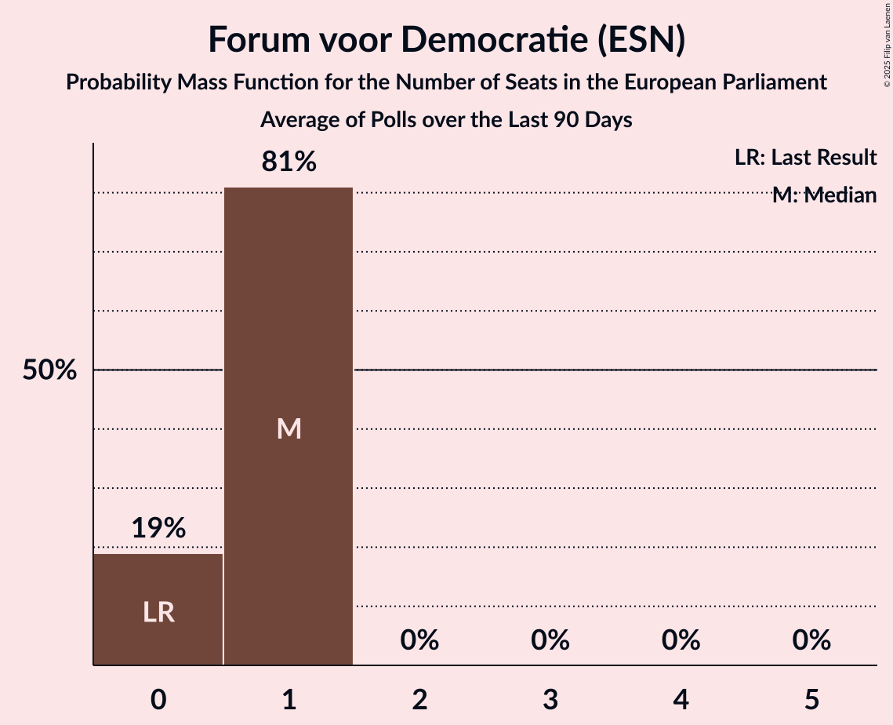

# Forum voor Democratie (ESN)

<a href="#voting-intentions">Voting Intentions</a> | <a href="#seats">Seats</a>

## Voting Intentions

Last result: **0.0%** (General Election of 6 June 2024)

### Confidence Intervals

| Period     | Polling firm/Commissioner(s) | Median | 80% Confidence Interval | 90% Confidence Interval | 95% Confidence Interval | 99% Confidence Interval |
|:----------:|:----------------:|:-----------:|:-----------------------:|:-----------------------:|:-----------------------:|:-----------------------:|
| N/A | [Poll Average](average.html) | 3.1% | 2.5–3.7% | 2.4–3.9% | 2.2–4.0% | 2.0–4.4% |
| [10 October 2025](2025-10-10-Peilnl.html) | Peil.nl | 3.3% | 2.9–3.8% | 2.8–3.9% | 2.7–4.0% | 2.6–4.3% |
| [3–6 October 2025](2025-10-06-IpsosIO.html) | Ipsos I&O   Pauw & De Wit | 2.9% | 2.5–3.4% | 2.3–3.6% | 2.2–3.7% | 2.1–4.0% |
| [3 October 2025](2025-10-03-Peilnl.html) | Peil.nl | 3.3% | 2.9–3.8% | 2.8–3.9% | 2.7–4.0% | 2.6–4.3% |
| [26–29 September 2025](2025-09-29-Verian.html) | Verian   EenVandaag | 3.0% | 2.4–3.8% | 2.2–4.0% | 2.1–4.2% | 1.9–4.6% |
| [26–29 September 2025](2025-09-29-IpsosIO.html) | Ipsos I&O   Pauw & De Wit | 3.1% | 2.7–3.7% | 2.5–3.8% | 2.4–4.0% | 2.2–4.3% |
| [26 September 2025](2025-09-26-Peilnl.html) | Peil.nl | 3.3% | 2.9–3.8% | 2.8–3.9% | 2.7–4.0% | 2.6–4.3% |
| [19 September 2025](2025-09-19-Peilnl.html) | Peil.nl | 3.3% | 2.9–3.8% | 2.8–3.9% | 2.7–4.0% | 2.6–4.3% |
| [13–15 September 2025](2025-09-15-IpsosIO.html) | Ipsos I&O   Pauw & De Wit | 2.8% | 2.4–3.4% | 2.3–3.5% | 2.1–3.7% | 2.0–3.9% |
| [6 September 2025](2025-09-06-Peilnl.html) | Peil.nl | 3.3% | N/A | N/A | N/A | N/A |
| [29 August–1 September 2025](2025-09-01-IpsosIO.html) | Ipsos I&O   Pauw & De Wit | 2.0% | 1.7–2.5% | 1.6–2.6% | 1.5–2.7% | 1.3–3.0% |
| [22–25 August 2025](2025-08-25-Verian.html) | Verian   EenVandaag | 2.7% | 2.2–3.3% | 2.1–3.5% | 2.0–3.7% | 1.8–4.0% |
| [25 August 2025](2025-08-25-Peilnl.html) | Peil.nl | 2.6% | 2.4–2.9% | 2.3–3.0% | 2.3–3.1% | 2.1–3.2% |
| [8–9 August 2025](2025-08-09-Peilnl.html) | Peil.nl | 2.7% | 2.3–3.1% | 2.2–3.2% | 2.1–3.3% | 2.0–3.5% |
| [25–28 July 2025](2025-07-28-Verian.html) | Verian   EenVandaag | 2.8% | 2.3–3.4% | 2.2–3.6% | 2.1–3.7% | 1.9–4.1% |
| [25–28 July 2025](2025-07-28-IpsosIO.html) | Ipsos I&O | 2.1% | 1.7–2.6% | 1.6–2.7% | 1.5–2.9% | 1.3–3.1% |
| [25–26 July 2025](2025-07-26-Peilnl.html) | Peil.nl | 2.7% | 2.3–3.1% | 2.2–3.2% | 2.1–3.3% | 2.0–3.5% |
| [4–5 July 2025](2025-07-05-Peilnl.html) | Peil.nl | 2.7% | N/A | N/A | N/A | N/A |
| [20–23 June 2025](2025-06-23-Verian.html) | Verian   EenVandaag | 2.3% | 1.9–2.8% | 1.8–3.0% | 1.7–3.1% | 1.5–3.4% |
| [21 June 2025](2025-06-21-Peilnl.html) | Peil.nl | 2.7% | 2.3–3.1% | 2.2–3.2% | 2.1–3.3% | 2.0–3.5% |
| [13–16 June 2025](2025-06-16-IpsosIO.html) | Ipsos I&O | 2.2% | 1.9–2.7% | 1.8–2.8% | 1.7–2.9% | 1.5–3.2% |
| [6–9 June 2025](2025-06-09-Verian.html) | Verian   EenVandaag | 2.0% | 1.6–2.5% | 1.5–2.7% | 1.4–2.8% | 1.2–3.1% |
| [6–7 June 2025](2025-06-07-Peilnl.html) | Peil.nl | 2.7% | N/A | N/A | N/A | N/A |
| [5–6 June 2025](2025-06-06-IpsosIO.html) | Ipsos I&O | 3.2% | 2.8–3.7% | 2.7–3.9% | 2.5–4.0% | 2.3–4.3% |
| [30–31 May 2025](2025-05-31-Peilnl.html) | Peil.nl | 3.3% | 2.9–3.8% | 2.8–3.9% | 2.7–4.0% | 2.6–4.3% |
| [23–26 May 2025](2025-05-26-Verian.html) | Verian   EenVandaag | 2.0% | 1.6–2.5% | 1.5–2.7% | 1.4–2.8% | 1.2–3.1% |
| [9–12 May 2025](2025-05-12-IpsosIO.html) | Ipsos I&O | 2.8% | 2.4–3.3% | 2.3–3.5% | 2.2–3.6% | 2.0–3.9% |
| [25–28 April 2025](2025-04-28-Verian.html) | Verian   EenVandaag | 3.0% | 2.5–3.6% | 2.4–3.8% | 2.2–4.0% | 2.0–4.3% |
| [25–26 April 2025](2025-04-26-Peilnl.html) | Peil.nl | 3.3% | 2.9–3.8% | 2.8–3.9% | 2.7–4.0% | 2.6–4.3% |
| [11–14 April 2025](2025-04-14-IpsosIO.html) | Ipsos I&O | 3.0% | 2.6–3.6% | 2.5–3.7% | 2.3–3.9% | 2.1–4.1% |
| [3–4 April 2025](2025-04-04-Peilnl.html) | Peil.nl | 3.3% | 2.9–3.8% | 2.8–3.9% | 2.7–4.0% | 2.6–4.3% |
| [28–29 March 2025](2025-03-29-Peilnl.html) | Peil.nl | 3.3% | 2.9–3.8% | 2.8–3.9% | 2.7–4.0% | 2.6–4.3% |
| [21–24 March 2025](2025-03-24-Verian.html) | Verian   EenVandaag | 3.1% | 2.6–3.7% | 2.4–3.9% | 2.3–4.1% | 2.1–4.4% |
| [14–17 March 2025](2025-03-17-IpsosIO.html) | Ipsos I&O | 2.4% | 2.0–2.9% | 1.9–3.0% | 1.8–3.1% | 1.7–3.4% |
| [7–8 March 2025](2025-03-08-Peilnl.html) | Peil.nl | 3.3% | 2.9–3.8% | 2.8–3.9% | 2.7–4.0% | 2.6–4.3% |
| [21–24 February 2025](2025-02-24-Verian.html) | Verian   EenVandaag | 1.7% | 1.0–1.8% | 0.9–1.9% | 0.9–2.0% | 0.7–2.3% |
| [21–22 February 2025](2025-02-22-Peilnl.html) | Peil.nl | 3.3% | 2.9–3.8% | 2.8–3.9% | 2.7–4.0% | 2.6–4.3% |
| [14–17 February 2025](2025-02-17-IpsosIO.html) | Ipsos I&O | 2.8% | 2.4–3.3% | 2.3–3.5% | 2.2–3.6% | 2.0–3.9% |
| [24–27 January 2025](2025-01-27-Verian.html) | Verian   EenVandaag | 2.7% | 2.2–3.3% | 2.1–3.5% | 2.0–3.6% | 1.8–3.9% |
| [24–25 January 2025](2025-01-25-Peilnl.html) | Peil.nl | 3.3% | 2.9–3.8% | 2.8–3.9% | 2.7–4.0% | 2.6–4.3% |
| [17–20 January 2025](2025-01-20-IpsosIO.html) | Ipsos I&O | 2.2% | 1.8–2.7% | 1.8–2.8% | 1.7–2.9% | 1.5–3.1% |
| [24–28 December 2024](2024-12-28-Verian.html) | Verian   EenVandaag | 2.6% | 2.1–3.2% | 2.0–3.4% | 1.9–3.5% | 1.7–3.8% |
| [13–14 December 2024](2024-12-14-Peilnl.html) | Peil.nl | 3.3% | 2.9–3.8% | 2.8–3.9% | 2.7–4.0% | 2.6–4.3% |
| [6–9 December 2024](2024-12-09-IpsosIO.html) | Ipsos I&O | 2.1% | 1.7–2.6% | 1.6–2.7% | 1.5–2.8% | 1.4–3.1% |
| [22–25 November 2024](2024-11-25-Verian.html) | Verian   EenVandaag | 2.4% | 1.6–2.5% | 1.5–2.7% | 1.4–2.8% | 1.2–3.1% |
| [22–23 November 2024](2024-11-23-Peilnl.html) | Peil.nl | 3.3% | 2.9–3.8% | 2.8–3.9% | 2.7–4.0% | 2.6–4.3% |
| [9–11 November 2024](2024-11-11-IpsosIO.html) | Ipsos I&O | 2.3% | 1.9–2.8% | 1.8–2.9% | 1.7–3.0% | 1.5–3.3% |
| [8–9 November 2024](2024-11-09-Peilnl.html) | Peil.nl | 3.3% | 2.9–3.8% | 2.8–3.9% | 2.7–4.0% | 2.6–4.3% |
| [25–28 October 2024](2024-10-28-Verian.html) | Verian   EenVandaag | 2.2% | 1.6–2.5% | 1.5–2.7% | 1.4–2.8% | 1.2–3.1% |
| [18–21 October 2024](2024-10-21-IpsosIO.html) | Ipsos I&O | 2.9% | 2.5–3.4% | 2.4–3.6% | 2.3–3.7% | 2.1–4.0% |
| [12 October 2024](2024-10-12-Peilnl.html) | Peil.nl | 2.7% | 2.3–3.1% | 2.2–3.2% | 2.1–3.3% | 2.0–3.5% |
| [28 September 2024](2024-09-28-Peilnl.html) | Peil.nl | 2.7% | 2.3–3.1% | 2.2–3.2% | 2.1–3.3% | 2.0–3.5% |
| [20–23 September 2024](2024-09-23-Verian.html) | Verian   EenVandaag | 2.6% | 2.2–3.3% | 2.1–3.4% | 2.0–3.6% | 1.8–3.9% |
| [20–23 September 2024](2024-09-23-IpsosIO.html) | Ipsos I&O | 3.0% | 2.6–3.6% | 2.5–3.7% | 2.3–3.9% | 2.1–4.2% |
| [13–16 September 2024](2024-09-16-IpsosIO.html) | Ipsos I&O | 3.1% | 2.7–3.6% | 2.5–3.8% | 2.4–3.9% | 2.2–4.2% |
| [14–15 September 2024](2024-09-15-Peilnl.html) | Peil.nl | 2.0% | 1.8–2.3% | 1.7–2.4% | 1.6–2.4% | 1.5–2.6% |
| [23–26 August 2024](2024-08-26-Verian.html) | Verian   EenVandaag | 2.2% | 1.6–2.5% | 1.5–2.7% | 1.4–2.8% | 1.2–3.1% |
| [26–29 July 2024](2024-07-29-IpsosIO.html) | Ipsos I&O   EenVandaag | 2.3% | 1.5–2.7% | 1.4–2.9% | 1.3–3.0% | 1.1–3.4% |
| [6 July 2024](2024-07-06-Peilnl.html) | Peil.nl | 2.0% | 1.7–2.4% | 1.6–2.5% | 1.6–2.6% | 1.4–2.8% |
| [28–29 June 2024](2024-06-29-Peilnl.html) | Peil.nl | 2.0% | N/A | N/A | N/A | N/A |
| [21–24 June 2024](2024-06-24-IpsosIO.html) | Ipsos I&O   EenVandaag | 2.0% | N/A | N/A | N/A | N/A |
| [14–17 June 2024](2024-06-17-IpsosIO.html) | Ipsos I&O | 2.0% | N/A | N/A | N/A | N/A |

### Probability Mass Function

The following table shows the probability mass function per percentage block of voting intentions for the [poll average](average.html) for Forum voor Democratie (ESN).

| Voting Intentions | Probability | Accumulated | Special Marks |
|:-----------------:|:-----------:|:-----------:|:-------------:|
| 0.0–0.5% | 0% | 100% | Last Result |
| 0.5–1.5% | 0% | 100% |  |
| 1.5–2.5% | 10% | 100% |  |
| 2.5–3.5% | 73% | 90% | Median |
| 3.5–4.5% | 17% | 17% |  |
| 4.5–5.5% | 0.2% | 0.2% |  |
| 5.5–6.5% | 0% | 0% |  |

## Seats

Last result: **0** seats (General Election of 6 June 2024)

### Confidence Intervals

| Period     | Polling firm/Commissioner(s) | Median | 80% Confidence Interval | 90% Confidence Interval | 95% Confidence Interval | 99% Confidence Interval |
|:----------:|:----------------:|:------:|:-----------------------:|:-----------------------:|:-----------------------:|:-----------------------:|
| N/A | [Poll Average](average.html) | 0 | 0–1 | 0–1 | 0–1 | 0–1 |
| [10 October 2025](2025-10-10-Peilnl.html) | Peil.nl | 1 | 0–1 | 0–1 | 0–1 | 0–1 |
| [3–6 October 2025](2025-10-06-IpsosIO.html) | Ipsos I&O   Pauw & De Wit | 0 | 0–1 | 0–1 | 0–1 | 0–1 |
| [3 October 2025](2025-10-03-Peilnl.html) | Peil.nl | 1 | 0–1 | 0–1 | 0–1 | 0–1 |
| [26–29 September 2025](2025-09-29-Verian.html) | Verian   EenVandaag | 0 | 0 | 0 | 0 | 0–1 |
| [26–29 September 2025](2025-09-29-IpsosIO.html) | Ipsos I&O   Pauw & De Wit | 0 | 0–1 | 0–1 | 0–1 | 0–1 |
| [26 September 2025](2025-09-26-Peilnl.html) | Peil.nl | 1 | 0–1 | 0–1 | 0–1 | 0–1 |
| [19 September 2025](2025-09-19-Peilnl.html) | Peil.nl | 1 | 0–1 | 0–1 | 0–1 | 0–1 |
| [13–15 September 2025](2025-09-15-IpsosIO.html) | Ipsos I&O   Pauw & De Wit | 0 | 0 | 0 | 0 | 0–1 |
| [6 September 2025](2025-09-06-Peilnl.html) | Peil.nl |  |  |  |  |  |
| [29 August–1 September 2025](2025-09-01-IpsosIO.html) | Ipsos I&O   Pauw & De Wit | 0 | 0 | 0 | 0 | 0 |
| [22–25 August 2025](2025-08-25-Verian.html) | Verian   EenVandaag | 0 | 0–1 | 0–1 | 0–1 | 0–1 |
| [25 August 2025](2025-08-25-Peilnl.html) | Peil.nl | 0 | 0 | 0 | 0 | 0 |
| [8–9 August 2025](2025-08-09-Peilnl.html) | Peil.nl | 0 | 0 | 0 | 0–1 | 0–1 |
| [25–28 July 2025](2025-07-28-Verian.html) | Verian   EenVandaag | 0 | 0 | 0 | 0–1 | 0–1 |
| [25–28 July 2025](2025-07-28-IpsosIO.html) | Ipsos I&O | 0 | 0 | 0 | 0 | 0 |
| [25–26 July 2025](2025-07-26-Peilnl.html) | Peil.nl | 0 | 0 | 0 | 0–1 | 0–1 |
| [4–5 July 2025](2025-07-05-Peilnl.html) | Peil.nl |  |  |  |  |  |
| [20–23 June 2025](2025-06-23-Verian.html) | Verian   EenVandaag | 0 | 0 | 0 | 0 | 0 |
| [21 June 2025](2025-06-21-Peilnl.html) | Peil.nl | 0 | 0 | 0 | 0 | 0 |
| [13–16 June 2025](2025-06-16-IpsosIO.html) | Ipsos I&O | 0 | 0 | 0 | 0 | 0–1 |
| [6–9 June 2025](2025-06-09-Verian.html) | Verian   EenVandaag | 0 | 0 | 0 | 0 | 0 |
| [6–7 June 2025](2025-06-07-Peilnl.html) | Peil.nl |  |  |  |  |  |
| [5–6 June 2025](2025-06-06-IpsosIO.html) | Ipsos I&O | 1 | 0–1 | 0–1 | 0–1 | 0–1 |
| [30–31 May 2025](2025-05-31-Peilnl.html) | Peil.nl | 1 | 0–1 | 0–1 | 0–1 | 0–1 |
| [23–26 May 2025](2025-05-26-Verian.html) | Verian   EenVandaag | 0 | 0 | 0 | 0 | 0 |
| [9–12 May 2025](2025-05-12-IpsosIO.html) | Ipsos I&O | 0 | 0–1 | 0–1 | 0–1 | 0–1 |
| [25–28 April 2025](2025-04-28-Verian.html) | Verian   EenVandaag | 0 | 0–1 | 0–1 | 0–1 | 0–1 |
| [25–26 April 2025](2025-04-26-Peilnl.html) | Peil.nl | 1 | 1 | 0–1 | 0–1 | 0–1 |
| [11–14 April 2025](2025-04-14-IpsosIO.html) | Ipsos I&O | 0 | 0 | 0–1 | 0–1 | 0–1 |
| [3–4 April 2025](2025-04-04-Peilnl.html) | Peil.nl | 1 | 0–1 | 0–1 | 0–1 | 0–1 |
| [28–29 March 2025](2025-03-29-Peilnl.html) | Peil.nl | 1 | 1 | 1 | 0–1 | 0–1 |
| [21–24 March 2025](2025-03-24-Verian.html) | Verian   EenVandaag | 1 | 1 | 1 | 0–1 | 0–1 |
| [14–17 March 2025](2025-03-17-IpsosIO.html) | Ipsos I&O | 0 | 0 | 0 | 0 | 0 |
| [7–8 March 2025](2025-03-08-Peilnl.html) | Peil.nl | 0 | 0–1 | 0–1 | 0–1 | 0–1 |
| [21–24 February 2025](2025-02-24-Verian.html) | Verian   EenVandaag | 0 | 0 | 0 | 0 | 0 |
| [21–22 February 2025](2025-02-22-Peilnl.html) | Peil.nl | 0 | 0–1 | 0–1 | 0–1 | 0–1 |
| [14–17 February 2025](2025-02-17-IpsosIO.html) | Ipsos I&O | 1 | 0–1 | 0–1 | 0–1 | 0–1 |
| [24–27 January 2025](2025-01-27-Verian.html) | Verian   EenVandaag | 0 | 0 | 0–1 | 0–1 | 0–1 |
| [24–25 January 2025](2025-01-25-Peilnl.html) | Peil.nl | 1 | 0–1 | 0–1 | 0–1 | 0–1 |
| [17–20 January 2025](2025-01-20-IpsosIO.html) | Ipsos I&O | 0 | 0 | 0 | 0 | 0 |
| [24–28 December 2024](2024-12-28-Verian.html) | Verian   EenVandaag | 0 | 0 | 0 | 0–1 | 0–1 |
| [13–14 December 2024](2024-12-14-Peilnl.html) | Peil.nl | 1 | 0–1 | 0–1 | 0–1 | 0–1 |
| [6–9 December 2024](2024-12-09-IpsosIO.html) | Ipsos I&O | 0 | 0 | 0 | 0 | 0 |
| [22–25 November 2024](2024-11-25-Verian.html) | Verian   EenVandaag | 0 | 0 | 0 | 0 | 0 |
| [22–23 November 2024](2024-11-23-Peilnl.html) | Peil.nl | 1 | 1 | 1 | 1 | 0–1 |
| [9–11 November 2024](2024-11-11-IpsosIO.html) | Ipsos I&O | 0 | 0 | 0 | 0 | 0 |
| [8–9 November 2024](2024-11-09-Peilnl.html) | Peil.nl | 0 | 0–1 | 0–1 | 0–1 | 0–1 |
| [25–28 October 2024](2024-10-28-Verian.html) | Verian   EenVandaag | 0 | 0 | 0 | 0 | 0 |
| [18–21 October 2024](2024-10-21-IpsosIO.html) | Ipsos I&O | 0 | 0–1 | 0–1 | 0–1 | 0–1 |
| [12 October 2024](2024-10-12-Peilnl.html) | Peil.nl | 0 | 0 | 0 | 0 | 0 |
| [28 September 2024](2024-09-28-Peilnl.html) | Peil.nl | 0 | 0 | 0 | 0 | 0 |
| [20–23 September 2024](2024-09-23-Verian.html) | Verian   EenVandaag | 0 | 0 | 0–1 | 0–1 | 0–1 |
| [20–23 September 2024](2024-09-23-IpsosIO.html) | Ipsos I&O | 1 | 0–1 | 0–1 | 0–1 | 0–1 |
| [13–16 September 2024](2024-09-16-IpsosIO.html) | Ipsos I&O | 0 | 0–1 | 0–1 | 0–1 | 0–1 |
| [14–15 September 2024](2024-09-15-Peilnl.html) | Peil.nl | 0 | 0 | 0 | 0 | 0 |
| [23–26 August 2024](2024-08-26-Verian.html) | Verian   EenVandaag | 0 | 0 | 0 | 0 | 0 |
| [26–29 July 2024](2024-07-29-IpsosIO.html) | Ipsos I&O   EenVandaag | 0 | 0 | 0 | 0 | 0 |
| [6 July 2024](2024-07-06-Peilnl.html) | Peil.nl | 0 | 0 | 0 | 0 | 0 |
| [28–29 June 2024](2024-06-29-Peilnl.html) | Peil.nl |  |  |  |  |  |
| [21–24 June 2024](2024-06-24-IpsosIO.html) | Ipsos I&O   EenVandaag |  |  |  |  |  |
| [14–17 June 2024](2024-06-17-IpsosIO.html) | Ipsos I&O |  |  |  |  |  |

### Probability Mass Function

The following table shows the probability mass function per seat for the [poll average](average.html) for Forum voor Democratie (ESN).

| Number of Seats | Probability | Accumulated | Special Marks |
|:---------------:|:-----------:|:-----------:|:-------------:|
| 0 | 65% | 100% | Last Result, Median |
| 1 | 35% | 35% |  |
| 2 | 0% | 0% |  |

