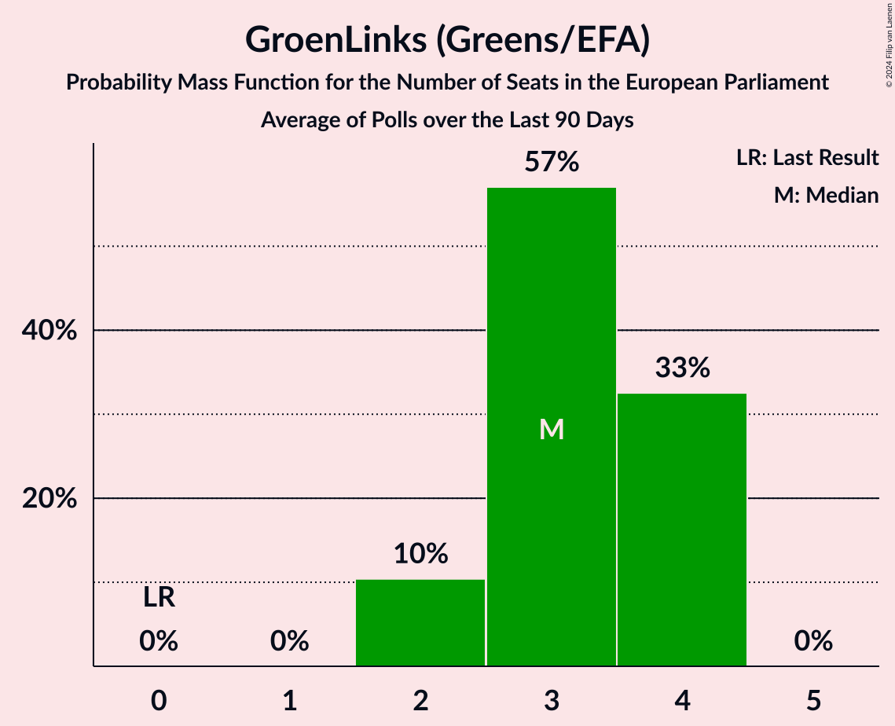

# GroenLinks (Greens/EFA)

<a href="#voting-intentions">Voting Intentions</a> | <a href="#seats">Seats</a>

## Voting Intentions

Last result: **7.0%** (General Election of 22 May 2014)

### Confidence Intervals

| Period     | Polling firm/Commissioner(s) | Median | 80% Confidence Interval | 90% Confidence Interval | 95% Confidence Interval | 99% Confidence Interval |
|:----------:|:----------------:|:-----------:|:-----------------------:|:-----------------------:|:-----------------------:|:-----------------------:|
| N/A | [Poll Average](average.html) | 11.6% | 10.3–12.7% | 9.8–13.1% | 9.5–13.5% | 8.8–14.2% |
| [11–17 February 2019](2019-02-17-Peilnl.html) | Peil.nl | 11.3% | 10.6–12.1% | 10.4–12.3% | 10.2–12.5% | 9.9–12.9% |
| [4–10 February 2019](2019-02-10-Peilnl.html) | Peil.nl | 11.3% | 10.6–12.1% | 10.4–12.3% | 10.2–12.5% | 9.9–12.9% |
| [28 January–3 February 2019](2019-02-03-Peilnl.html) | Peil.nl | 11.3% | 10.6–12.1% | 10.4–12.3% | 10.2–12.5% | 9.9–12.9% |
| [25–28 January 2019](2019-01-28-Ipsos.html) | Ipsos   EenVandaag | 12.0% | 10.7–13.4% | 10.4–13.8% | 10.1–14.1% | 9.5–14.8% |
| [21–27 January 2019](2019-01-27-Peilnl.html) | Peil.nl | 11.3% | 10.6–12.1% | 10.4–12.3% | 10.2–12.5% | 9.9–12.9% |
| [18–22 January 2019](2019-01-22-IOResearch.html) | I&O Research | 12.0% | 11.4–12.7% | 11.2–12.9% | 11.0–13.1% | 10.7–13.5% |
| [14–20 January 2019](2019-01-20-Peilnl.html) | Peil.nl | 11.3% | 10.6–12.1% | 10.4–12.3% | 10.2–12.5% | 9.9–12.9% |
| [7–13 January 2019](2019-01-13-Peilnl.html) | Peil.nl | 11.3% | 10.6–12.1% | 10.4–12.3% | 10.2–12.5% | 9.9–12.9% |
| [14–17 December 2018](2018-12-17-Ipsos.html) | Ipsos   EenVandaag | 10.6% | 9.4–11.9% | 9.1–12.3% | 8.8–12.6% | 8.3–13.3% |
| [10–16 December 2018](2018-12-16-Peilnl.html) | Peil.nl | 11.3% | 10.6–12.1% | 10.4–12.3% | 10.2–12.5% | 9.9–12.9% |
| [7–11 December 2018](2018-12-11-KantarPublic.html) | Kantar Public | 10.6% | 9.5–12.0% | 9.2–12.3% | 8.9–12.7% | 8.4–13.3% |
| [3–9 December 2018](2018-12-09-Peilnl.html) | Peil.nl | 11.3% | 10.6–12.1% | 10.4–12.3% | 10.2–12.5% | 9.9–12.9% |
| [26 November–2 December 2018](2018-12-02-Peilnl.html) | Peil.nl | 11.3% | 10.6–12.1% | 10.4–12.3% | 10.2–12.5% | 9.9–12.9% |
| [22–27 November 2018](2018-11-27-IOResearch.html) | I&O Research | 12.5% | 11.8–13.3% | 11.6–13.5% | 11.4–13.7% | 11.1–14.1% |
| [23–26 November 2018](2018-11-26-Ipsos.html) | Ipsos   EenVandaag | 10.8% | 9.6–12.1% | 9.3–12.5% | 9.0–12.8% | 8.5–13.5% |
| [19–25 November 2018](2018-11-25-Peilnl.html) | Peil.nl | 11.3% | 10.6–12.1% | 10.4–12.3% | 10.2–12.5% | 9.9–12.9% |
| [12–18 November 2018](2018-11-18-Peilnl.html) | Peil.nl | 10.7% | 10.0–11.4% | 9.8–11.6% | 9.6–11.8% | 9.3–12.2% |
| [5–11 November 2018](2018-11-11-Peilnl.html) | Peil.nl | 10.7% | 10.0–11.4% | 9.8–11.6% | 9.6–11.8% | 9.3–12.2% |
| [29 October–4 November 2018](2018-11-04-Peilnl.html) | Peil.nl | 10.7% | 10.0–11.4% | 9.8–11.6% | 9.6–11.8% | 9.3–12.2% |
| [26–29 October 2018](2018-10-29-Ipsos.html) | Ipsos   EenVandaag | 10.4% | 9.2–11.7% | 8.9–12.1% | 8.6–12.4% | 8.1–13.1% |
| [22–28 October 2018](2018-10-28-Peilnl.html) | Peil.nl | 12.0% | 11.3–12.8% | 11.1–13.0% | 10.9–13.2% | 10.5–13.6% |
| [15–21 October 2018](2018-10-21-Peilnl.html) | Peil.nl | 12.0% | 11.3–12.8% | 11.1–13.0% | 10.9–13.2% | 10.5–13.6% |
| [8–14 October 2018](2018-10-14-Peilnl.html) | Peil.nl | 12.0% | 11.3–12.8% | 11.1–13.0% | 10.9–13.2% | 10.5–13.6% |
| [1–7 October 2018](2018-10-07-Peilnl.html) | Peil.nl | 12.0% | 11.3–12.8% | 11.1–13.0% | 10.9–13.2% | 10.5–13.6% |
| [24–30 September 2018](2018-09-30-Peilnl.html) | Peil.nl | 12.0% | 11.3–12.8% | 11.1–13.0% | 10.9–13.2% | 10.5–13.6% |
| [17–23 September 2018](2018-09-23-Peilnl.html) | Peil.nl | 12.0% | 11.3–12.8% | 11.1–13.0% | 10.9–13.2% | 10.5–13.6% |
| [21–23 September 2018](2018-09-23-Ipsos.html) | Ipsos   EenVandaag | 10.8% | 9.6–12.1% | 9.3–12.5% | 9.0–12.8% | 8.5–13.5% |
| [10–16 September 2018](2018-09-16-Peilnl.html) | Peil.nl | 12.0% | 11.3–12.8% | 11.1–13.0% | 10.9–13.2% | 10.5–13.6% |
| [13–16 September 2018](2018-09-16-KantarPublic.html) | Kantar Public | 12.7% | 11.4–14.1% | 11.1–14.5% | 10.8–14.9% | 10.2–15.6% |
| [7–11 September 2018](2018-09-11-IOResearch.html) | I&O Research | 12.7% | 11.8–13.7% | 11.5–14.0% | 11.3–14.2% | 10.9–14.7% |
| [3–9 September 2018](2018-09-09-Peilnl.html) | Peil.nl | 11.3% | 10.6–12.1% | 10.4–12.3% | 10.2–12.5% | 9.9–12.9% |
| [31 August–3 September 2018](2018-09-03-Ipsos.html) | Ipsos   EenVandaag | 10.2% | 9.1–11.5% | 8.8–11.9% | 8.5–12.2% | 8.0–12.9% |
| [27 August–2 September 2018](2018-09-02-Peilnl.html) | Peil.nl | 10.7% | 10.0–11.4% | 9.8–11.6% | 9.6–11.8% | 9.3–12.2% |
| [20–26 August 2018](2018-08-26-Peilnl.html) | Peil.nl | 10.7% | 10.0–11.4% | 9.8–11.6% | 9.6–11.8% | 9.3–12.2% |
| [13–19 August 2018](2018-08-19-Peilnl.html) | Peil.nl | 10.7% | 10.0–11.4% | 9.8–11.6% | 9.6–11.8% | 9.3–12.2% |
| [27–30 July 2018](2018-07-30-Ipsos.html) | Ipsos   EenVandaag | 10.0% | 9.0–11.1% | 8.8–11.4% | 8.6–11.7% | 8.1–12.2% |
| [2–8 July 2018](2018-07-08-Peilnl.html) | Peil.nl | 11.3% | 10.6–12.1% | 10.4–12.3% | 10.2–12.5% | 9.9–12.9% |
| [25 June–1 July 2018](2018-07-01-Peilnl.html) | Peil.nl | 11.3% | 10.6–12.1% | 10.4–12.3% | 10.2–12.5% | 9.9–12.9% |
| [13–29 June 2018](2018-06-29-IOResearch.html) | I&O Research | 12.7% | 11.8–13.6% | 11.6–13.9% | 11.4–14.1% | 11.0–14.6% |
| [22–25 June 2018](2018-06-25-Ipsos.html) | Ipsos   EenVandaag | 10.7% | 9.6–12.0% | 9.3–12.3% | 9.0–12.6% | 8.5–13.3% |
| [18–24 June 2018](2018-06-24-Peilnl.html) | Peil.nl | 11.3% | 10.6–12.1% | 10.4–12.3% | 10.2–12.5% | 9.9–12.9% |
| [11–17 June 2018](2018-06-17-Peilnl.html) | Peil.nl | 10.7% | 10.0–11.4% | 9.8–11.6% | 9.6–11.8% | 9.3–12.2% |
| [13 June 2018](2018-06-13-KantarPublic.html) | Kantar Public | 10.0% | 8.9–11.4% | 8.6–11.7% | 8.4–12.1% | 7.8–12.7% |
| [4–10 June 2018](2018-06-10-Peilnl.html) | Peil.nl | 10.7% | 10.0–11.4% | 9.8–11.6% | 9.6–11.8% | 9.3–12.2% |
| [28 May–3 June 2018](2018-06-03-Peilnl.html) | Peil.nl | 10.7% | 10.0–11.4% | 9.8–11.6% | 9.6–11.8% | 9.3–12.2% |
| [25–28 May 2018](2018-05-28-Ipsos.html) | Ipsos   EenVandaag | 11.7% | 10.5–13.0% | 10.2–13.4% | 9.9–13.8% | 9.3–14.4% |
| [21–27 May 2018](2018-05-27-Peilnl.html) | Peil.nl | 11.3% | 10.6–12.1% | 10.4–12.3% | 10.2–12.5% | 9.9–12.9% |
| [14–20 May 2018](2018-05-20-Peilnl.html) | Peil.nl | 11.3% | 10.6–12.1% | 10.4–12.3% | 10.2–12.5% | 9.9–12.9% |
| [7–13 May 2018](2018-05-13-Peilnl.html) | Peil.nl | 11.3% | 10.6–12.1% | 10.4–12.3% | 10.2–12.5% | 9.9–12.9% |
| [30 April–6 May 2018](2018-05-06-Peilnl.html) | Peil.nl | 11.3% | 10.6–12.1% | 10.4–12.3% | 10.2–12.5% | 9.9–12.9% |
| [23–29 April 2018](2018-04-29-Peilnl.html) | Peil.nl | 11.3% | 10.6–12.1% | 10.4–12.3% | 10.2–12.5% | 9.9–12.9% |
| [20–23 April 2018](2018-04-23-Ipsos.html) | Ipsos   EenVandaag | 11.6% | 10.5–12.9% | 10.2–13.3% | 9.9–13.6% | 9.4–14.3% |
| [16–22 April 2018](2018-04-22-Peilnl.html) | Peil.nl | 10.7% | 10.0–11.4% | 9.8–11.6% | 9.6–11.8% | 9.3–12.2% |
| [9–15 April 2018](2018-04-15-Peilnl.html) | Peil.nl | 10.7% | 10.0–11.4% | 9.8–11.6% | 9.6–11.8% | 9.3–12.2% |
| [2–8 April 2018](2018-04-08-Peilnl.html) | Peil.nl | 10.7% | 10.0–11.4% | 9.8–11.6% | 9.6–11.8% | 9.3–12.2% |
| [26 March–1 April 2018](2018-04-01-Peilnl.html) | Peil.nl | 10.7% | 10.0–11.4% | 9.8–11.6% | 9.6–11.8% | 9.3–12.2% |
| [19–25 March 2018](2018-03-25-Peilnl.html) | Peil.nl | 10.7% | 10.0–11.4% | 9.8–11.6% | 9.6–11.8% | 9.3–12.2% |
| [19 March 2018](2018-03-19-Ipsos.html) | Ipsos   EenVandaag | 9.5% | 8.5–10.7% | 8.2–11.1% | 8.0–11.4% | 7.5–12.0% |
| [12–18 March 2018](2018-03-18-Peilnl.html) | Peil.nl | 9.3% | 8.7–10.1% | 8.5–10.3% | 8.3–10.4% | 8.0–10.8% |
| [8–12 March 2018](2018-03-12-IOResearch.html) | I&O Research | 10.7% | 10.0–11.4% | 9.8–11.6% | 9.7–11.8% | 9.4–12.1% |
| [5–11 March 2018](2018-03-11-Peilnl.html) | Peil.nl | 9.3% | 8.7–10.1% | 8.5–10.3% | 8.3–10.4% | 8.0–10.8% |
| [26 February–4 March 2018](2018-03-04-Peilnl.html) | Peil.nl | 9.3% | 8.7–10.1% | 8.5–10.3% | 8.3–10.4% | 8.0–10.8% |
| [27 February–4 March 2018](2018-03-04-KantarPublic.html) | Kantar Public | 10.6% | 9.5–11.9% | 9.2–12.3% | 8.9–12.7% | 8.4–13.3% |
| [23–26 February 2018](2018-02-26-Ipsos.html) | Ipsos   EenVandaag | 9.3% | 8.2–10.5% | 7.9–10.9% | 7.6–11.2% | 7.1–11.8% |
| [19–25 February 2018](2018-02-25-Peilnl.html) | Peil.nl | 9.3% | 8.7–10.1% | 8.5–10.3% | 8.3–10.4% | 8.0–10.8% |
| [12–18 February 2018](2018-02-18-Peilnl.html) | Peil.nl | 9.3% | 8.7–10.1% | 8.5–10.3% | 8.3–10.4% | 8.0–10.8% |
| [5–11 February 2018](2018-02-11-Peilnl.html) | Peil.nl | 9.3% | 8.7–10.1% | 8.5–10.3% | 8.3–10.4% | 8.0–10.8% |
| [2–6 February 2018](2018-02-06-IOResearch.html) | I&O Research | 10.7% | 10.0–11.4% | 9.9–11.6% | 9.7–11.8% | 9.4–12.1% |
| [29 January–4 February 2018](2018-02-04-Peilnl.html) | Peil.nl | 8.7% | 8.0–9.4% | 7.9–9.6% | 7.7–9.7% | 7.4–10.1% |
| [26–29 January 2018](2018-01-29-Ipsos.html) | Ipsos   EenVandaag | 9.3% | 8.2–10.6% | 8.0–10.9% | 7.7–11.2% | 7.2–11.9% |
| [22–28 January 2018](2018-01-28-Peilnl.html) | Peil.nl | 8.7% | 8.0–9.4% | 7.9–9.6% | 7.7–9.7% | 7.4–10.1% |
| [25–28 January 2018](2018-01-28-KantarPublic.html) | Kantar Public | 10.6% | 9.6–11.9% | 9.3–12.3% | 9.0–12.6% | 8.5–13.2% |
| [15–21 January 2018](2018-01-21-Peilnl.html) | Peil.nl | 8.7% | 8.0–9.4% | 7.9–9.6% | 7.7–9.7% | 7.4–10.1% |
| [8–14 January 2018](2018-01-14-Peilnl.html) | Peil.nl | 9.3% | 8.7–10.1% | 8.5–10.3% | 8.3–10.4% | 8.0–10.8% |
| [18–24 December 2017](2017-12-24-Peilnl.html) | Peil.nl | 9.3% | 8.7–10.1% | 8.5–10.3% | 8.3–10.4% | 8.0–10.8% |
| [15–18 December 2017](2017-12-18-GfK.html) | GfK   EenVandaag | 8.7% | 7.9–9.5% | 7.7–9.8% | 7.5–10.0% | 7.1–10.5% |

### Probability Mass Function

The following table shows the probability mass function per percentage block of voting intentions for the [poll average](average.html) for GroenLinks (Greens/EFA).

| Voting Intentions | Probability | Accumulated | Special Marks |
|:-----------------:|:-----------:|:-----------:|:-------------:|
| 6.5–7.5% | 0% | 100% | Last Result |
| 7.5–8.5% | 0.2% | 100% |  |
| 8.5–9.5% | 3% | 99.8% |  |
| 9.5–10.5% | 12% | 97% |  |
| 10.5–11.5% | 34% | 85% |  |
| 11.5–12.5% | 38% | 51% | Median |
| 12.5–13.5% | 11% | 13% |  |
| 13.5–14.5% | 2% | 2% |  |
| 14.5–15.5% | 0.2% | 0.2% |  |
| 15.5–16.5% | 0% | 0% |  |

## Seats

Last result: **2** seats (General Election of 22 May 2014)

### Confidence Intervals

| Period     | Polling firm/Commissioner(s) | Median | 80% Confidence Interval | 90% Confidence Interval | 95% Confidence Interval | 99% Confidence Interval |
|:----------:|:----------------:|:------:|:-----------------------:|:-----------------------:|:-----------------------:|:-----------------------:|
| N/A | [Poll Average](average.html) | 4 | 3–4 | 3–4 | 3–5 | 3–5 |
| [11–17 February 2019](2019-02-17-Peilnl.html) | Peil.nl | 4 | 3–4 | 3–4 | 3–4 | 3–4 |
| [4–10 February 2019](2019-02-10-Peilnl.html) | Peil.nl | 4 | 3–4 | 3–4 | 3–4 | 3–4 |
| [28 January–3 February 2019](2019-02-03-Peilnl.html) | Peil.nl | 4 | 3–4 | 3–4 | 3–4 | 3–4 |
| [25–28 January 2019](2019-01-28-Ipsos.html) | Ipsos   EenVandaag | 4 | 3–5 | 3–5 | 3–5 | 3–5 |
| [21–27 January 2019](2019-01-27-Peilnl.html) | Peil.nl | 4 | 3–4 | 3–4 | 3–4 | 3–4 |
| [18–22 January 2019](2019-01-22-IOResearch.html) | I&O Research | 4 | 4 | 4 | 4 | 3–4 |
| [14–20 January 2019](2019-01-20-Peilnl.html) | Peil.nl | 4 | 3–4 | 3–4 | 3–4 | 3–4 |
| [7–13 January 2019](2019-01-13-Peilnl.html) | Peil.nl | 4 | 4 | 4 | 3–4 | 3–4 |
| [14–17 December 2018](2018-12-17-Ipsos.html) | Ipsos   EenVandaag | 4 | 3–4 | 3–4 | 3–4 | 3–4 |
| [10–16 December 2018](2018-12-16-Peilnl.html) | Peil.nl | 4 | 4 | 4 | 3–4 | 3–4 |
| [7–11 December 2018](2018-12-11-KantarPublic.html) | Kantar Public | 3 | 3–4 | 3–4 | 3–4 | 3–4 |
| [3–9 December 2018](2018-12-09-Peilnl.html) | Peil.nl | 4 | 4 | 4 | 3–4 | 3–4 |
| [26 November–2 December 2018](2018-12-02-Peilnl.html) | Peil.nl | 4 | 3–4 | 3–4 | 3–4 | 3–5 |
| [22–27 November 2018](2018-11-27-IOResearch.html) | I&O Research | 4 | 4 | 4–5 | 4–5 | 4–5 |
| [23–26 November 2018](2018-11-26-Ipsos.html) | Ipsos   EenVandaag | 3 | 3–4 | 3–4 | 3–4 | 2–4 |
| [19–25 November 2018](2018-11-25-Peilnl.html) | Peil.nl | 4 | 3–4 | 3–4 | 3–4 | 3–5 |
| [12–18 November 2018](2018-11-18-Peilnl.html) | Peil.nl | 3 | 3 | 3 | 3 | 3 |
| [5–11 November 2018](2018-11-11-Peilnl.html) | Peil.nl | 3 | 3 | 3 | 3–4 | 3–4 |
| [29 October–4 November 2018](2018-11-04-Peilnl.html) | Peil.nl | 3 | 3 | 3 | 3–4 | 3–4 |
| [26–29 October 2018](2018-10-29-Ipsos.html) | Ipsos   EenVandaag | 3 | 3–4 | 3–4 | 3–4 | 2–4 |
| [22–28 October 2018](2018-10-28-Peilnl.html) | Peil.nl | 3 | 3 | 3 | 3 | 3 |
| [15–21 October 2018](2018-10-21-Peilnl.html) | Peil.nl | 3 | 3 | 3 | 3 | 3 |
| [8–14 October 2018](2018-10-14-Peilnl.html) | Peil.nl | 3 | 3 | 3 | 3 | 3 |
| [1–7 October 2018](2018-10-07-Peilnl.html) | Peil.nl | 3 | 3 | 3 | 3 | 3 |
| [24–30 September 2018](2018-09-30-Peilnl.html) | Peil.nl | 4 | 4 | 4 | 4 | 3–4 |
| [17–23 September 2018](2018-09-23-Peilnl.html) | Peil.nl | 5 | 3–5 | 3–5 | 3–5 | 3–5 |
| [21–23 September 2018](2018-09-23-Ipsos.html) | Ipsos   EenVandaag | 4 | 3–4 | 3–4 | 3–4 | 2–4 |
| [10–16 September 2018](2018-09-16-Peilnl.html) | Peil.nl | 4 | 4 | 4 | 4 | 4 |
| [13–16 September 2018](2018-09-16-KantarPublic.html) | Kantar Public | 3 | 3–4 | 3–4 | 3–4 | 3–5 |
| [7–11 September 2018](2018-09-11-IOResearch.html) | I&O Research | 4 | 4 | 4–5 | 4–5 | 3–5 |
| [3–9 September 2018](2018-09-09-Peilnl.html) | Peil.nl | 4 | 3–4 | 3–4 | 3–4 | 3–4 |
| [31 August–3 September 2018](2018-09-03-Ipsos.html) | Ipsos   EenVandaag | 3 | 3–4 | 3–4 | 3–4 | 2–4 |
| [27 August–2 September 2018](2018-09-02-Peilnl.html) | Peil.nl | 3 | 3–4 | 3–4 | 3–4 | 3–4 |
| [20–26 August 2018](2018-08-26-Peilnl.html) | Peil.nl | 3 | 3–4 | 3–4 | 3–4 | 3–4 |
| [13–19 August 2018](2018-08-19-Peilnl.html) | Peil.nl | 3 | 3 | 3 | 3 | 3–4 |
| [27–30 July 2018](2018-07-30-Ipsos.html) | Ipsos   EenVandaag | 3 | 3–4 | 3–4 | 2–4 | 2–4 |
| [2–8 July 2018](2018-07-08-Peilnl.html) | Peil.nl | 4 | 3–4 | 3–4 | 3–4 | 3–4 |
| [25 June–1 July 2018](2018-07-01-Peilnl.html) | Peil.nl | 4 | 4 | 3–4 | 3–4 | 3–4 |
| [13–29 June 2018](2018-06-29-IOResearch.html) | I&O Research | 4 | 4–5 | 4–5 | 4–5 | 4–5 |
| [22–25 June 2018](2018-06-25-Ipsos.html) | Ipsos   EenVandaag | 3 | 3 | 3–4 | 3–4 | 3–4 |
| [18–24 June 2018](2018-06-24-Peilnl.html) | Peil.nl | 4 | 4 | 4 | 4 | 4 |
| [11–17 June 2018](2018-06-17-Peilnl.html) | Peil.nl | 3 | 3–4 | 3–4 | 3–4 | 3–4 |
| [13 June 2018](2018-06-13-KantarPublic.html) | Kantar Public | 4 | 4 | 4 | 3–4 | 3–4 |
| [4–10 June 2018](2018-06-10-Peilnl.html) | Peil.nl | 3 | 3–4 | 3–4 | 3–4 | 3–4 |
| [28 May–3 June 2018](2018-06-03-Peilnl.html) | Peil.nl | 4 | 3–4 | 3–4 | 3–4 | 3–4 |
| [25–28 May 2018](2018-05-28-Ipsos.html) | Ipsos   EenVandaag | 4 | 3–4 | 3–4 | 3–5 | 3–5 |
| [21–27 May 2018](2018-05-27-Peilnl.html) | Peil.nl | 3 | 3 | 3 | 3 | 3–4 |
| [14–20 May 2018](2018-05-20-Peilnl.html) | Peil.nl | 4 | 4 | 4 | 4 | 4 |
| [7–13 May 2018](2018-05-13-Peilnl.html) | Peil.nl | 4 | 4 | 4 | 4 | 4 |
| [30 April–6 May 2018](2018-05-06-Peilnl.html) | Peil.nl | 4 | 4 | 4 | 4 | 4 |
| [23–29 April 2018](2018-04-29-Peilnl.html) | Peil.nl | 4 | 4 | 4 | 4 | 4 |
| [20–23 April 2018](2018-04-23-Ipsos.html) | Ipsos   EenVandaag | 4 | 3–5 | 3–5 | 3–5 | 3–5 |
| [16–22 April 2018](2018-04-22-Peilnl.html) | Peil.nl | 4 | 4 | 4 | 4 | 4 |
| [9–15 April 2018](2018-04-15-Peilnl.html) | Peil.nl | 4 | 4 | 4 | 4 | 4 |
| [2–8 April 2018](2018-04-08-Peilnl.html) | Peil.nl | 4 | 4 | 4 | 4 | 4 |
| [26 March–1 April 2018](2018-04-01-Peilnl.html) | Peil.nl | 3 | 3 | 3 | 3 | 3 |
| [19–25 March 2018](2018-03-25-Peilnl.html) | Peil.nl | 3 | 3 | 3 | 3 | 3 |
| [19 March 2018](2018-03-19-Ipsos.html) | Ipsos   EenVandaag | 3 | 3–4 | 2–4 | 2–4 | 2–4 |
| [12–18 March 2018](2018-03-18-Peilnl.html) | Peil.nl | 3 | 3 | 3 | 3 | 3 |
| [8–12 March 2018](2018-03-12-IOResearch.html) | I&O Research | 3 | 3 | 3–4 | 3–4 | 3–4 |
| [5–11 March 2018](2018-03-11-Peilnl.html) | Peil.nl | 3 | 3 | 3 | 3 | 2–3 |
| [26 February–4 March 2018](2018-03-04-Peilnl.html) | Peil.nl | 3 | 3 | 3 | 3 | 3 |
| [27 February–4 March 2018](2018-03-04-KantarPublic.html) | Kantar Public | 3 | 3 | 3 | 3 | 3–4 |
| [23–26 February 2018](2018-02-26-Ipsos.html) | Ipsos   EenVandaag | 3 | 3 | 2–4 | 2–4 | 2–4 |
| [19–25 February 2018](2018-02-25-Peilnl.html) | Peil.nl | 3 | 3 | 3 | 3 | 3 |
| [12–18 February 2018](2018-02-18-Peilnl.html) | Peil.nl | 3 | 3 | 3 | 2–3 | 2–3 |
| [5–11 February 2018](2018-02-11-Peilnl.html) | Peil.nl | 3 | 3 | 3 | 3 | 3 |
| [2–6 February 2018](2018-02-06-IOResearch.html) | I&O Research | 3 | 3–4 | 3–4 | 3–4 | 3–4 |
| [29 January–4 February 2018](2018-02-04-Peilnl.html) | Peil.nl | 3 | 2–3 | 2–3 | 2–3 | 2–3 |
| [26–29 January 2018](2018-01-29-Ipsos.html) | Ipsos   EenVandaag | 3 | 2–3 | 2–3 | 2–4 | 2–4 |
| [22–28 January 2018](2018-01-28-Peilnl.html) | Peil.nl | 3 | 2–3 | 2–3 | 2–3 | 2–3 |
| [25–28 January 2018](2018-01-28-KantarPublic.html) | Kantar Public | 3 | 3–4 | 3–4 | 3–4 | 3–4 |
| [15–21 January 2018](2018-01-21-Peilnl.html) | Peil.nl | 3 | 2–3 | 2–3 | 2–3 | 2–3 |
| [8–14 January 2018](2018-01-14-Peilnl.html) | Peil.nl | 2 | 2 | 2 | 2 | 2–3 |
| [18–24 December 2017](2017-12-24-Peilnl.html) | Peil.nl | 2 | 2 | 2 | 2 | 2–3 |
| [15–18 December 2017](2017-12-18-GfK.html) | GfK   EenVandaag | 3 | 2–3 | 2–3 | 2–3 | 2–3 |

### Probability Mass Function

The following table shows the probability mass function per seat for the [poll average](average.html) for GroenLinks (Greens/EFA).

| Number of Seats | Probability | Accumulated | Special Marks |
|:---------------:|:-----------:|:-----------:|:-------------:|
| 2 | 0% | 100% | Last Result |
| 3 | 30% | 100% |  |
| 4 | 66% | 70% | Median |
| 5 | 4% | 4% |  |
| 6 | 0% | 0% |  |

