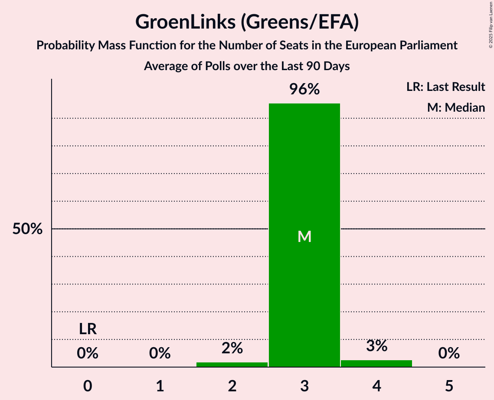

# GroenLinks (Greens/EFA)

<a href="#voting-intentions">Voting Intentions</a> | <a href="#seats">Seats</a>

## Voting Intentions

Last result: **7.0%** (General Election of 23 May 2019)

### Confidence Intervals

| Period     | Polling firm/Commissioner(s) | Median | 80% Confidence Interval | 90% Confidence Interval | 95% Confidence Interval | 99% Confidence Interval |
|:----------:|:----------------:|:-----------:|:-----------------------:|:-----------------------:|:-----------------------:|:-----------------------:|
| N/A | [Poll Average](average.html) | 9.4% | 8.8–10.1% | 8.6–10.3% | 8.4–10.5% | 8.1–10.8% |
| [27 May–2 June 2019](2019-06-02-Peilnl.html) | Peil.nl | 9.4% | 8.7–10.1% | 8.6–10.3% | 8.4–10.5% | 8.1–10.9% |

### Probability Mass Function

The following table shows the probability mass function per percentage block of voting intentions for the [poll average](average.html) for GroenLinks (Greens/EFA).

| Voting Intentions | Probability | Accumulated | Special Marks |
|:-----------------:|:-----------:|:-----------:|:-------------:|
| 6.5–7.5% | 0% | 100% | Last Result |
| 7.5–8.5% | 5% | 100% |  |
| 8.5–9.5% | 56% | 95% | Median |
| 9.5–10.5% | 38% | 40% |  |
| 10.5–11.5% | 2% | 2% |  |
| 11.5–12.5% | 0% | 0% |  |

## Seats

Last result: **2** seats (General Election of 23 May 2019)

### Confidence Intervals

| Period     | Polling firm/Commissioner(s) | Median | 80% Confidence Interval | 90% Confidence Interval | 95% Confidence Interval | 99% Confidence Interval |
|:----------:|:----------------:|:------:|:-----------------------:|:-----------------------:|:-----------------------:|:-----------------------:|
| N/A | [Poll Average](average.html) | 3 | 2–3 | 2–3 | 2–3 | 2–3 |
| [27 May–2 June 2019](2019-06-02-Peilnl.html) | Peil.nl | 3 | 2–3 | 2–3 | 2–3 | 2–3 |

### Probability Mass Function

The following table shows the probability mass function per seat for the [poll average](average.html) for GroenLinks (Greens/EFA).

| Number of Seats | Probability | Accumulated | Special Marks |
|:---------------:|:-----------:|:-----------:|:-------------:|
| 2 | 20% | 100% | Last Result |
| 3 | 80% | 80% | Median |
| 4 | 0% | 0% |  |

