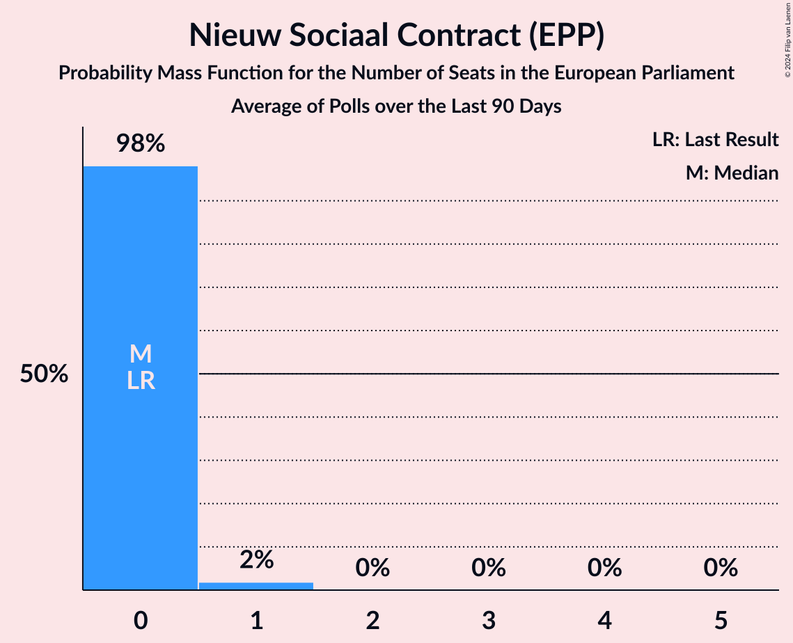

# Nieuw Sociaal Contract (EPP)

<a href="#voting-intentions">Voting Intentions</a> | <a href="#seats">Seats</a>

## Voting Intentions

Last result: **0.0%** (General Election of 6 June 2024)

### Confidence Intervals

| Period     | Polling firm/Commissioner(s) | Median | 80% Confidence Interval | 90% Confidence Interval | 95% Confidence Interval | 99% Confidence Interval |
|:----------:|:----------------:|:-----------:|:-----------------------:|:-----------------------:|:-----------------------:|:-----------------------:|
| N/A | [Poll Average](average.html) | 1.2% | 1.0–1.6% | 0.9–1.7% | 0.8–1.8% | 0.7–2.0% |
| [30–31 May 2025](2025-05-31-Peilnl.html) | Peil.nl | 0.7% | N/A | N/A | N/A | N/A |
| [23–26 May 2025](2025-05-26-Verian.html) | Verian   EenVandaag | 1.5% | N/A | N/A | N/A | N/A |
| [9–12 May 2025](2025-05-12-IpsosIO.html) | Ipsos I&O | 1.2% | 1.0–1.6% | 0.9–1.7% | 0.8–1.8% | 0.7–2.0% |
| [25–28 April 2025](2025-04-28-Verian.html) | Verian   EenVandaag | 0.8% | 0.6–1.2% | 0.5–1.3% | 0.5–1.4% | 0.4–1.6% |
| [25–26 April 2025](2025-04-26-Peilnl.html) | Peil.nl | 0.7% | 0.5–0.9% | 0.5–1.0% | 0.4–1.0% | 0.4–1.2% |
| [11–14 April 2025](2025-04-14-IpsosIO.html) | Ipsos I&O | 1.3% | 1.0–1.7% | 0.9–1.8% | 0.9–1.9% | 0.8–2.1% |
| [3–4 April 2025](2025-04-04-Peilnl.html) | Peil.nl | 1.3% | 1.1–1.6% | 1.0–1.7% | 1.0–1.8% | 0.9–2.0% |
| [28–29 March 2025](2025-03-29-Peilnl.html) | Peil.nl | 1.3% | 1.1–1.6% | 1.0–1.7% | 1.0–1.8% | 0.9–2.0% |
| [21–24 March 2025](2025-03-24-Verian.html) | Verian   EenVandaag | 1.8% | 1.4–2.3% | 1.3–2.5% | 1.2–2.6% | 1.1–2.9% |
| [14–17 March 2025](2025-03-17-IpsosIO.html) | Ipsos I&O | 2.1% | 1.8–2.6% | 1.7–2.7% | 1.6–2.8% | 1.4–3.1% |
| [7–8 March 2025](2025-03-08-Peilnl.html) | Peil.nl | 2.0% | 1.7–2.4% | 1.6–2.5% | 1.6–2.6% | 1.4–2.8% |
| [21–24 February 2025](2025-02-24-Verian.html) | Verian   EenVandaag | 1.7% | 1.0–1.8% | 0.9–1.9% | 0.9–2.0% | 0.7–2.3% |
| [21–22 February 2025](2025-02-22-Peilnl.html) | Peil.nl | 2.0% | 1.7–2.4% | 1.6–2.5% | 1.6–2.6% | 1.4–2.8% |
| [14–17 February 2025](2025-02-17-IpsosIO.html) | Ipsos I&O | 2.1% | 1.7–2.5% | 1.6–2.7% | 1.6–2.8% | 1.4–3.0% |
| [24–27 January 2025](2025-01-27-Verian.html) | Verian   EenVandaag | 2.2% | 1.8–2.7% | 1.7–2.9% | 1.6–3.0% | 1.4–3.3% |
| [24–25 January 2025](2025-01-25-Peilnl.html) | Peil.nl | 2.0% | 1.7–2.4% | 1.6–2.5% | 1.6–2.6% | 1.4–2.8% |
| [17–20 January 2025](2025-01-20-IpsosIO.html) | Ipsos I&O | 1.9% | 1.6–2.3% | 1.5–2.4% | 1.4–2.5% | 1.3–2.8% |
| [24–28 December 2024](2024-12-28-Verian.html) | Verian   EenVandaag | 1.8% | 1.4–2.3% | 1.3–2.4% | 1.2–2.5% | 1.1–2.8% |
| [13–14 December 2024](2024-12-14-Peilnl.html) | Peil.nl | 2.0% | 1.7–2.4% | 1.6–2.5% | 1.6–2.6% | 1.4–2.8% |
| [6–9 December 2024](2024-12-09-IpsosIO.html) | Ipsos I&O | 2.1% | 1.7–2.6% | 1.6–2.7% | 1.5–2.8% | 1.4–3.1% |
| [22–25 November 2024](2024-11-25-Verian.html) | Verian   EenVandaag | 2.2% | 1.6–2.5% | 1.5–2.7% | 1.4–2.8% | 1.2–3.1% |
| [22–23 November 2024](2024-11-23-Peilnl.html) | Peil.nl | 2.0% | 1.7–2.4% | 1.6–2.5% | 1.6–2.6% | 1.4–2.8% |
| [9–11 November 2024](2024-11-11-IpsosIO.html) | Ipsos I&O | 2.3% | 1.9–2.8% | 1.8–2.9% | 1.7–3.0% | 1.5–3.3% |
| [8–9 November 2024](2024-11-09-Peilnl.html) | Peil.nl | 2.7% | 2.3–3.1% | 2.2–3.2% | 2.1–3.3% | 2.0–3.5% |
| [25–28 October 2024](2024-10-28-Verian.html) | Verian   EenVandaag | 2.8% | 2.2–3.3% | 2.1–3.4% | 2.0–3.6% | 1.8–3.9% |
| [18–21 October 2024](2024-10-21-IpsosIO.html) | Ipsos I&O | 2.7% | 2.3–3.2% | 2.2–3.4% | 2.1–3.5% | 1.9–3.7% |
| [12 October 2024](2024-10-12-Peilnl.html) | Peil.nl | 2.7% | 2.3–3.1% | 2.2–3.2% | 2.1–3.3% | 2.0–3.5% |
| [28 September 2024](2024-09-28-Peilnl.html) | Peil.nl | 3.3% | 2.9–3.8% | 2.8–3.9% | 2.7–4.0% | 2.6–4.3% |
| [20–23 September 2024](2024-09-23-Verian.html) | Verian   EenVandaag | 2.0% | 1.6–2.5% | 1.5–2.7% | 1.4–2.8% | 1.2–3.1% |
| [20–23 September 2024](2024-09-23-IpsosIO.html) | Ipsos I&O | 4.0% | 3.5–4.6% | 3.3–4.8% | 3.2–5.0% | 3.0–5.3% |
| [13–16 September 2024](2024-09-16-IpsosIO.html) | Ipsos I&O | 4.4% | 3.9–5.0% | 3.7–5.2% | 3.6–5.3% | 3.4–5.6% |
| [14–15 September 2024](2024-09-15-Peilnl.html) | Peil.nl | 4.7% | 4.3–5.1% | 4.2–5.2% | 4.1–5.3% | 3.9–5.5% |
| [23–26 August 2024](2024-08-26-Verian.html) | Verian   EenVandaag | 5.9% | 5.3–6.8% | 5.1–7.0% | 4.9–7.2% | 4.6–7.7% |
| [26–29 July 2024](2024-07-29-IpsosIO.html) | Ipsos I&O   EenVandaag | 7.3% | 6.3–8.4% | 6.1–8.8% | 5.8–9.1% | 5.4–9.6% |
| [6 July 2024](2024-07-06-Peilnl.html) | Peil.nl | 5.3% | 4.8–5.9% | 4.7–6.1% | 4.6–6.2% | 4.4–6.5% |
| [28–29 June 2024](2024-06-29-Peilnl.html) | Peil.nl | 5.3% | N/A | N/A | N/A | N/A |
| [21–24 June 2024](2024-06-24-IpsosIO.html) | Ipsos I&O   EenVandaag | 8.0% | N/A | N/A | N/A | N/A |
| [14–17 June 2024](2024-06-17-IpsosIO.html) | Ipsos I&O | 4.5% | N/A | N/A | N/A | N/A |

### Probability Mass Function

The following table shows the probability mass function per percentage block of voting intentions for the [poll average](average.html) for Nieuw Sociaal Contract (EPP).

| Voting Intentions | Probability | Accumulated | Special Marks |
|:-----------------:|:-----------:|:-----------:|:-------------:|
| 0.0–0.5% | 0% | 100% | Last Result |
| 0.5–1.5% | 89% | 100% | Median |
| 1.5–2.5% | 11% | 11% |  |
| 2.5–3.5% | 0% | 0% |  |

## Seats

Last result: **0** seats (General Election of 6 June 2024)

### Confidence Intervals

| Period     | Polling firm/Commissioner(s) | Median | 80% Confidence Interval | 90% Confidence Interval | 95% Confidence Interval | 99% Confidence Interval |
|:----------:|:----------------:|:------:|:-----------------------:|:-----------------------:|:-----------------------:|:-----------------------:|
| N/A | [Poll Average](average.html) | 0 | 0 | 0 | 0 | 0 |
| [30–31 May 2025](2025-05-31-Peilnl.html) | Peil.nl |  |  |  |  |  |
| [23–26 May 2025](2025-05-26-Verian.html) | Verian   EenVandaag |  |  |  |  |  |
| [9–12 May 2025](2025-05-12-IpsosIO.html) | Ipsos I&O | 0 | 0 | 0 | 0 | 0 |
| [25–28 April 2025](2025-04-28-Verian.html) | Verian   EenVandaag | 0 | 0 | 0 | 0 | 0 |
| [25–26 April 2025](2025-04-26-Peilnl.html) | Peil.nl | 0 | 0 | 0 | 0 | 0 |
| [11–14 April 2025](2025-04-14-IpsosIO.html) | Ipsos I&O | 0 | 0 | 0 | 0 | 0 |
| [3–4 April 2025](2025-04-04-Peilnl.html) | Peil.nl | 0 | 0 | 0 | 0 | 0 |
| [28–29 March 2025](2025-03-29-Peilnl.html) | Peil.nl | 0 | 0 | 0 | 0 | 0 |
| [21–24 March 2025](2025-03-24-Verian.html) | Verian   EenVandaag | 0 | 0 | 0 | 0 | 0 |
| [14–17 March 2025](2025-03-17-IpsosIO.html) | Ipsos I&O | 0 | 0 | 0 | 0 | 0 |
| [7–8 March 2025](2025-03-08-Peilnl.html) | Peil.nl | 0 | 0 | 0 | 0 | 0 |
| [21–24 February 2025](2025-02-24-Verian.html) | Verian   EenVandaag | 0 | 0 | 0 | 0 | 0 |
| [21–22 February 2025](2025-02-22-Peilnl.html) | Peil.nl | 0 | 0 | 0 | 0 | 0 |
| [14–17 February 2025](2025-02-17-IpsosIO.html) | Ipsos I&O | 0 | 0 | 0 | 0 | 0 |
| [24–27 January 2025](2025-01-27-Verian.html) | Verian   EenVandaag | 0 | 0 | 0 | 0 | 0 |
| [24–25 January 2025](2025-01-25-Peilnl.html) | Peil.nl | 0 | 0 | 0 | 0 | 0 |
| [17–20 January 2025](2025-01-20-IpsosIO.html) | Ipsos I&O | 0 | 0 | 0 | 0 | 0 |
| [24–28 December 2024](2024-12-28-Verian.html) | Verian   EenVandaag | 0 | 0 | 0 | 0 | 0 |
| [13–14 December 2024](2024-12-14-Peilnl.html) | Peil.nl | 0 | 0 | 0 | 0 | 0 |
| [6–9 December 2024](2024-12-09-IpsosIO.html) | Ipsos I&O | 0 | 0 | 0 | 0 | 0 |
| [22–25 November 2024](2024-11-25-Verian.html) | Verian   EenVandaag | 0 | 0 | 0 | 0 | 0 |
| [22–23 November 2024](2024-11-23-Peilnl.html) | Peil.nl | 0 | 0 | 0 | 0 | 0 |
| [9–11 November 2024](2024-11-11-IpsosIO.html) | Ipsos I&O | 0 | 0 | 0 | 0 | 0 |
| [8–9 November 2024](2024-11-09-Peilnl.html) | Peil.nl | 0 | 0 | 0 | 0 | 0 |
| [25–28 October 2024](2024-10-28-Verian.html) | Verian   EenVandaag | 0 | 0–1 | 0–1 | 0–1 | 0–1 |
| [18–21 October 2024](2024-10-21-IpsosIO.html) | Ipsos I&O | 0 | 0–1 | 0–1 | 0–1 | 0–1 |
| [12 October 2024](2024-10-12-Peilnl.html) | Peil.nl | 0 | 0 | 0 | 0 | 0 |
| [28 September 2024](2024-09-28-Peilnl.html) | Peil.nl | 1 | 1 | 1 | 0–1 | 0–1 |
| [20–23 September 2024](2024-09-23-Verian.html) | Verian   EenVandaag | 0 | 0 | 0 | 0 | 0 |
| [20–23 September 2024](2024-09-23-IpsosIO.html) | Ipsos I&O | 1 | 1 | 0–1 | 0–1 | 0–2 |
| [13–16 September 2024](2024-09-16-IpsosIO.html) | Ipsos I&O | 1 | 1 | 1 | 1–2 | 0–2 |
| [14–15 September 2024](2024-09-15-Peilnl.html) | Peil.nl | 1 | 1 | 1 | 1 | 1–2 |
| [23–26 August 2024](2024-08-26-Verian.html) | Verian   EenVandaag | 2 | 2 | 2 | 2 | 2–3 |
| [26–29 July 2024](2024-07-29-IpsosIO.html) | Ipsos I&O   EenVandaag | 2 | 2 | 2 | 2–3 | 2–3 |
| [6 July 2024](2024-07-06-Peilnl.html) | Peil.nl | 1 | 1 | 1 | 1–2 | 1–2 |
| [28–29 June 2024](2024-06-29-Peilnl.html) | Peil.nl |  |  |  |  |  |
| [21–24 June 2024](2024-06-24-IpsosIO.html) | Ipsos I&O   EenVandaag |  |  |  |  |  |
| [14–17 June 2024](2024-06-17-IpsosIO.html) | Ipsos I&O |  |  |  |  |  |

### Probability Mass Function

The following table shows the probability mass function per seat for the [poll average](average.html) for Nieuw Sociaal Contract (EPP).

| Number of Seats | Probability | Accumulated | Special Marks |
|:---------------:|:-----------:|:-----------:|:-------------:|
| 0 | 100% | 100% | Last Result, Median |

