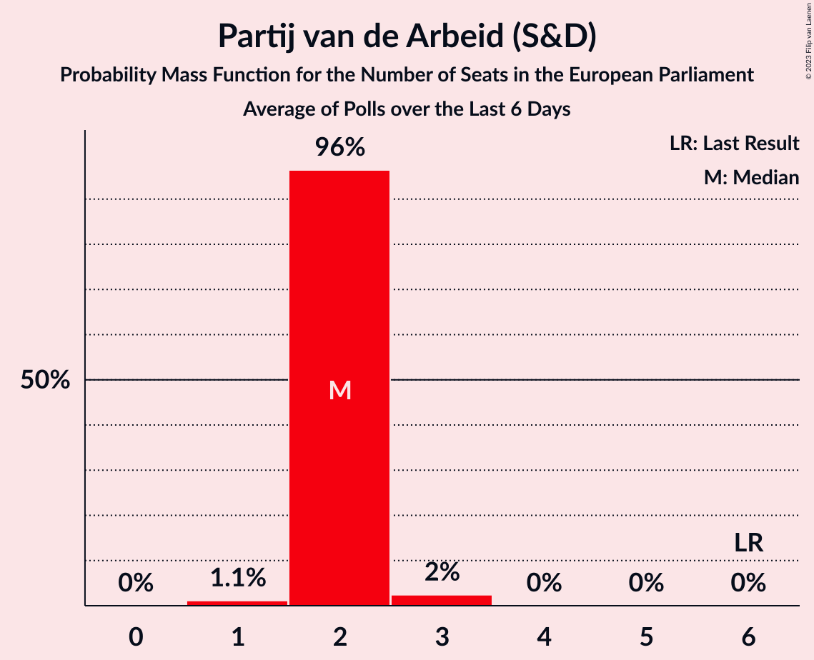

# Partij van de Arbeid (S&D)

<a href="#voting-intentions">Voting Intentions</a> | <a href="#seats">Seats</a>

## Voting Intentions

Last result: **0.0%** (General Election of 6 June 2024)

### Confidence Intervals

| Period     | Polling firm/Commissioner(s) | Median | 80% Confidence Interval | 90% Confidence Interval | 95% Confidence Interval | 99% Confidence Interval |
|:----------:|:----------------:|:-----------:|:-----------------------:|:-----------------------:|:-----------------------:|:-----------------------:|
| N/A | [Poll Average](average.html) | 9.4% | 8.3–10.4% | 8.1–10.6% | 7.9–10.9% | 7.4–11.3% |
| [30–31 May 2025](2025-05-31-Peilnl.html) | Peil.nl | 10.0% | 9.3–10.7% | 9.1–10.9% | 9.0–11.1% | 8.7–11.5% |
| [23–26 May 2025](2025-05-26-Verian.html) | Verian   EenVandaag | 8.9% | 8.1–9.9% | 7.8–10.2% | 7.6–10.5% | 7.2–10.9% |
| [9–12 May 2025](2025-05-12-IpsosIO.html) | Ipsos I&O | 9.1% | 8.3–9.9% | 8.1–10.1% | 7.9–10.3% | 7.6–10.8% |
| [25–28 April 2025](2025-04-28-Verian.html) | Verian   EenVandaag | 8.6% | 7.8–9.6% | 7.5–9.9% | 7.3–10.1% | 7.0–10.6% |
| [25–26 April 2025](2025-04-26-Peilnl.html) | Peil.nl | 9.7% | 9.0–10.4% | 8.8–10.6% | 8.7–10.8% | 8.4–11.1% |
| [11–14 April 2025](2025-04-14-IpsosIO.html) | Ipsos I&O | 8.4% | 7.6–9.3% | 7.4–9.5% | 7.2–9.7% | 6.9–10.1% |
| [3–4 April 2025](2025-04-04-Peilnl.html) | Peil.nl | 9.7% | 9.0–10.4% | 8.8–10.6% | 8.7–10.8% | 8.4–11.1% |
| [28–29 March 2025](2025-03-29-Peilnl.html) | Peil.nl | 9.3% | 8.7–10.1% | 8.5–10.3% | 8.3–10.4% | 8.0–10.8% |
| [21–24 March 2025](2025-03-24-Verian.html) | Verian   EenVandaag | 8.7% | 7.8–9.7% | 7.6–10.0% | 7.4–10.2% | 7.0–10.7% |
| [14–17 March 2025](2025-03-17-IpsosIO.html) | Ipsos I&O | 8.5% | 7.7–9.3% | 7.5–9.5% | 7.3–9.7% | 7.0–10.1% |
| [7–8 March 2025](2025-03-08-Peilnl.html) | Peil.nl | 9.0% | 8.4–9.7% | 8.2–9.9% | 8.0–10.1% | 7.7–10.4% |
| [21–24 February 2025](2025-02-24-Verian.html) | Verian   EenVandaag | 8.7% | 8.1–10.0% | 7.9–10.3% | 7.7–10.5% | 7.3–11.0% |
| [21–22 February 2025](2025-02-22-Peilnl.html) | Peil.nl | 8.0% | 7.4–8.7% | 7.2–8.9% | 7.1–9.0% | 6.8–9.4% |
| [14–17 February 2025](2025-02-17-IpsosIO.html) | Ipsos I&O | 7.7% | 7.0–8.5% | 6.8–8.7% | 6.6–8.9% | 6.3–9.3% |
| [24–27 January 2025](2025-01-27-Verian.html) | Verian   EenVandaag | 7.9% | 7.1–8.9% | 6.9–9.1% | 6.7–9.4% | 6.3–9.8% |
| [24–25 January 2025](2025-01-25-Peilnl.html) | Peil.nl | 8.0% | 7.4–8.7% | 7.2–8.9% | 7.1–9.0% | 6.8–9.4% |
| [17–20 January 2025](2025-01-20-IpsosIO.html) | Ipsos I&O | 7.8% | 7.1–8.5% | 6.9–8.7% | 6.7–8.9% | 6.4–9.3% |
| [24–28 December 2024](2024-12-28-Verian.html) | Verian   EenVandaag | 8.5% | 7.6–9.4% | 7.4–9.7% | 7.2–10.0% | 6.8–10.4% |
| [13–14 December 2024](2024-12-14-Peilnl.html) | Peil.nl | 8.3% | 7.7–9.0% | 7.5–9.2% | 7.4–9.4% | 7.1–9.7% |
| [6–9 December 2024](2024-12-09-IpsosIO.html) | Ipsos I&O | 7.1% | 6.4–7.9% | 6.2–8.2% | 6.1–8.4% | 5.7–8.8% |
| [22–25 November 2024](2024-11-25-Verian.html) | Verian   EenVandaag | 8.4% | 7.8–9.6% | 7.5–9.9% | 7.3–10.2% | 7.0–10.6% |
| [22–23 November 2024](2024-11-23-Peilnl.html) | Peil.nl | 8.3% | 7.7–9.0% | 7.5–9.2% | 7.4–9.4% | 7.1–9.7% |
| [9–11 November 2024](2024-11-11-IpsosIO.html) | Ipsos I&O | 8.1% | 7.4–9.0% | 7.2–9.2% | 7.0–9.4% | 6.7–9.8% |
| [8–9 November 2024](2024-11-09-Peilnl.html) | Peil.nl | 8.3% | 7.7–9.0% | 7.5–9.2% | 7.4–9.4% | 7.1–9.7% |
| [25–28 October 2024](2024-10-28-Verian.html) | Verian   EenVandaag | 7.7% | 7.2–8.9% | 6.9–9.2% | 6.8–9.4% | 6.4–9.9% |
| [18–21 October 2024](2024-10-21-IpsosIO.html) | Ipsos I&O | 8.4% | 7.6–9.2% | 7.4–9.4% | 7.3–9.6% | 6.9–10.0% |
| [12 October 2024](2024-10-12-Peilnl.html) | Peil.nl | 8.7% | 8.0–9.4% | 7.8–9.6% | 7.7–9.7% | 7.4–10.1% |
| [28 September 2024](2024-09-28-Peilnl.html) | Peil.nl | 8.7% | 8.0–9.4% | 7.8–9.6% | 7.7–9.7% | 7.4–10.1% |
| [20–23 September 2024](2024-09-23-Verian.html) | Verian   EenVandaag | 8.8% | 8.1–9.9% | 7.9–10.2% | 7.7–10.5% | 7.3–11.0% |
| [20–23 September 2024](2024-09-23-IpsosIO.html) | Ipsos I&O | 8.1% | 7.3–8.9% | 7.1–9.1% | 6.9–9.4% | 6.6–9.8% |
| [13–16 September 2024](2024-09-16-IpsosIO.html) | Ipsos I&O | 7.8% | 7.1–8.6% | 7.0–8.8% | 6.8–9.0% | 6.5–9.4% |
| [14–15 September 2024](2024-09-15-Peilnl.html) | Peil.nl | 8.7% | 8.2–9.2% | 8.0–9.3% | 7.9–9.5% | 7.7–9.7% |
| [23–26 August 2024](2024-08-26-Verian.html) | Verian   EenVandaag | 8.7% | 8.1–10.0% | 7.9–10.2% | 7.7–10.5% | 7.3–11.0% |
| [26–29 July 2024](2024-07-29-IpsosIO.html) | Ipsos I&O   EenVandaag | 8.7% | 7.9–10.2% | 7.6–10.6% | 7.3–10.9% | 6.9–11.5% |
| [6 July 2024](2024-07-06-Peilnl.html) | Peil.nl | 8.3% | 7.7–9.0% | 7.5–9.2% | 7.4–9.4% | 7.1–9.7% |
| [28–29 June 2024](2024-06-29-Peilnl.html) | Peil.nl | 8.7% | N/A | N/A | N/A | N/A |
| [21–24 June 2024](2024-06-24-IpsosIO.html) | Ipsos I&O   EenVandaag | 8.9% | N/A | N/A | N/A | N/A |
| [14–17 June 2024](2024-06-17-IpsosIO.html) | Ipsos I&O | 8.7% | N/A | N/A | N/A | N/A |

### Probability Mass Function

The following table shows the probability mass function per percentage block of voting intentions for the [poll average](average.html) for Partij van de Arbeid (S&D).

| Voting Intentions | Probability | Accumulated | Special Marks |
|:-----------------:|:-----------:|:-----------:|:-------------:|
| 0.0–0.5% | 0% | 100% | Last Result |
| 0.5–1.5% | 0% | 100% |  |
| 1.5–2.5% | 0% | 100% |  |
| 2.5–3.5% | 0% | 100% |  |
| 3.5–4.5% | 0% | 100% |  |
| 4.5–5.5% | 0% | 100% |  |
| 5.5–6.5% | 0% | 100% |  |
| 6.5–7.5% | 0.8% | 100% |  |
| 7.5–8.5% | 15% | 99.2% |  |
| 8.5–9.5% | 43% | 84% | Median |
| 9.5–10.5% | 35% | 41% |  |
| 10.5–11.5% | 7% | 7% |  |
| 11.5–12.5% | 0.1% | 0.1% |  |
| 12.5–13.5% | 0% | 0% |  |

## Seats

Last result: **0** seats (General Election of 6 June 2024)

### Confidence Intervals

| Period     | Polling firm/Commissioner(s) | Median | 80% Confidence Interval | 90% Confidence Interval | 95% Confidence Interval | 99% Confidence Interval |
|:----------:|:----------------:|:------:|:-----------------------:|:-----------------------:|:-----------------------:|:-----------------------:|
| N/A | [Poll Average](average.html) | 4 | 3–4 | 3–4 | 3–5 | 3–5 |
| [30–31 May 2025](2025-05-31-Peilnl.html) | Peil.nl | 4 | 3–4 | 3–5 | 3–5 | 3–5 |
| [23–26 May 2025](2025-05-26-Verian.html) | Verian   EenVandaag | 4 | 4 | 3–4 | 3–4 | 3–4 |
| [9–12 May 2025](2025-05-12-IpsosIO.html) | Ipsos I&O | 3 | 3–4 | 3–4 | 3–4 | 3–5 |
| [25–28 April 2025](2025-04-28-Verian.html) | Verian   EenVandaag | 4 | 3–4 | 3–4 | 3–4 | 3–4 |
| [25–26 April 2025](2025-04-26-Peilnl.html) | Peil.nl | 4 | 3–4 | 3–4 | 3–4 | 3–5 |
| [11–14 April 2025](2025-04-14-IpsosIO.html) | Ipsos I&O | 3 | 3–4 | 3–4 | 3–4 | 3–4 |
| [3–4 April 2025](2025-04-04-Peilnl.html) | Peil.nl | 4 | 4 | 3–4 | 3–4 | 3–4 |
| [28–29 March 2025](2025-03-29-Peilnl.html) | Peil.nl | 3 | 3–4 | 3–4 | 3–4 | 3–5 |
| [21–24 March 2025](2025-03-24-Verian.html) | Verian   EenVandaag | 3 | 3 | 3 | 3 | 3 |
| [14–17 March 2025](2025-03-17-IpsosIO.html) | Ipsos I&O | 4 | 4 | 3–4 | 3–4 | 3–4 |
| [7–8 March 2025](2025-03-08-Peilnl.html) | Peil.nl | 3 | 3–4 | 3–4 | 3–4 | 3–4 |
| [21–24 February 2025](2025-02-24-Verian.html) | Verian   EenVandaag | 4 | 3–4 | 3–4 | 3–4 | 3–4 |
| [21–22 February 2025](2025-02-22-Peilnl.html) | Peil.nl | 3 | 3 | 3 | 3 | 3–4 |
| [14–17 February 2025](2025-02-17-IpsosIO.html) | Ipsos I&O | 3 | 3 | 3 | 3 | 2–4 |
| [24–27 January 2025](2025-01-27-Verian.html) | Verian   EenVandaag | 3 | 3 | 3 | 3 | 2–4 |
| [24–25 January 2025](2025-01-25-Peilnl.html) | Peil.nl | 3 | 3 | 3–4 | 3–4 | 3–4 |
| [17–20 January 2025](2025-01-20-IpsosIO.html) | Ipsos I&O | 3 | 3 | 3 | 3–4 | 2–4 |
| [24–28 December 2024](2024-12-28-Verian.html) | Verian   EenVandaag | 4 | 3–4 | 3–4 | 3–4 | 3–4 |
| [13–14 December 2024](2024-12-14-Peilnl.html) | Peil.nl | 3 | 3 | 3 | 3–4 | 3–4 |
| [6–9 December 2024](2024-12-09-IpsosIO.html) | Ipsos I&O | 3 | 3 | 2–4 | 2–4 | 2–4 |
| [22–25 November 2024](2024-11-25-Verian.html) | Verian   EenVandaag | 3 | 3–4 | 3–4 | 3–4 | 3–4 |
| [22–23 November 2024](2024-11-23-Peilnl.html) | Peil.nl | 3 | 3 | 3 | 3 | 3 |
| [9–11 November 2024](2024-11-11-IpsosIO.html) | Ipsos I&O | 3 | 3 | 3 | 3–4 | 2–4 |
| [8–9 November 2024](2024-11-09-Peilnl.html) | Peil.nl | 3 | 3–4 | 3–4 | 3–4 | 3–4 |
| [25–28 October 2024](2024-10-28-Verian.html) | Verian   EenVandaag | 3 | 3 | 3 | 3 | 3–4 |
| [18–21 October 2024](2024-10-21-IpsosIO.html) | Ipsos I&O | 3 | 3–4 | 3–4 | 3–4 | 3–4 |
| [12 October 2024](2024-10-12-Peilnl.html) | Peil.nl | 4 | 3–4 | 3–4 | 3–4 | 3–4 |
| [28 September 2024](2024-09-28-Peilnl.html) | Peil.nl | 4 | 4 | 3–4 | 3–4 | 3–4 |
| [20–23 September 2024](2024-09-23-Verian.html) | Verian   EenVandaag | 4 | 3–5 | 3–5 | 3–5 | 3–5 |
| [20–23 September 2024](2024-09-23-IpsosIO.html) | Ipsos I&O | 3 | 3–4 | 3–4 | 3–4 | 2–4 |
| [13–16 September 2024](2024-09-16-IpsosIO.html) | Ipsos I&O | 3 | 2–4 | 2–4 | 2–4 | 2–4 |
| [14–15 September 2024](2024-09-15-Peilnl.html) | Peil.nl | 4 | 4 | 4 | 3–4 | 3–4 |
| [23–26 August 2024](2024-08-26-Verian.html) | Verian   EenVandaag | 3 | 3 | 3–4 | 3–4 | 3–4 |
| [26–29 July 2024](2024-07-29-IpsosIO.html) | Ipsos I&O   EenVandaag | 4 | 3–4 | 3–4 | 3–4 | 3–4 |
| [6 July 2024](2024-07-06-Peilnl.html) | Peil.nl | 3 | 3 | 3 | 3 | 3–4 |
| [28–29 June 2024](2024-06-29-Peilnl.html) | Peil.nl |  |  |  |  |  |
| [21–24 June 2024](2024-06-24-IpsosIO.html) | Ipsos I&O   EenVandaag |  |  |  |  |  |
| [14–17 June 2024](2024-06-17-IpsosIO.html) | Ipsos I&O |  |  |  |  |  |

### Probability Mass Function

The following table shows the probability mass function per seat for the [poll average](average.html) for Partij van de Arbeid (S&D).

| Number of Seats | Probability | Accumulated | Special Marks |
|:---------------:|:-----------:|:-----------:|:-------------:|
| 0 | 0% | 100% | Last Result |
| 1 | 0% | 100% |  |
| 2 | 0% | 100% |  |
| 3 | 33% | 100% |  |
| 4 | 65% | 67% | Median |
| 5 | 3% | 3% |  |
| 6 | 0% | 0% |  |

