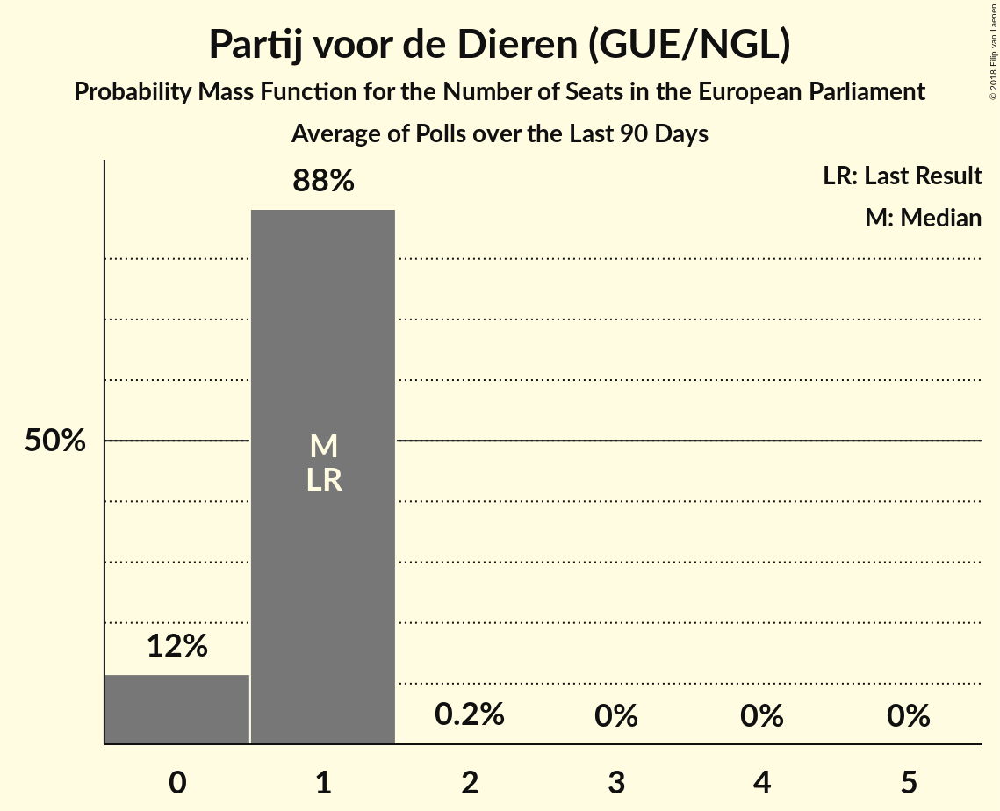

# Partij voor de Dieren (GUE/NGL)

<a href="#voting-intentions">Voting Intentions</a> | <a href="#seats">Seats</a>

## Voting Intentions

Last result: **0.0%** (General Election of 6 June 2024)

### Confidence Intervals

| Period     | Polling firm/Commissioner(s) | Median | 80% Confidence Interval | 90% Confidence Interval | 95% Confidence Interval | 99% Confidence Interval |
|:----------:|:----------------:|:-----------:|:-----------------------:|:-----------------------:|:-----------------------:|:-----------------------:|
| N/A | [Poll Average](average.html) | 3.3% | 2.5–4.7% | 2.4–4.9% | 2.3–5.1% | 2.1–5.4% |
| [30–31 May 2025](2025-05-31-Peilnl.html) | Peil.nl | 2.7% | 2.3–3.1% | 2.2–3.2% | 2.1–3.3% | 2.0–3.5% |
| [23–26 May 2025](2025-05-26-Verian.html) | Verian   EenVandaag | 3.2% | 2.7–3.8% | 2.5–4.0% | 2.4–4.2% | 2.2–4.5% |
| [9–12 May 2025](2025-05-12-IpsosIO.html) | Ipsos I&O | 4.4% | 3.9–5.0% | 3.7–5.2% | 3.6–5.3% | 3.4–5.7% |
| [25–28 April 2025](2025-04-28-Verian.html) | Verian   EenVandaag | 3.4% | 2.9–4.1% | 2.8–4.3% | 2.6–4.5% | 2.4–4.8% |
| [25–26 April 2025](2025-04-26-Peilnl.html) | Peil.nl | 2.7% | 2.3–3.1% | 2.2–3.2% | 2.1–3.3% | 2.0–3.5% |
| [11–14 April 2025](2025-04-14-IpsosIO.html) | Ipsos I&O | 4.6% | 4.1–5.3% | 3.9–5.5% | 3.8–5.6% | 3.5–6.0% |
| [3–4 April 2025](2025-04-04-Peilnl.html) | Peil.nl | 2.7% | 2.3–3.1% | 2.2–3.2% | 2.1–3.3% | 2.0–3.5% |
| [28–29 March 2025](2025-03-29-Peilnl.html) | Peil.nl | 2.7% | 2.3–3.1% | 2.2–3.2% | 2.1–3.3% | 2.0–3.5% |
| [21–24 March 2025](2025-03-24-Verian.html) | Verian   EenVandaag | 3.7% | 3.2–4.4% | 3.0–4.6% | 2.9–4.8% | 2.6–5.1% |
| [14–17 March 2025](2025-03-17-IpsosIO.html) | Ipsos I&O | 4.3% | 3.8–4.9% | 3.6–5.1% | 3.5–5.2% | 3.3–5.5% |
| [7–8 March 2025](2025-03-08-Peilnl.html) | Peil.nl | 2.7% | 2.3–3.1% | 2.2–3.2% | 2.1–3.3% | 2.0–3.5% |
| [21–24 February 2025](2025-02-24-Verian.html) | Verian   EenVandaag | 3.4% | 2.8–4.0% | 2.7–4.2% | 2.6–4.4% | 2.3–4.7% |
| [21–22 February 2025](2025-02-22-Peilnl.html) | Peil.nl | 3.3% | 2.9–3.8% | 2.8–3.9% | 2.7–4.0% | 2.6–4.3% |
| [14–17 February 2025](2025-02-17-IpsosIO.html) | Ipsos I&O | 5.6% | 5.0–6.3% | 4.8–6.5% | 4.7–6.6% | 4.4–7.0% |
| [24–27 January 2025](2025-01-27-Verian.html) | Verian   EenVandaag | 3.5% | 2.9–4.1% | 2.8–4.3% | 2.7–4.5% | 2.4–4.8% |
| [24–25 January 2025](2025-01-25-Peilnl.html) | Peil.nl | 3.3% | 2.9–3.8% | 2.8–3.9% | 2.7–4.0% | 2.6–4.3% |
| [17–20 January 2025](2025-01-20-IpsosIO.html) | Ipsos I&O | 4.3% | 3.8–4.9% | 3.6–5.0% | 3.5–5.2% | 3.3–5.5% |
| [24–28 December 2024](2024-12-28-Verian.html) | Verian   EenVandaag | 3.5% | 2.9–4.1% | 2.8–4.3% | 2.7–4.5% | 2.4–4.8% |
| [13–14 December 2024](2024-12-14-Peilnl.html) | Peil.nl | 3.3% | 2.9–3.8% | 2.8–3.9% | 2.7–4.0% | 2.6–4.3% |
| [6–9 December 2024](2024-12-09-IpsosIO.html) | Ipsos I&O | 4.9% | 4.3–5.6% | 4.1–5.8% | 4.0–5.9% | 3.7–6.3% |
| [22–25 November 2024](2024-11-25-Verian.html) | Verian   EenVandaag | 3.5% | 2.8–4.0% | 2.7–4.2% | 2.6–4.4% | 2.3–4.7% |
| [22–23 November 2024](2024-11-23-Peilnl.html) | Peil.nl | 2.7% | 2.3–3.1% | 2.2–3.2% | 2.1–3.3% | 2.0–3.5% |
| [9–11 November 2024](2024-11-11-IpsosIO.html) | Ipsos I&O | 4.8% | 4.2–5.5% | 4.1–5.7% | 3.9–5.8% | 3.7–6.2% |
| [8–9 November 2024](2024-11-09-Peilnl.html) | Peil.nl | 2.7% | 2.3–3.1% | 2.2–3.2% | 2.1–3.3% | 2.0–3.5% |
| [25–28 October 2024](2024-10-28-Verian.html) | Verian   EenVandaag | 5.0% | 4.1–5.4% | 3.9–5.6% | 3.7–5.8% | 3.5–6.2% |
| [18–21 October 2024](2024-10-21-IpsosIO.html) | Ipsos I&O | 5.2% | 4.6–5.9% | 4.5–6.0% | 4.3–6.2% | 4.1–6.5% |
| [12 October 2024](2024-10-12-Peilnl.html) | Peil.nl | 2.7% | 2.3–3.1% | 2.2–3.2% | 2.1–3.3% | 2.0–3.5% |
| [28 September 2024](2024-09-28-Peilnl.html) | Peil.nl | 2.7% | 2.3–3.1% | 2.2–3.2% | 2.1–3.3% | 2.0–3.5% |
| [20–23 September 2024](2024-09-23-Verian.html) | Verian   EenVandaag | 3.6% | 2.8–3.9% | 2.7–4.1% | 2.5–4.3% | 2.3–4.6% |
| [20–23 September 2024](2024-09-23-IpsosIO.html) | Ipsos I&O | 5.0% | 4.4–5.7% | 4.3–5.9% | 4.1–6.1% | 3.9–6.4% |
| [13–16 September 2024](2024-09-16-IpsosIO.html) | Ipsos I&O | 4.3% | 3.8–4.9% | 3.6–5.1% | 3.5–5.2% | 3.3–5.5% |
| [14–15 September 2024](2024-09-15-Peilnl.html) | Peil.nl | 2.7% | 2.4–3.0% | 2.3–3.1% | 2.2–3.2% | 2.1–3.3% |
| [23–26 August 2024](2024-08-26-Verian.html) | Verian   EenVandaag | 3.0% | 2.2–3.2% | 2.1–3.4% | 2.0–3.6% | 1.8–3.9% |
| [26–29 July 2024](2024-07-29-IpsosIO.html) | Ipsos I&O   EenVandaag | 3.6% | 2.7–4.2% | 2.5–4.4% | 2.4–4.6% | 2.1–5.1% |
| [6 July 2024](2024-07-06-Peilnl.html) | Peil.nl | 2.7% | 2.3–3.1% | 2.2–3.2% | 2.1–3.3% | 2.0–3.5% |
| [28–29 June 2024](2024-06-29-Peilnl.html) | Peil.nl | 2.7% | N/A | N/A | N/A | N/A |
| [21–24 June 2024](2024-06-24-IpsosIO.html) | Ipsos I&O   EenVandaag | 3.3% | N/A | N/A | N/A | N/A |
| [14–17 June 2024](2024-06-17-IpsosIO.html) | Ipsos I&O | 4.5% | N/A | N/A | N/A | N/A |

### Probability Mass Function

The following table shows the probability mass function per percentage block of voting intentions for the [poll average](average.html) for Partij voor de Dieren (GUE/NGL).

| Voting Intentions | Probability | Accumulated | Special Marks |
|:-----------------:|:-----------:|:-----------:|:-------------:|
| 0.0–0.5% | 0% | 100% | Last Result |
| 0.5–1.5% | 0% | 100% |  |
| 1.5–2.5% | 12% | 100% |  |
| 2.5–3.5% | 47% | 88% | Median |
| 3.5–4.5% | 28% | 41% |  |
| 4.5–5.5% | 12% | 13% |  |
| 5.5–6.5% | 0.3% | 0.3% |  |
| 6.5–7.5% | 0% | 0% |  |

## Seats

Last result: **0** seats (General Election of 6 June 2024)

### Confidence Intervals

| Period     | Polling firm/Commissioner(s) | Median | 80% Confidence Interval | 90% Confidence Interval | 95% Confidence Interval | 99% Confidence Interval |
|:----------:|:----------------:|:------:|:-----------------------:|:-----------------------:|:-----------------------:|:-----------------------:|
| N/A | [Poll Average](average.html) | 1 | 0–1 | 0–2 | 0–2 | 0–2 |
| [30–31 May 2025](2025-05-31-Peilnl.html) | Peil.nl | 0 | 0 | 0 | 0 | 0–1 |
| [23–26 May 2025](2025-05-26-Verian.html) | Verian   EenVandaag | 1 | 0–1 | 0–1 | 0–1 | 0–1 |
| [9–12 May 2025](2025-05-12-IpsosIO.html) | Ipsos I&O | 1 | 1–2 | 1–2 | 1–2 | 0–2 |
| [25–28 April 2025](2025-04-28-Verian.html) | Verian   EenVandaag | 1 | 0–1 | 0–1 | 0–1 | 0–1 |
| [25–26 April 2025](2025-04-26-Peilnl.html) | Peil.nl | 0 | 0 | 0 | 0 | 0 |
| [11–14 April 2025](2025-04-14-IpsosIO.html) | Ipsos I&O | 2 | 1–2 | 1–2 | 1–2 | 0–2 |
| [3–4 April 2025](2025-04-04-Peilnl.html) | Peil.nl | 0 | 0 | 0 | 0 | 0 |
| [28–29 March 2025](2025-03-29-Peilnl.html) | Peil.nl | 0 | 0 | 0–1 | 0–1 | 0–1 |
| [21–24 March 2025](2025-03-24-Verian.html) | Verian   EenVandaag | 1 | 1 | 1 | 0–1 | 0–1 |
| [14–17 March 2025](2025-03-17-IpsosIO.html) | Ipsos I&O | 1 | 1 | 1 | 1 | 1–2 |
| [7–8 March 2025](2025-03-08-Peilnl.html) | Peil.nl | 0 | 0 | 0 | 0 | 0 |
| [21–24 February 2025](2025-02-24-Verian.html) | Verian   EenVandaag | 1 | 0–1 | 0–1 | 0–1 | 0–2 |
| [21–22 February 2025](2025-02-22-Peilnl.html) | Peil.nl | 1 | 0–1 | 0–1 | 0–1 | 0–1 |
| [14–17 February 2025](2025-02-17-IpsosIO.html) | Ipsos I&O | 2 | 2 | 2 | 2 | 2 |
| [24–27 January 2025](2025-01-27-Verian.html) | Verian   EenVandaag | 0 | 0 | 0–1 | 0–1 | 0–1 |
| [24–25 January 2025](2025-01-25-Peilnl.html) | Peil.nl | 1 | 0–1 | 0–1 | 0–1 | 0–1 |
| [17–20 January 2025](2025-01-20-IpsosIO.html) | Ipsos I&O | 1 | 1 | 1–2 | 1–2 | 1–2 |
| [24–28 December 2024](2024-12-28-Verian.html) | Verian   EenVandaag | 2 | 0–2 | 0–2 | 0–2 | 0–2 |
| [13–14 December 2024](2024-12-14-Peilnl.html) | Peil.nl | 1 | 0–1 | 0–1 | 0–1 | 0–1 |
| [6–9 December 2024](2024-12-09-IpsosIO.html) | Ipsos I&O | 2 | 1–2 | 1–2 | 1–2 | 1–2 |
| [22–25 November 2024](2024-11-25-Verian.html) | Verian   EenVandaag | 1 | 0–1 | 0–1 | 0–1 | 0–1 |
| [22–23 November 2024](2024-11-23-Peilnl.html) | Peil.nl | 0 | 0 | 0 | 0 | 0 |
| [9–11 November 2024](2024-11-11-IpsosIO.html) | Ipsos I&O | 2 | 1–2 | 1–2 | 1–2 | 1–2 |
| [8–9 November 2024](2024-11-09-Peilnl.html) | Peil.nl | 0 | 0 | 0 | 0 | 0 |
| [25–28 October 2024](2024-10-28-Verian.html) | Verian   EenVandaag | 1 | 1 | 1 | 1–2 | 1–2 |
| [18–21 October 2024](2024-10-21-IpsosIO.html) | Ipsos I&O | 2 | 1–2 | 1–2 | 1–2 | 1–2 |
| [12 October 2024](2024-10-12-Peilnl.html) | Peil.nl | 0 | 0 | 0 | 0 | 0 |
| [28 September 2024](2024-09-28-Peilnl.html) | Peil.nl | 0 | 0 | 0 | 0 | 0 |
| [20–23 September 2024](2024-09-23-Verian.html) | Verian   EenVandaag | 1 | 1 | 0–1 | 0–1 | 0–1 |
| [20–23 September 2024](2024-09-23-IpsosIO.html) | Ipsos I&O | 2 | 1–2 | 1–2 | 1–2 | 1–2 |
| [13–16 September 2024](2024-09-16-IpsosIO.html) | Ipsos I&O | 1 | 1–2 | 1–2 | 1–2 | 1–2 |
| [14–15 September 2024](2024-09-15-Peilnl.html) | Peil.nl | 0 | 0 | 0 | 0 | 0 |
| [23–26 August 2024](2024-08-26-Verian.html) | Verian   EenVandaag | 0 | 0 | 0–1 | 0–1 | 0–1 |
| [26–29 July 2024](2024-07-29-IpsosIO.html) | Ipsos I&O   EenVandaag | 0 | 0–1 | 0–1 | 0–1 | 0–1 |
| [6 July 2024](2024-07-06-Peilnl.html) | Peil.nl | 0 | 0 | 0 | 0 | 0 |
| [28–29 June 2024](2024-06-29-Peilnl.html) | Peil.nl |  |  |  |  |  |
| [21–24 June 2024](2024-06-24-IpsosIO.html) | Ipsos I&O   EenVandaag |  |  |  |  |  |
| [14–17 June 2024](2024-06-17-IpsosIO.html) | Ipsos I&O |  |  |  |  |  |

### Probability Mass Function

The following table shows the probability mass function per seat for the [poll average](average.html) for Partij voor de Dieren (GUE/NGL).

| Number of Seats | Probability | Accumulated | Special Marks |
|:---------------:|:-----------:|:-----------:|:-------------:|
| 0 | 40% | 100% | Last Result |
| 1 | 54% | 60% | Median |
| 2 | 7% | 7% |  |
| 3 | 0% | 0% |  |

