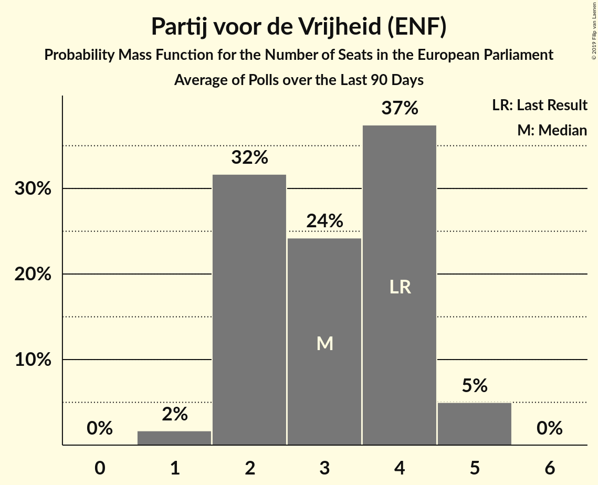

# Partij voor de Vrijheid (ENF)

<a href="#voting-intentions">Voting Intentions</a> | <a href="#seats">Seats</a>

## Voting Intentions

Last result: **13.3%** (General Election of 22 May 2014)

### Confidence Intervals

| Period     | Polling firm/Commissioner(s) | Median | 80% Confidence Interval | 90% Confidence Interval | 95% Confidence Interval | 99% Confidence Interval |
|:----------:|:----------------:|:-----------:|:-----------------------:|:-----------------------:|:-----------------------:|:-----------------------:|
| N/A | [Poll Average](average.html) | 12.0% | 11.0–13.2% | 10.7–13.5% | 10.4–13.8% | 10.0–14.4% |
| [27–30 July 2018](2018-07-30-Ipsos.html) | Ipsos   EenVandaag | 12.0% | 11.0–13.2% | 10.7–13.5% | 10.4–13.8% | 10.0–14.4% |
| [22–25 June 2018](2018-06-25-Ipsos.html) | Ipsos   EenVandaag | 11.4% | 10.3–12.7% | 10.0–13.1% | 9.7–13.4% | 9.2–14.0% |
| [25–28 May 2018](2018-05-28-Ipsos.html) | Ipsos   EenVandaag | 10.5% | 9.4–11.8% | 9.1–12.2% | 8.8–12.5% | 8.3–13.2% |
| [20–23 April 2018](2018-04-23-Ipsos.html) | Ipsos   EenVandaag | 9.4% | 8.4–10.6% | 8.1–10.9% | 7.9–11.2% | 7.4–11.8% |
| [19 March 2018](2018-03-19-Ipsos.html) | Ipsos   EenVandaag | 10.4% | 9.3–11.6% | 9.0–12.0% | 8.8–12.3% | 8.3–12.9% |
| [27 February–4 March 2018](2018-03-04-KantarPublic.html) | Kantar Public | 10.6% | 9.5–11.9% | 9.2–12.3% | 8.9–12.7% | 8.4–13.3% |
| [23–26 February 2018](2018-02-26-Ipsos.html) | Ipsos   EenVandaag | 9.7% | 8.6–11.0% | 8.3–11.4% | 8.1–11.7% | 7.6–12.4% |
| [2–6 February 2018](2018-02-06-IOResearch.html) | I&O Research | 10.6% | 9.9–11.3% | 9.8–11.5% | 9.6–11.6% | 9.3–12.0% |
| [26–29 January 2018](2018-01-29-Ipsos.html) | Ipsos   EenVandaag | 10.7% | 9.5–12.0% | 9.2–12.4% | 8.9–12.7% | 8.4–13.4% |
| [25–28 January 2018](2018-01-28-KantarPublic.html) | Kantar Public | 12.0% | 10.9–13.3% | 10.5–13.7% | 10.3–14.0% | 9.7–14.7% |
| [15–18 December 2017](2017-12-18-GfK.html) | GfK   EenVandaag | 14.0% | 13.0–15.1% | 12.8–15.4% | 12.5–15.7% | 12.1–16.2% |

### Probability Mass Function

The following table shows the probability mass function per percentage block of voting intentions for the [poll average](average.html) for Partij voor de Vrijheid (ENF).

| Voting Intentions | Probability | Accumulated | Special Marks |
|:-----------------:|:-----------:|:-----------:|:-------------:|
| 7.5–8.5% | 0% | 100% |  |
| 8.5–9.5% | 0.1% | 100% |  |
| 9.5–10.5% | 3% | 99.9% |  |
| 10.5–11.5% | 24% | 97% |  |
| 11.5–12.5% | 44% | 72% | Median |
| 12.5–13.5% | 24% | 28% | Last Result |
| 13.5–14.5% | 4% | 5% |  |
| 14.5–15.5% | 0.3% | 0.3% |  |
| 15.5–16.5% | 0% | 0% |  |

## Seats

Last result: **4** seats (General Election of 22 May 2014)

### Confidence Intervals

| Period     | Polling firm/Commissioner(s) | Median | 80% Confidence Interval | 90% Confidence Interval | 95% Confidence Interval | 99% Confidence Interval |
|:----------:|:----------------:|:------:|:-----------------------:|:-----------------------:|:-----------------------:|:-----------------------:|
| N/A | [Poll Average](average.html) | 4 | 3–4 | 3–4 | 3–4 | 3–5 |
| [27–30 July 2018](2018-07-30-Ipsos.html) | Ipsos   EenVandaag | 4 | 3–4 | 3–4 | 3–4 | 3–5 |
| [22–25 June 2018](2018-06-25-Ipsos.html) | Ipsos   EenVandaag | 3 | 3–4 | 3–4 | 3–4 | 3–5 |
| [25–28 May 2018](2018-05-28-Ipsos.html) | Ipsos   EenVandaag | 3 | 3–4 | 3–4 | 2–4 | 2–4 |
| [20–23 April 2018](2018-04-23-Ipsos.html) | Ipsos   EenVandaag | 3 | 3 | 2–3 | 2–4 | 2–4 |
| [19 March 2018](2018-03-19-Ipsos.html) | Ipsos   EenVandaag | 3 | 3–4 | 3–4 | 3–4 | 3–4 |
| [27 February–4 March 2018](2018-03-04-KantarPublic.html) | Kantar Public | 3 | 3 | 3 | 3 | 3–4 |
| [23–26 February 2018](2018-02-26-Ipsos.html) | Ipsos   EenVandaag | 3 | 3–4 | 2–4 | 2–4 | 2–4 |
| [2–6 February 2018](2018-02-06-IOResearch.html) | I&O Research | 3 | 3–4 | 3–4 | 3–4 | 3–4 |
| [26–29 January 2018](2018-01-29-Ipsos.html) | Ipsos   EenVandaag | 3 | 3–4 | 3–4 | 2–4 | 2–4 |
| [25–28 January 2018](2018-01-28-KantarPublic.html) | Kantar Public | 4 | 3–4 | 3–4 | 3–4 | 3–5 |
| [15–18 December 2017](2017-12-18-GfK.html) | GfK   EenVandaag | 4 | 4–5 | 4–5 | 4–5 | 4–6 |

### Probability Mass Function

The following table shows the probability mass function per seat for the [poll average](average.html) for Partij voor de Vrijheid (ENF).

| Number of Seats | Probability | Accumulated | Special Marks |
|:---------------:|:-----------:|:-----------:|:-------------:|
| 3 | 16% | 100% |  |
| 4 | 82% | 84% | Last Result, Median |
| 5 | 2% | 2% |  |
| 6 | 0% | 0% |  |

