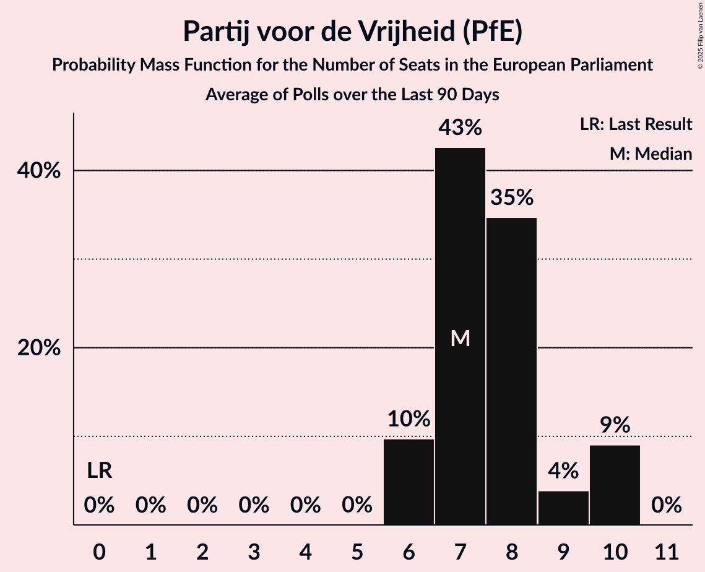

# Partij voor de Vrijheid (PfE)

<a href="#voting-intentions">Voting Intentions</a> | <a href="#seats">Seats</a>

## Voting Intentions

Last result: **0.0%** (General Election of 6 June 2024)

### Confidence Intervals

| Period     | Polling firm/Commissioner(s) | Median | 80% Confidence Interval | 90% Confidence Interval | 95% Confidence Interval | 99% Confidence Interval |
|:----------:|:----------------:|:-----------:|:-----------------------:|:-----------------------:|:-----------------------:|:-----------------------:|
| N/A | [Poll Average](average.html) | 19.3% | 17.7–21.1% | 17.3–21.4% | 17.0–21.7% | 16.3–22.3% |
| [5–6 June 2025](2025-06-06-IpsosIO.html) | Ipsos I&O | 19.0% | 18.0–20.1% | 17.7–20.4% | 17.4–20.7% | 16.9–21.2% |
| [30–31 May 2025](2025-05-31-Peilnl.html) | Peil.nl | 20.6% | 19.7–21.6% | 19.4–21.9% | 19.2–22.1% | 18.8–22.6% |
| [23–26 May 2025](2025-05-26-Verian.html) | Verian   EenVandaag | 18.4% | 17.2–19.7% | 16.8–20.1% | 16.5–20.4% | 16.0–21.0% |
| [9–12 May 2025](2025-05-12-IpsosIO.html) | Ipsos I&O | 18.3% | 17.3–19.4% | 17.0–19.7% | 16.7–20.0% | 16.2–20.5% |
| [25–28 April 2025](2025-04-28-Verian.html) | Verian   EenVandaag | 18.8% | 17.6–20.1% | 17.2–20.5% | 16.9–20.8% | 16.4–21.5% |
| [25–26 April 2025](2025-04-26-Peilnl.html) | Peil.nl | 18.6% | 17.7–19.6% | 17.5–19.8% | 17.3–20.1% | 16.9–20.5% |
| [11–14 April 2025](2025-04-14-IpsosIO.html) | Ipsos I&O | 17.9% | 16.8–19.0% | 16.5–19.4% | 16.3–19.6% | 15.8–20.2% |
| [3–4 April 2025](2025-04-04-Peilnl.html) | Peil.nl | 19.3% | 18.4–20.3% | 18.1–20.5% | 17.9–20.8% | 17.5–21.2% |
| [28–29 March 2025](2025-03-29-Peilnl.html) | Peil.nl | 19.3% | 18.4–20.3% | 18.1–20.5% | 17.9–20.8% | 17.5–21.2% |
| [21–24 March 2025](2025-03-24-Verian.html) | Verian   EenVandaag | 19.9% | 18.6–21.2% | 18.3–21.6% | 18.0–21.9% | 17.4–22.6% |
| [14–17 March 2025](2025-03-17-IpsosIO.html) | Ipsos I&O | 19.2% | 18.1–20.3% | 17.8–20.6% | 17.6–20.9% | 17.1–21.5% |
| [7–8 March 2025](2025-03-08-Peilnl.html) | Peil.nl | 20.0% | 19.1–20.9% | 18.8–21.2% | 18.6–21.4% | 18.1–21.9% |
| [21–24 February 2025](2025-02-24-Verian.html) | Verian   EenVandaag | 21.9% | 21.3–24.0% | 20.9–24.4% | 20.6–24.8% | 20.0–25.4% |
| [21–22 February 2025](2025-02-22-Peilnl.html) | Peil.nl | 21.3% | 20.4–22.3% | 20.1–22.6% | 19.9–22.8% | 19.4–23.3% |
| [14–17 February 2025](2025-02-17-IpsosIO.html) | Ipsos I&O | 21.9% | 20.8–23.1% | 20.5–23.4% | 20.2–23.7% | 19.6–24.3% |
| [24–27 January 2025](2025-01-27-Verian.html) | Verian   EenVandaag | 24.2% | 22.8–25.6% | 22.4–26.0% | 22.1–26.4% | 21.5–27.1% |
| [24–25 January 2025](2025-01-25-Peilnl.html) | Peil.nl | 22.6% | 21.7–23.6% | 21.4–23.9% | 21.2–24.2% | 20.7–24.7% |
| [17–20 January 2025](2025-01-20-IpsosIO.html) | Ipsos I&O | 22.0% | 20.9–23.2% | 20.6–23.5% | 20.3–23.8% | 19.8–24.3% |
| [24–28 December 2024](2024-12-28-Verian.html) | Verian   EenVandaag | 24.3% | 22.9–25.7% | 22.5–26.1% | 22.2–26.4% | 21.6–27.1% |
| [13–14 December 2024](2024-12-14-Peilnl.html) | Peil.nl | 23.3% | 22.3–24.3% | 22.1–24.6% | 21.8–24.9% | 21.4–25.3% |
| [6–9 December 2024](2024-12-09-IpsosIO.html) | Ipsos I&O | 23.2% | 22.0–24.5% | 21.7–24.9% | 21.4–25.2% | 20.8–25.8% |
| [22–25 November 2024](2024-11-25-Verian.html) | Verian   EenVandaag | 26.5% | 25.8–28.8% | 25.5–29.2% | 25.1–29.6% | 24.4–30.3% |
| [22–23 November 2024](2024-11-23-Peilnl.html) | Peil.nl | 25.3% | 24.3–26.3% | 24.0–26.6% | 23.8–26.9% | 23.3–27.4% |
| [9–11 November 2024](2024-11-11-IpsosIO.html) | Ipsos I&O | 23.7% | 22.5–25.0% | 22.2–25.3% | 21.9–25.6% | 21.3–26.2% |
| [8–9 November 2024](2024-11-09-Peilnl.html) | Peil.nl | 25.3% | 24.3–26.3% | 24.0–26.6% | 23.8–26.9% | 23.3–27.4% |
| [25–28 October 2024](2024-10-28-Verian.html) | Verian   EenVandaag | 25.6% | 24.6–27.4% | 24.2–27.8% | 23.8–28.2% | 23.2–28.8% |
| [18–21 October 2024](2024-10-21-IpsosIO.html) | Ipsos I&O | 24.8% | 23.6–26.0% | 23.3–26.4% | 23.0–26.7% | 22.4–27.3% |
| [12 October 2024](2024-10-12-Peilnl.html) | Peil.nl | 24.6% | 23.6–25.7% | 23.4–26.0% | 23.1–26.2% | 22.6–26.7% |
| [28 September 2024](2024-09-28-Peilnl.html) | Peil.nl | 26.6% | 25.6–27.7% | 25.3–28.0% | 25.1–28.3% | 24.6–28.8% |
| [20–23 September 2024](2024-09-23-Verian.html) | Verian   EenVandaag | 26.7% | 25.9–28.8% | 25.5–29.2% | 25.2–29.6% | 24.5–30.3% |
| [20–23 September 2024](2024-09-23-IpsosIO.html) | Ipsos I&O | 25.9% | 24.6–27.2% | 24.3–27.6% | 24.0–27.9% | 23.4–28.5% |
| [13–16 September 2024](2024-09-16-IpsosIO.html) | Ipsos I&O | 27.0% | 25.8–28.2% | 25.5–28.6% | 25.2–28.9% | 24.6–29.5% |
| [14–15 September 2024](2024-09-15-Peilnl.html) | Peil.nl | 25.3% | 24.5–26.1% | 24.3–26.3% | 24.1–26.5% | 23.7–26.9% |
| [23–26 August 2024](2024-08-26-Verian.html) | Verian   EenVandaag | 24.9% | 24.5–27.4% | 24.1–27.8% | 23.8–28.1% | 23.2–28.8% |
| [26–29 July 2024](2024-07-29-IpsosIO.html) | Ipsos I&O   EenVandaag | 25.8% | 24.8–28.4% | 24.4–28.9% | 23.9–29.4% | 23.1–30.3% |
| [6 July 2024](2024-07-06-Peilnl.html) | Peil.nl | 25.3% | 24.3–26.3% | 24.0–26.6% | 23.8–26.9% | 23.3–27.4% |
| [28–29 June 2024](2024-06-29-Peilnl.html) | Peil.nl | 27.3% | N/A | N/A | N/A | N/A |
| [21–24 June 2024](2024-06-24-IpsosIO.html) | Ipsos I&O   EenVandaag | 29.3% | N/A | N/A | N/A | N/A |
| [14–17 June 2024](2024-06-17-IpsosIO.html) | Ipsos I&O | 27.1% | N/A | N/A | N/A | N/A |

### Probability Mass Function

The following table shows the probability mass function per percentage block of voting intentions for the [poll average](average.html) for Partij voor de Vrijheid (PfE).

| Voting Intentions | Probability | Accumulated | Special Marks |
|:-----------------:|:-----------:|:-----------:|:-------------:|
| 0.0–0.5% | 0% | 100% | Last Result |
| 0.5–1.5% | 0% | 100% |  |
| 1.5–2.5% | 0% | 100% |  |
| 2.5–3.5% | 0% | 100% |  |
| 3.5–4.5% | 0% | 100% |  |
| 4.5–5.5% | 0% | 100% |  |
| 5.5–6.5% | 0% | 100% |  |
| 6.5–7.5% | 0% | 100% |  |
| 7.5–8.5% | 0% | 100% |  |
| 8.5–9.5% | 0% | 100% |  |
| 9.5–10.5% | 0% | 100% |  |
| 10.5–11.5% | 0% | 100% |  |
| 11.5–12.5% | 0% | 100% |  |
| 12.5–13.5% | 0% | 100% |  |
| 13.5–14.5% | 0% | 100% |  |
| 14.5–15.5% | 0% | 100% |  |
| 15.5–16.5% | 0.9% | 100% |  |
| 16.5–17.5% | 6% | 99.1% |  |
| 17.5–18.5% | 21% | 93% |  |
| 18.5–19.5% | 28% | 72% | Median |
| 19.5–20.5% | 24% | 44% |  |
| 20.5–21.5% | 16% | 20% |  |
| 21.5–22.5% | 4% | 4% |  |
| 22.5–23.5% | 0.2% | 0.2% |  |
| 23.5–24.5% | 0% | 0% |  |

## Seats

Last result: **0** seats (General Election of 6 June 2024)

### Confidence Intervals

| Period     | Polling firm/Commissioner(s) | Median | 80% Confidence Interval | 90% Confidence Interval | 95% Confidence Interval | 99% Confidence Interval |
|:----------:|:----------------:|:------:|:-----------------------:|:-----------------------:|:-----------------------:|:-----------------------:|
| N/A | [Poll Average](average.html) | 7 | 7–9 | 7–9 | 7–9 | 7–9 |
| [5–6 June 2025](2025-06-06-IpsosIO.html) | Ipsos I&O | 7 | 7–8 | 7–8 | 7–8 | 7–8 |
| [30–31 May 2025](2025-05-31-Peilnl.html) | Peil.nl | 8 | 7–9 | 7–9 | 7–9 | 7–9 |
| [23–26 May 2025](2025-05-26-Verian.html) | Verian   EenVandaag | 7 | 7 | 7 | 7 | 6–8 |
| [9–12 May 2025](2025-05-12-IpsosIO.html) | Ipsos I&O | 8 | 7–8 | 7–8 | 7–8 | 6–9 |
| [25–28 April 2025](2025-04-28-Verian.html) | Verian   EenVandaag | 8 | 7–8 | 7–8 | 7–8 | 7–8 |
| [25–26 April 2025](2025-04-26-Peilnl.html) | Peil.nl | 7 | 7 | 7–8 | 7–8 | 6–8 |
| [11–14 April 2025](2025-04-14-IpsosIO.html) | Ipsos I&O | 7 | 7–8 | 7–8 | 6–8 | 6–8 |
| [3–4 April 2025](2025-04-04-Peilnl.html) | Peil.nl | 7 | 7–8 | 7–8 | 7–8 | 7–9 |
| [28–29 March 2025](2025-03-29-Peilnl.html) | Peil.nl | 8 | 7–8 | 7–8 | 7–8 | 6–9 |
| [21–24 March 2025](2025-03-24-Verian.html) | Verian   EenVandaag | 8 | 8 | 8 | 8–9 | 8–9 |
| [14–17 March 2025](2025-03-17-IpsosIO.html) | Ipsos I&O | 7 | 7–8 | 7–8 | 7–8 | 7–8 |
| [7–8 March 2025](2025-03-08-Peilnl.html) | Peil.nl | 9 | 8–9 | 8–9 | 8–9 | 8–9 |
| [21–24 February 2025](2025-02-24-Verian.html) | Verian   EenVandaag | 9 | 8–9 | 8–9 | 8–9 | 7–10 |
| [21–22 February 2025](2025-02-22-Peilnl.html) | Peil.nl | 9 | 9 | 8–9 | 8–9 | 8–9 |
| [14–17 February 2025](2025-02-17-IpsosIO.html) | Ipsos I&O | 8 | 8–10 | 8–10 | 8–10 | 8–10 |
| [24–27 January 2025](2025-01-27-Verian.html) | Verian   EenVandaag | 10 | 9–11 | 9–11 | 9–11 | 9–11 |
| [24–25 January 2025](2025-01-25-Peilnl.html) | Peil.nl | 9 | 8–10 | 8–10 | 8–10 | 8–10 |
| [17–20 January 2025](2025-01-20-IpsosIO.html) | Ipsos I&O | 9 | 8–9 | 8–9 | 8–10 | 8–10 |
| [24–28 December 2024](2024-12-28-Verian.html) | Verian   EenVandaag | 9 | 9–10 | 8–10 | 8–11 | 8–11 |
| [13–14 December 2024](2024-12-14-Peilnl.html) | Peil.nl | 10 | 9–10 | 9–10 | 9–10 | 9–10 |
| [6–9 December 2024](2024-12-09-IpsosIO.html) | Ipsos I&O | 10 | 9–10 | 9–10 | 9–11 | 8–11 |
| [22–25 November 2024](2024-11-25-Verian.html) | Verian   EenVandaag | 11 | 10–11 | 10–11 | 10–11 | 10–11 |
| [22–23 November 2024](2024-11-23-Peilnl.html) | Peil.nl | 10 | 10 | 10 | 10 | 10 |
| [9–11 November 2024](2024-11-11-IpsosIO.html) | Ipsos I&O | 9 | 9–10 | 9–10 | 9–10 | 8–10 |
| [8–9 November 2024](2024-11-09-Peilnl.html) | Peil.nl | 11 | 11–12 | 11–12 | 10–12 | 9–12 |
| [25–28 October 2024](2024-10-28-Verian.html) | Verian   EenVandaag | 11 | 10–11 | 10–11 | 10–11 | 9–11 |
| [18–21 October 2024](2024-10-21-IpsosIO.html) | Ipsos I&O | 10 | 9–10 | 9–11 | 9–11 | 9–11 |
| [12 October 2024](2024-10-12-Peilnl.html) | Peil.nl | 10 | 10–11 | 10–11 | 9–11 | 9–11 |
| [28 September 2024](2024-09-28-Peilnl.html) | Peil.nl | 10 | 10–11 | 10–11 | 10–11 | 10–11 |
| [20–23 September 2024](2024-09-23-Verian.html) | Verian   EenVandaag | 11 | 10–12 | 10–12 | 10–12 | 10–12 |
| [20–23 September 2024](2024-09-23-IpsosIO.html) | Ipsos I&O | 10 | 9–11 | 9–11 | 9–11 | 9–11 |
| [13–16 September 2024](2024-09-16-IpsosIO.html) | Ipsos I&O | 11 | 10–11 | 10–11 | 10–11 | 9–11 |
| [14–15 September 2024](2024-09-15-Peilnl.html) | Peil.nl | 10 | 10 | 10 | 10 | 10 |
| [23–26 August 2024](2024-08-26-Verian.html) | Verian   EenVandaag | 10 | 9–10 | 9–10 | 9–10 | 9–11 |
| [26–29 July 2024](2024-07-29-IpsosIO.html) | Ipsos I&O   EenVandaag | 10 | 10 | 9–11 | 9–11 | 9–11 |
| [6 July 2024](2024-07-06-Peilnl.html) | Peil.nl | 10 | 10 | 10 | 9–11 | 9–11 |
| [28–29 June 2024](2024-06-29-Peilnl.html) | Peil.nl |  |  |  |  |  |
| [21–24 June 2024](2024-06-24-IpsosIO.html) | Ipsos I&O   EenVandaag |  |  |  |  |  |
| [14–17 June 2024](2024-06-17-IpsosIO.html) | Ipsos I&O |  |  |  |  |  |

### Probability Mass Function

The following table shows the probability mass function per seat for the [poll average](average.html) for Partij voor de Vrijheid (PfE).

| Number of Seats | Probability | Accumulated | Special Marks |
|:---------------:|:-----------:|:-----------:|:-------------:|
| 0 | 0% | 100% | Last Result |
| 1 | 0% | 100% |  |
| 2 | 0% | 100% |  |
| 3 | 0% | 100% |  |
| 4 | 0% | 100% |  |
| 5 | 0% | 100% |  |
| 6 | 0.3% | 100% |  |
| 7 | 62% | 99.7% | Median |
| 8 | 23% | 37% |  |
| 9 | 14% | 14% |  |
| 10 | 0% | 0% |  |

