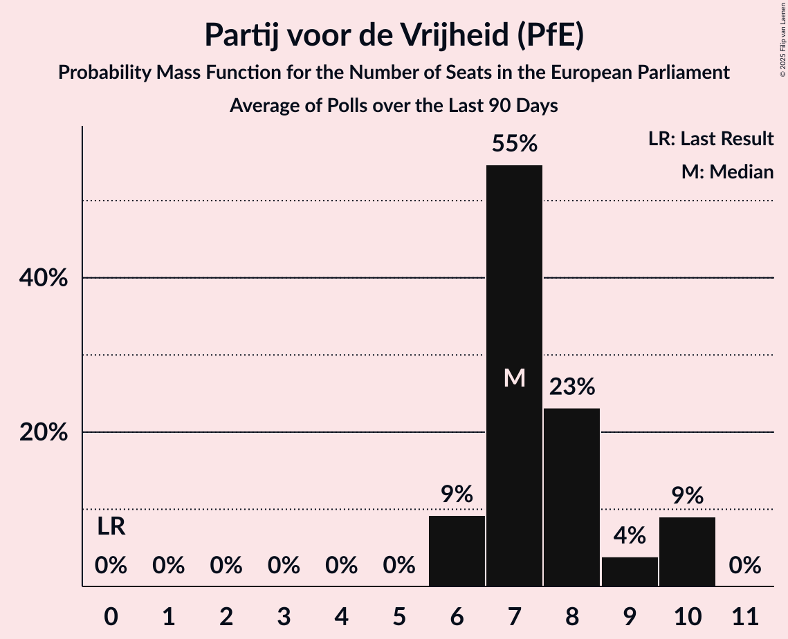

# Partij voor de Vrijheid (PfE)

<a href="#voting-intentions">Voting Intentions</a> | <a href="#seats">Seats</a>

## Voting Intentions

Last result: **0.0%** (General Election of 6 June 2024)

### Confidence Intervals

| Period     | Polling firm/Commissioner(s) | Median | 80% Confidence Interval | 90% Confidence Interval | 95% Confidence Interval | 99% Confidence Interval |
|:----------:|:----------------:|:-----------:|:-----------------------:|:-----------------------:|:-----------------------:|:-----------------------:|
| N/A | [Poll Average](average.html) | 25.1% | 23.2–26.7% | 22.7–27.2% | 22.4–27.6% | 21.7–28.4% |
| [9–11 November 2024](2024-11-11-IpsosIO.html) | Ipsos I&O | 23.7% | 22.5–25.0% | 22.2–25.3% | 21.9–25.6% | 21.3–26.2% |
| [8–9 November 2024](2024-11-09-Peilnl.html) | Peil.nl | 25.3% | 24.3–26.3% | 24.0–26.6% | 23.8–26.9% | 23.3–27.4% |
| [25–28 October 2024](2024-10-28-Verian.html) | Verian   EenVandaag | 25.9% | 24.6–27.4% | 24.2–27.8% | 23.8–28.2% | 23.2–28.8% |
| [18–21 October 2024](2024-10-21-IpsosIO.html) | Ipsos I&O | 24.8% | N/A | N/A | N/A | N/A |
| [12 October 2024](2024-10-12-Peilnl.html) | Peil.nl | 24.6% | 23.6–25.7% | 23.4–26.0% | 23.1–26.2% | 22.6–26.7% |
| [28 September 2024](2024-09-28-Peilnl.html) | Peil.nl | 26.6% | 25.6–27.7% | 25.3–28.0% | 25.1–28.3% | 24.6–28.8% |
| [20–23 September 2024](2024-09-23-Verian.html) | Verian   EenVandaag | 27.3% | 25.9–28.8% | 25.5–29.2% | 25.2–29.6% | 24.5–30.3% |
| [20–23 September 2024](2024-09-23-IpsosIO.html) | Ipsos I&O | 25.9% | 24.6–27.2% | 24.3–27.6% | 24.0–27.9% | 23.4–28.5% |
| [13–16 September 2024](2024-09-16-IpsosIO.html) | Ipsos I&O | 27.0% | 25.8–28.2% | 25.5–28.6% | 25.2–28.9% | 24.6–29.5% |
| [14–15 September 2024](2024-09-15-Peilnl.html) | Peil.nl | 25.3% | 24.5–26.1% | 24.3–26.3% | 24.1–26.5% | 23.7–26.9% |
| [23–26 August 2024](2024-08-26-Verian.html) | Verian   EenVandaag | 25.9% | 24.5–27.4% | 24.1–27.8% | 23.8–28.1% | 23.2–28.8% |
| [26–29 July 2024](2024-07-29-IpsosIO.html) | Ipsos I&O   EenVandaag | 25.8% | 24.8–28.4% | 24.4–28.9% | 23.9–29.4% | 23.1–30.3% |
| [6 July 2024](2024-07-06-Peilnl.html) | Peil.nl | 25.3% | 24.3–26.3% | 24.0–26.6% | 23.8–26.9% | 23.3–27.4% |
| [28–29 June 2024](2024-06-29-Peilnl.html) | Peil.nl | 27.3% | N/A | N/A | N/A | N/A |
| [21–24 June 2024](2024-06-24-IpsosIO.html) | Ipsos I&O   EenVandaag | 29.3% | N/A | N/A | N/A | N/A |
| [14–17 June 2024](2024-06-17-IpsosIO.html) | Ipsos I&O | 27.1% | N/A | N/A | N/A | N/A |

### Probability Mass Function

The following table shows the probability mass function per percentage block of voting intentions for the [poll average](average.html) for Partij voor de Vrijheid (PfE).

| Voting Intentions | Probability | Accumulated | Special Marks |
|:-----------------:|:-----------:|:-----------:|:-------------:|
| 0.0–0.5% | 0% | 100% | Last Result |
| 0.5–1.5% | 0% | 100% |  |
| 1.5–2.5% | 0% | 100% |  |
| 2.5–3.5% | 0% | 100% |  |
| 3.5–4.5% | 0% | 100% |  |
| 4.5–5.5% | 0% | 100% |  |
| 5.5–6.5% | 0% | 100% |  |
| 6.5–7.5% | 0% | 100% |  |
| 7.5–8.5% | 0% | 100% |  |
| 8.5–9.5% | 0% | 100% |  |
| 9.5–10.5% | 0% | 100% |  |
| 10.5–11.5% | 0% | 100% |  |
| 11.5–12.5% | 0% | 100% |  |
| 12.5–13.5% | 0% | 100% |  |
| 13.5–14.5% | 0% | 100% |  |
| 14.5–15.5% | 0% | 100% |  |
| 15.5–16.5% | 0% | 100% |  |
| 16.5–17.5% | 0% | 100% |  |
| 17.5–18.5% | 0% | 100% |  |
| 18.5–19.5% | 0% | 100% |  |
| 19.5–20.5% | 0% | 100% |  |
| 20.5–21.5% | 0.3% | 100% |  |
| 21.5–22.5% | 3% | 99.7% |  |
| 22.5–23.5% | 11% | 96% |  |
| 23.5–24.5% | 21% | 85% |  |
| 24.5–25.5% | 29% | 64% | Median |
| 25.5–26.5% | 23% | 35% |  |
| 26.5–27.5% | 9% | 12% |  |
| 27.5–28.5% | 2% | 3% |  |
| 28.5–29.5% | 0.3% | 0.3% |  |
| 29.5–30.5% | 0% | 0% |  |

## Seats

Last result: **0** seats (General Election of 6 June 2024)

### Confidence Intervals

| Period     | Polling firm/Commissioner(s) | Median | 80% Confidence Interval | 90% Confidence Interval | 95% Confidence Interval | 99% Confidence Interval |
|:----------:|:----------------:|:------:|:-----------------------:|:-----------------------:|:-----------------------:|:-----------------------:|
| N/A | [Poll Average](average.html) | 11 | 9–12 | 9–12 | 9–12 | 9–12 |
| [9–11 November 2024](2024-11-11-IpsosIO.html) | Ipsos I&O | 9 | 9–10 | 9–10 | 9–11 | 8–11 |
| [8–9 November 2024](2024-11-09-Peilnl.html) | Peil.nl | 12 | 11–12 | 10–12 | 9–12 | 9–12 |
| [25–28 October 2024](2024-10-28-Verian.html) | Verian   EenVandaag | 11 | 10–11 | 10–11 | 10–11 | 9–11 |
| [18–21 October 2024](2024-10-21-IpsosIO.html) | Ipsos I&O |  |  |  |  |  |
| [12 October 2024](2024-10-12-Peilnl.html) | Peil.nl | 10 | 10–11 | 10–11 | 9–11 | 9–11 |
| [28 September 2024](2024-09-28-Peilnl.html) | Peil.nl | 10 | 10–11 | 10–11 | 10–11 | 10–11 |
| [20–23 September 2024](2024-09-23-Verian.html) | Verian   EenVandaag | 11 | 10–12 | 10–12 | 10–12 | 10–12 |
| [20–23 September 2024](2024-09-23-IpsosIO.html) | Ipsos I&O | 10 | 9–11 | 9–11 | 9–11 | 9–11 |
| [13–16 September 2024](2024-09-16-IpsosIO.html) | Ipsos I&O | 11 | 10–11 | 10–11 | 10–11 | 9–11 |
| [14–15 September 2024](2024-09-15-Peilnl.html) | Peil.nl | 10 | 10 | 10 | 10 | 10 |
| [23–26 August 2024](2024-08-26-Verian.html) | Verian   EenVandaag | 10 | 9–10 | 9–10 | 9–10 | 9–11 |
| [26–29 July 2024](2024-07-29-IpsosIO.html) | Ipsos I&O   EenVandaag | 10 | 10 | 9–11 | 9–11 | 9–11 |
| [6 July 2024](2024-07-06-Peilnl.html) | Peil.nl | 10 | 10 | 10 | 9–11 | 9–11 |
| [28–29 June 2024](2024-06-29-Peilnl.html) | Peil.nl |  |  |  |  |  |
| [21–24 June 2024](2024-06-24-IpsosIO.html) | Ipsos I&O   EenVandaag |  |  |  |  |  |
| [14–17 June 2024](2024-06-17-IpsosIO.html) | Ipsos I&O |  |  |  |  |  |

### Probability Mass Function

The following table shows the probability mass function per seat for the [poll average](average.html) for Partij voor de Vrijheid (PfE).

| Number of Seats | Probability | Accumulated | Special Marks |
|:---------------:|:-----------:|:-----------:|:-------------:|
| 0 | 0% | 100% | Last Result |
| 1 | 0% | 100% |  |
| 2 | 0% | 100% |  |
| 3 | 0% | 100% |  |
| 4 | 0% | 100% |  |
| 5 | 0% | 100% |  |
| 6 | 0% | 100% |  |
| 7 | 0% | 100% |  |
| 8 | 0.2% | 100% |  |
| 9 | 21% | 99.8% |  |
| 10 | 18% | 79% |  |
| 11 | 35% | 61% | Median |
| 12 | 26% | 26% |  |
| 13 | 0% | 0% |  |

