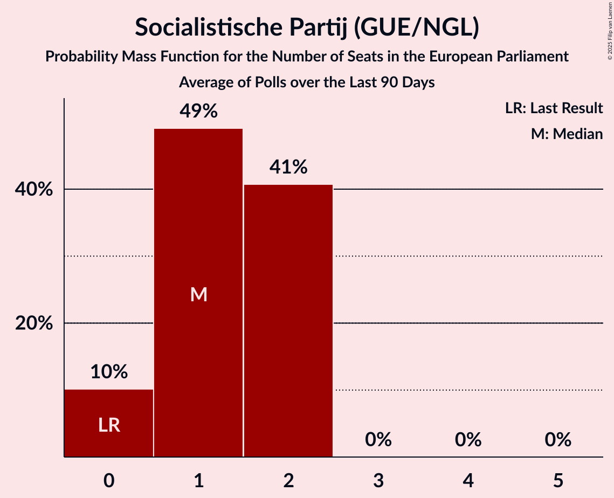

# Socialistische Partij (GUE/NGL)

<a href="#voting-intentions">Voting Intentions</a> | <a href="#seats">Seats</a>

## Voting Intentions

Last result: **3.4%** (General Election of 23 May 2019)

### Confidence Intervals

| Period     | Polling firm/Commissioner(s) | Median | 80% Confidence Interval | 90% Confidence Interval | 95% Confidence Interval | 99% Confidence Interval |
|:----------:|:----------------:|:-----------:|:-----------------------:|:-----------------------:|:-----------------------:|:-----------------------:|
| N/A | [Poll Average](average.html) | 6.0% | 4.9–7.0% | 4.6–7.3% | 4.3–7.5% | 3.9–8.1% |
| [25–30 November 2019](2019-11-30-Peilnl.html) | Peil.nl | 6.0% | 5.5–6.6% | 5.3–6.8% | 5.2–6.9% | 5.0–7.2% |
| [22–25 November 2019](2019-11-25-Ipsos.html) | Ipsos   EenVandaag | 5.1% | 4.3–6.1% | 4.1–6.4% | 3.9–6.6% | 3.6–7.1% |
| [18–23 November 2019](2019-11-23-Peilnl.html) | Peil.nl | 5.3% | 4.8–5.9% | 4.7–6.1% | 4.6–6.2% | 4.4–6.5% |
| [11–16 November 2019](2019-11-16-Peilnl.html) | Peil.nl | 5.3% | 4.8–5.9% | 4.7–6.1% | 4.6–6.2% | 4.4–6.5% |
| [7–13 November 2019](2019-11-13-IOResearch.html) | I&O Research | 6.4% | 5.6–7.4% | 5.4–7.6% | 5.2–7.9% | 4.9–8.4% |
| [4–9 November 2019](2019-11-09-Peilnl.html) | Peil.nl | 6.0% | 5.5–6.6% | 5.3–6.8% | 5.2–6.9% | 5.0–7.2% |
| [28 October–2 November 2019](2019-11-02-Peilnl.html) | Peil.nl | 6.0% | 5.5–6.6% | 5.3–6.8% | 5.2–6.9% | 5.0–7.2% |
| [1 November 2019](2019-11-01-KantarPublic.html) | Kantar Public | 6.0% | 5.1–7.1% | 4.8–7.4% | 4.6–7.7% | 4.3–8.2% |
| [25–28 October 2019](2019-10-28-Ipsos.html) | Ipsos   EenVandaag | 5.6% | 4.8–6.6% | 4.5–6.9% | 4.3–7.2% | 4.0–7.7% |
| [21–26 October 2019](2019-10-26-Peilnl.html) | Peil.nl | 6.1% | 5.5–6.7% | 5.4–6.8% | 5.3–7.0% | 5.0–7.3% |
| [14–19 October 2019](2019-10-19-Peilnl.html) | Peil.nl | 6.0% | 5.5–6.6% | 5.3–6.8% | 5.2–6.9% | 5.0–7.2% |
| [15 October 2019](2019-10-15-KantarPublic.html) | Kantar Public | 4.7% | 3.9–5.7% | 3.7–5.9% | 3.6–6.2% | 3.2–6.7% |
| [10–15 October 2019](2019-10-15-IOResearch.html) | I&O Research | 4.6% | 4.0–5.3% | 3.9–5.5% | 3.7–5.7% | 3.5–6.1% |
| [7–12 October 2019](2019-10-12-Peilnl.html) | Peil.nl | 6.0% | 5.5–6.6% | 5.3–6.8% | 5.2–6.9% | 5.0–7.2% |
| [30 September–5 October 2019](2019-10-05-Peilnl.html) | Peil.nl | 6.0% | 5.5–6.6% | 5.3–6.8% | 5.2–6.9% | 5.0–7.2% |
| [23–28 September 2019](2019-09-28-Peilnl.html) | Peil.nl | 6.0% | 5.5–6.6% | 5.3–6.8% | 5.2–6.9% | 5.0–7.2% |
| [20–23 September 2019](2019-09-23-Ipsos.html) | Ipsos   EenVandaag | 6.1% | 5.2–7.2% | 5.0–7.5% | 4.8–7.8% | 4.4–8.3% |
| [16–21 September 2019](2019-09-21-Peilnl.html) | Peil.nl | 6.0% | 5.5–6.6% | 5.3–6.8% | 5.2–6.9% | 5.0–7.2% |
| [15 September 2019](2019-09-15-KantarPublic.html) | Kantar Public | 6.7% | 5.8–7.8% | 5.5–8.1% | 5.3–8.4% | 4.9–9.0% |
| [9–14 September 2019](2019-09-14-Peilnl.html) | Peil.nl | 6.0% | 5.5–6.6% | 5.3–6.8% | 5.2–6.9% | 5.0–7.2% |
| [2–7 September 2019](2019-09-07-Peilnl.html) | Peil.nl | 6.0% | 5.5–6.6% | 5.3–6.8% | 5.2–6.9% | 5.0–7.2% |
| [29 August–3 September 2019](2019-09-03-IOResearch.html) | I&O Research | 6.0% | 5.3–6.8% | 5.1–7.1% | 4.9–7.3% | 4.6–7.7% |
| [30 August–2 September 2019](2019-09-02-Ipsos.html) | Ipsos   EenVandaag | 5.8% | 4.9–6.9% | 4.7–7.2% | 4.5–7.4% | 4.1–8.0% |
| [26–31 August 2019](2019-08-31-Peilnl.html) | Peil.nl | 5.3% | 4.8–5.9% | 4.7–6.1% | 4.6–6.2% | 4.4–6.5% |
| [19–24 August 2019](2019-08-24-Peilnl.html) | Peil.nl | 5.3% | 4.8–5.9% | 4.7–6.1% | 4.6–6.2% | 4.4–6.5% |
| [29 July–4 August 2019](2019-08-04-Peilnl.html) | Peil.nl | 4.7% | 4.2–5.2% | 4.1–5.3% | 4.0–5.5% | 3.7–5.8% |
| [26–29 July 2019](2019-07-29-Ipsos.html) | Ipsos   EenVandaag | 5.4% | 4.6–6.5% | 4.4–6.8% | 4.2–7.0% | 3.9–7.5% |
| [5–9 July 2019](2019-07-09-IOResearch.html) | I&O Research | 5.3% | 4.7–6.0% | 4.6–6.1% | 4.5–6.3% | 4.2–6.6% |
| [1–7 July 2019](2019-07-07-Peilnl.html) | Peil.nl | 4.7% | 4.2–5.2% | 4.1–5.3% | 4.0–5.5% | 3.7–5.8% |
| [24–30 June 2019](2019-06-30-Peilnl.html) | Peil.nl | 4.7% | 4.2–5.2% | 4.1–5.3% | 4.0–5.5% | 3.7–5.8% |
| [21–24 June 2019](2019-06-24-Ipsos.html) | Ipsos   EenVandaag | 5.6% | 4.8–6.7% | 4.6–7.0% | 4.4–7.2% | 4.0–7.8% |
| [17–23 June 2019](2019-06-23-Peilnl.html) | Peil.nl | 4.7% | 4.2–5.2% | 4.1–5.3% | 4.0–5.5% | 3.7–5.8% |
| [10–16 June 2019](2019-06-16-Peilnl.html) | Peil.nl | 4.7% | 4.2–5.2% | 4.1–5.3% | 4.0–5.5% | 3.7–5.8% |
| [3–9 June 2019](2019-06-09-Peilnl.html) | Peil.nl | 5.3% | 4.8–5.9% | 4.7–6.1% | 4.6–6.2% | 4.4–6.5% |
| [27 May–2 June 2019](2019-06-02-Peilnl.html) | Peil.nl | 5.3% | 4.8–5.9% | 4.7–6.1% | 4.6–6.2% | 4.4–6.5% |

### Probability Mass Function

The following table shows the probability mass function per percentage block of voting intentions for the [poll average](average.html) for Socialistische Partij (GUE/NGL).

| Voting Intentions | Probability | Accumulated | Special Marks |
|:-----------------:|:-----------:|:-----------:|:-------------:|
| 1.5–2.5% | 0% | 100% |  |
| 2.5–3.5% | 0.1% | 100% | Last Result |
| 3.5–4.5% | 5% | 99.9% |  |
| 4.5–5.5% | 24% | 95% |  |
| 5.5–6.5% | 49% | 71% | Median |
| 6.5–7.5% | 19% | 21% |  |
| 7.5–8.5% | 2% | 2% |  |
| 8.5–9.5% | 0.1% | 0.1% |  |
| 9.5–10.5% | 0% | 0% |  |

## Seats

Last result: **0** seats (General Election of 23 May 2019)

### Confidence Intervals

| Period     | Polling firm/Commissioner(s) | Median | 80% Confidence Interval | 90% Confidence Interval | 95% Confidence Interval | 99% Confidence Interval |
|:----------:|:----------------:|:------:|:-----------------------:|:-----------------------:|:-----------------------:|:-----------------------:|
| N/A | [Poll Average](average.html) | 1 | 1–2 | 1–2 | 1–2 | 1–2 |
| [25–30 November 2019](2019-11-30-Peilnl.html) | Peil.nl | 1 | 1–2 | 1–2 | 1–2 | 1–2 |
| [22–25 November 2019](2019-11-25-Ipsos.html) | Ipsos   EenVandaag | 1 | 1–2 | 1–2 | 1–2 | 0–2 |
| [18–23 November 2019](2019-11-23-Peilnl.html) | Peil.nl | 1 | 1 | 1 | 1–2 | 1–2 |
| [11–16 November 2019](2019-11-16-Peilnl.html) | Peil.nl | 1 | 1–2 | 1–2 | 1–2 | 1–2 |
| [7–13 November 2019](2019-11-13-IOResearch.html) | I&O Research | 2 | 1–2 | 1–2 | 1–2 | 1–2 |
| [4–9 November 2019](2019-11-09-Peilnl.html) | Peil.nl | 2 | 1–2 | 1–2 | 1–2 | 1–2 |
| [28 October–2 November 2019](2019-11-02-Peilnl.html) | Peil.nl | 2 | 2 | 1–2 | 1–2 | 1–2 |
| [1 November 2019](2019-11-01-KantarPublic.html) | Kantar Public | 1 | 1–2 | 1–2 | 1–2 | 1–2 |
| [25–28 October 2019](2019-10-28-Ipsos.html) | Ipsos   EenVandaag | 2 | 1–2 | 1–2 | 1–2 | 1–2 |
| [21–26 October 2019](2019-10-26-Peilnl.html) | Peil.nl | 2 | 2 | 1–2 | 1–2 | 1–2 |
| [14–19 October 2019](2019-10-19-Peilnl.html) | Peil.nl | 1 | 1–2 | 1–2 | 1–2 | 1–2 |
| [15 October 2019](2019-10-15-KantarPublic.html) | Kantar Public | 1 | 0–2 | 0–2 | 0–2 | 0–2 |
| [10–15 October 2019](2019-10-15-IOResearch.html) | I&O Research | 1 | 1 | 0–1 | 0–1 | 0–2 |
| [7–12 October 2019](2019-10-12-Peilnl.html) | Peil.nl | 2 | 1–2 | 1–2 | 1–2 | 1–2 |
| [30 September–5 October 2019](2019-10-05-Peilnl.html) | Peil.nl | 2 | 1–2 | 1–2 | 1–2 | 1–2 |
| [23–28 September 2019](2019-09-28-Peilnl.html) | Peil.nl | 2 | 1–2 | 1–2 | 1–2 | 1–2 |
| [20–23 September 2019](2019-09-23-Ipsos.html) | Ipsos   EenVandaag | 1 | 1–2 | 1–2 | 1–2 | 1–2 |
| [16–21 September 2019](2019-09-21-Peilnl.html) | Peil.nl | 2 | 1–2 | 1–2 | 1–2 | 1–2 |
| [15 September 2019](2019-09-15-KantarPublic.html) | Kantar Public | 2 | 2 | 2 | 2 | 1–2 |
| [9–14 September 2019](2019-09-14-Peilnl.html) | Peil.nl | 1 | 1–2 | 1–2 | 1–2 | 1–2 |
| [2–7 September 2019](2019-09-07-Peilnl.html) | Peil.nl | 1 | 1–2 | 1–2 | 1–2 | 1–2 |
| [29 August–3 September 2019](2019-09-03-IOResearch.html) | I&O Research | 1 | 1–2 | 1–2 | 1–2 | 1–2 |
| [30 August–2 September 2019](2019-09-02-Ipsos.html) | Ipsos   EenVandaag | 2 | 1–2 | 1–2 | 1–2 | 1–2 |
| [26–31 August 2019](2019-08-31-Peilnl.html) | Peil.nl | 1 | 1 | 1 | 1 | 1–2 |
| [19–24 August 2019](2019-08-24-Peilnl.html) | Peil.nl | 1 | 1 | 1 | 1 | 1–2 |
| [29 July–4 August 2019](2019-08-04-Peilnl.html) | Peil.nl | 1 | 1 | 1 | 1 | 0–1 |
| [26–29 July 2019](2019-07-29-Ipsos.html) | Ipsos   EenVandaag | 2 | 1–2 | 1–2 | 1–2 | 1–2 |
| [5–9 July 2019](2019-07-09-IOResearch.html) | I&O Research | 1 | 1–2 | 1–2 | 1–2 | 1–2 |
| [1–7 July 2019](2019-07-07-Peilnl.html) | Peil.nl | 1 | 1 | 1 | 1 | 1 |
| [24–30 June 2019](2019-06-30-Peilnl.html) | Peil.nl | 1 | 1 | 1 | 1 | 0–1 |
| [21–24 June 2019](2019-06-24-Ipsos.html) | Ipsos   EenVandaag | 2 | 1–2 | 1–2 | 1–2 | 0–2 |
| [17–23 June 2019](2019-06-23-Peilnl.html) | Peil.nl | 1 | 1 | 1 | 1 | 1 |
| [10–16 June 2019](2019-06-16-Peilnl.html) | Peil.nl | 1 | 1 | 1 | 1 | 1 |
| [3–9 June 2019](2019-06-09-Peilnl.html) | Peil.nl | 1 | 1 | 1–2 | 1–2 | 1–2 |
| [27 May–2 June 2019](2019-06-02-Peilnl.html) | Peil.nl | 1 | 1 | 1–2 | 1–2 | 1–2 |

### Probability Mass Function

The following table shows the probability mass function per seat for the [poll average](average.html) for Socialistische Partij (GUE/NGL).

| Number of Seats | Probability | Accumulated | Special Marks |
|:---------------:|:-----------:|:-----------:|:-------------:|
| 0 | 0.4% | 100% | Last Result |
| 1 | 60% | 99.6% | Median |
| 2 | 39% | 40% |  |
| 3 | 0% | 0% |  |

