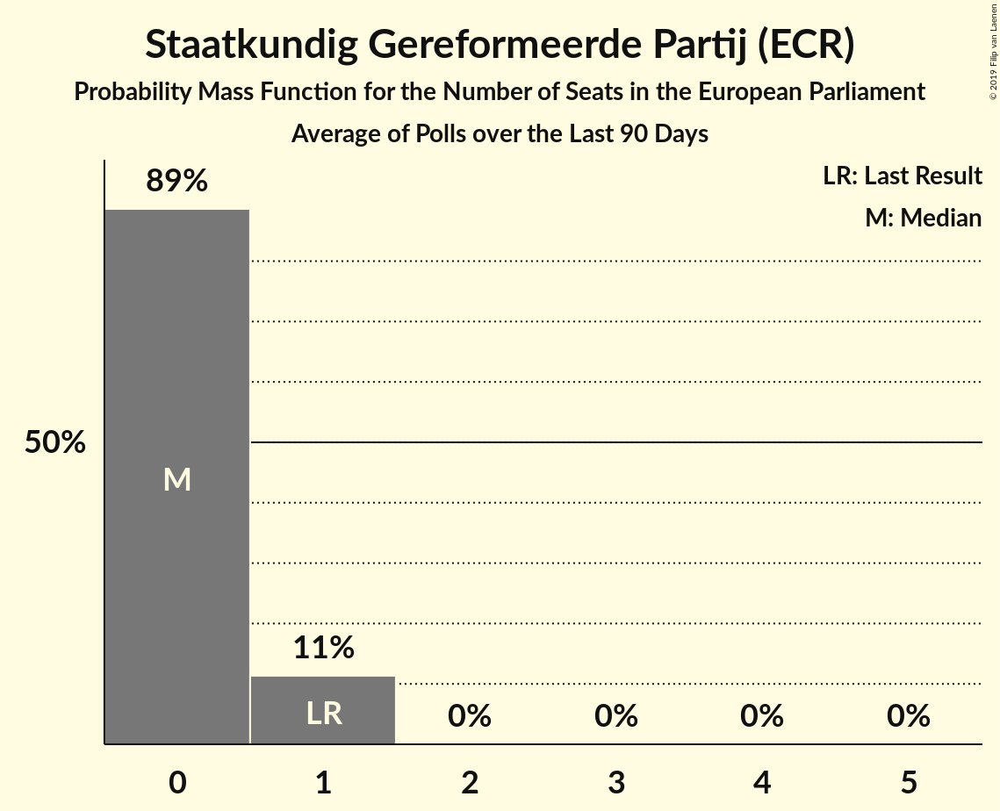

# Staatkundig Gereformeerde Partij (ECR)

<a href="#voting-intentions">Voting Intentions</a> | <a href="#seats">Seats</a>

## Voting Intentions

Last result: **6.8%** (General Election of 23 May 2019)

### Confidence Intervals

| Period     | Polling firm/Commissioner(s) | Median | 80% Confidence Interval | 90% Confidence Interval | 95% Confidence Interval | 99% Confidence Interval |
|:----------:|:----------------:|:-----------:|:-----------------------:|:-----------------------:|:-----------------------:|:-----------------------:|
| N/A | [Poll Average](average.html) | 0.8% | 0.6–1.0% | 0.6–1.1% | 0.5–1.2% | 0.4–1.3% |
| [17–18 May 2024](2024-05-18-Peilnl.html) | Peil.nl | 0.8% | 0.6–1.0% | 0.5–1.1% | 0.5–1.2% | 0.4–1.3% |
| [3–4 May 2024](2024-05-04-Peilnl.html) | Peil.nl | 0.8% | 0.6–1.0% | 0.5–1.1% | 0.5–1.2% | 0.4–1.3% |
| [12–15 April 2024](2024-04-15-IpsosIO.html) | Ipsos I&O | 3.3% | 2.9–3.9% | 2.7–4.0% | 2.6–4.1% | 2.4–4.4% |
| [22–25 March 2024](2024-03-25-IpsosIO.html) | Ipsos I&O | 3.8% | 3.2–4.5% | 3.1–4.7% | 2.9–4.8% | 2.7–5.2% |
| [23 February–5 March 2024](2024-03-05-Ipsos.html) | Ipsos   Euronews | 2.6% | 2.2–3.1% | 2.1–3.3% | 2.0–3.4% | 1.8–3.7% |
| [24–31 January 2024](2024-01-31-PortlandCommunications.html) | Portland Communications | 3.0% | 2.2–4.2% | 2.0–4.5% | 1.8–4.8% | 1.5–5.4% |
| [22 December 2023](2023-12-22-Peilnl.html) | Peil.nl | 2.0% | 1.7–2.4% | 1.6–2.5% | 1.6–2.6% | 1.4–2.8% |
| [15–18 December 2023](2023-12-18-Ipsos.html) | Ipsos   EenVandaag | 2.3% | 1.8–3.0% | 1.6–3.2% | 1.5–3.4% | 1.3–3.7% |
| [8–11 December 2023](2023-12-11-IOResearch.html) | I&O Research | 2.0% | 1.7–2.4% | 1.6–2.5% | 1.5–2.6% | 1.4–2.8% |
| [1–2 December 2023](2023-12-02-Peilnl.html) | Peil.nl | 2.0% | 1.7–2.4% | 1.6–2.5% | 1.6–2.6% | 1.4–2.8% |
| [21 November 2023](2023-11-21-Peilnl.html) | Peil.nl | 1.3% | 1.2–1.6% | 1.1–1.6% | 1.1–1.7% | 1.0–1.8% |
| [19–21 November 2023](2023-11-21-Ipsos.html) | Ipsos   EenVandaag | 2.0% | 1.7–2.4% | 1.6–2.5% | 1.5–2.7% | 1.3–2.9% |
| [20–21 November 2023](2023-11-21-IOResearch.html) | I&O Research | 2.0% | 1.6–2.4% | 1.5–2.6% | 1.4–2.7% | 1.3–2.9% |
| [18–20 November 2023](2023-11-20-IOResearch.html) | I&O Research | 2.3% | 1.6–2.5% | 1.5–2.6% | 1.5–2.7% | 1.3–2.9% |
| [17–18 November 2023](2023-11-18-Peilnl.html) | Peil.nl | 1.3% | 1.1–1.6% | 1.0–1.7% | 1.0–1.8% | 0.9–2.0% |
| [12–14 November 2023](2023-11-14-IOResearch.html) | I&O Research | 2.6% | 2.2–3.1% | 2.1–3.2% | 2.0–3.3% | 1.8–3.6% |
| [10–13 November 2023](2023-11-13-Ipsos.html) | Ipsos   EenVandaag | 2.3% | 1.6–2.5% | 1.6–2.6% | 1.5–2.7% | 1.3–2.9% |
| [10–11 November 2023](2023-11-11-Peilnl.html) | Peil.nl | 1.3% | 1.1–1.6% | 1.0–1.7% | 1.0–1.8% | 0.9–2.0% |
| [6–7 November 2023](2023-11-07-IOResearch.html) | I&O Research | 2.5% | 2.1–3.0% | 2.0–3.1% | 1.9–3.2% | 1.7–3.5% |
| [3–4 November 2023](2023-11-04-Peilnl.html) | Peil.nl | 1.3% | 1.1–1.6% | 1.0–1.7% | 1.0–1.8% | 0.9–2.0% |
| [27–30 October 2023](2023-10-30-Ipsos.html) | Ipsos   EenVandaag | 2.2% | 1.6–2.5% | 1.5–2.6% | 1.4–2.7% | 1.3–3.0% |
| [27–28 October 2023](2023-10-28-Peilnl.html) | Peil.nl | 1.3% | 1.1–1.6% | 1.0–1.7% | 1.0–1.8% | 0.9–2.0% |
| [22–24 October 2023](2023-10-24-IOResearch.html) | I&O Research | 2.3% | 1.8–2.9% | 1.7–3.0% | 1.6–3.2% | 1.4–3.4% |
| [20–21 October 2023](2023-10-21-Peilnl.html) | Peil.nl | 1.3% | N/A | N/A | N/A | N/A |
| [13–16 October 2023](2023-10-16-Ipsos.html) | Ipsos   EenVandaag | 2.0% | 1.5–2.7% | 1.4–2.9% | 1.3–3.0% | 1.1–3.4% |
| [13–14 October 2023](2023-10-14-Peilnl.html) | Peil.nl | 1.3% | 1.1–1.6% | 1.0–1.7% | 1.0–1.8% | 0.9–2.0% |
| [6–9 October 2023](2023-10-09-IOResearch.html) | I&O Research | 2.3% | 2.0–2.8% | 1.8–2.9% | 1.8–3.0% | 1.6–3.2% |
| [6–7 October 2023](2023-10-07-Peilnl.html) | Peil.nl | 1.3% | N/A | N/A | N/A | N/A |
| [22–25 September 2023](2023-09-25-IOResearch.html) | I&O Research | 2.6% | 2.1–3.2% | 2.0–3.4% | 1.9–3.6% | 1.7–3.9% |
| [22–24 September 2023](2023-09-24-Ipsos.html) | Ipsos   EenVandaag | 2.1% | 1.6–2.8% | 1.5–3.0% | 1.3–3.1% | 1.2–3.5% |
| [22–23 September 2023](2023-09-23-Peilnl.html) | Peil.nl | 1.3% | 1.1–1.6% | 1.0–1.7% | 1.0–1.8% | 0.9–2.0% |
| [8–11 September 2023](2023-09-11-IOResearch.html) | I&O Research | 2.6% | 2.2–3.2% | 2.0–3.4% | 1.9–3.5% | 1.7–3.8% |
| [8–9 September 2023](2023-09-09-Peilnl.html) | Peil.nl | 1.3% | 1.1–1.6% | 1.0–1.7% | 1.0–1.8% | 0.9–2.0% |
| [1–4 September 2023](2023-09-04-Ipsos.html) | Ipsos   EenVandaag | 2.3% | 1.8–3.1% | 1.7–3.3% | 1.5–3.5% | 1.3–3.9% |
| [1–2 September 2023](2023-09-02-Peilnl.html) | Peil.nl | 1.3% | 1.1–1.6% | 1.0–1.7% | 1.0–1.8% | 0.9–2.0% |
| [25–26 August 2023](2023-08-26-Peilnl.html) | Peil.nl | 1.3% | 1.1–1.6% | 1.0–1.7% | 1.0–1.8% | 0.9–2.0% |
| [23–24 August 2023](2023-08-24-IOResearch.html) | I&O Research | 2.6% | 2.2–3.2% | 2.1–3.4% | 2.0–3.5% | 1.8–3.8% |
| [18–19 August 2023](2023-08-19-Peilnl.html) | Peil.nl | 2.0% | 1.7–2.4% | 1.6–2.5% | 1.6–2.6% | 1.4–2.8% |
| [21 August–24 July 2023](2023-07-24-Ipsos.html) | Ipsos   EenVandaag | 2.0% | 1.5–2.7% | 1.4–2.9% | 1.3–3.1% | 1.1–3.4% |
| [14–17 July 2023](2023-07-17-IOResearch.html) | I&O Research | 2.9% | 2.5–3.5% | 2.3–3.7% | 2.2–3.8% | 2.0–4.1% |
| [14–15 July 2023](2023-07-15-Peilnl.html) | Peil.nl | 2.0% | 1.7–2.4% | 1.6–2.5% | 1.6–2.6% | 1.4–2.8% |
| [30 June–1 July 2023](2023-07-01-Peilnl.html) | Peil.nl | 2.0% | 1.7–2.4% | 1.6–2.5% | 1.6–2.6% | 1.4–2.8% |
| [23–25 June 2023](2023-06-25-Ipsos.html) | Ipsos   EenVandaag | 1.9% | 1.4–2.5% | 1.3–2.7% | 1.2–2.9% | 1.0–3.2% |
| [16–17 June 2023](2023-06-17-Peilnl.html) | Peil.nl | 2.0% | 1.7–2.4% | 1.6–2.5% | 1.6–2.6% | 1.4–2.8% |
| [9–12 June 2023](2023-06-12-IOResearch.html) | I&O Research | 2.6% | 2.2–3.1% | 2.1–3.2% | 2.0–3.4% | 1.9–3.6% |
| [26–29 May 2023](2023-05-29-Ipsos.html) | Ipsos   EenVandaag | 2.2% | 1.7–2.9% | 1.5–3.1% | 1.4–3.3% | 1.2–3.6% |
| [19–20 May 2023](2023-05-20-Peilnl.html) | Peil.nl | 2.0% | 1.7–2.4% | 1.6–2.5% | 1.6–2.6% | 1.4–2.8% |
| [12–15 May 2023](2023-05-15-IOResearch.html) | I&O Research | 2.6% | 2.2–3.2% | 2.1–3.3% | 2.0–3.4% | 1.8–3.7% |
| [5–6 May 2023](2023-05-06-Peilnl.html) | Peil.nl | 2.0% | N/A | N/A | N/A | N/A |
| [24 April 2023](2023-04-24-Ipsos.html) | Ipsos   EenVandaag | 2.0% | 1.5–2.7% | 1.4–2.9% | 1.3–3.1% | 1.1–3.4% |
| [21–22 April 2023](2023-04-22-Peilnl.html) | Peil.nl | 2.0% | 1.7–2.4% | 1.6–2.5% | 1.6–2.6% | 1.4–2.8% |
| [14–17 April 2023](2023-04-17-IOResearch.html) | I&O Research | 2.4% | 2.0–2.9% | 1.9–3.0% | 1.8–3.2% | 1.7–3.4% |
| [31 March–1 April 2023](2023-04-01-Peilnl.html) | Peil.nl | 2.0% | 1.7–2.4% | 1.6–2.5% | 1.6–2.6% | 1.4–2.8% |
| [24–27 March 2023](2023-03-27-Ipsos.html) | Ipsos   EenVandaag | 2.3% | 1.8–3.0% | 1.6–3.2% | 1.5–3.4% | 1.3–3.8% |
| [23–24 March 2023](2023-03-24-Peilnl.html) | Peil.nl | 2.0% | 1.7–2.3% | 1.7–2.4% | 1.6–2.5% | 1.5–2.7% |
| [17–27 February 2023](2023-02-27-Ipsos.html) | Ipsos   EenVandaag | 2.3% | 2.0–2.6% | 2.0–2.7% | 1.9–2.7% | 1.8–2.9% |
| [24–25 February 2023](2023-02-25-Peilnl.html) | Peil.nl | 2.7% | 2.3–3.1% | 2.2–3.2% | 2.1–3.3% | 2.0–3.5% |
| [17–18 February 2023](2023-02-18-Peilnl.html) | Peil.nl | 2.7% | 2.3–3.1% | 2.2–3.2% | 2.1–3.3% | 2.0–3.5% |
| [13 February 2023](2023-02-13-IOResearch.html) | I&O Research | 2.8% | 2.4–3.3% | 2.3–3.4% | 2.2–3.6% | 2.1–3.8% |
| [10–11 February 2023](2023-02-11-Peilnl.html) | Peil.nl | 2.7% | N/A | N/A | N/A | N/A |
| [27–30 January 2023](2023-01-30-Ipsos.html) | Ipsos   EenVandaag | 2.1% | 1.6–2.8% | 1.5–3.0% | 1.4–3.2% | 1.2–3.6% |
| [13–16 January 2023](2023-01-16-IOResearch.html) | I&O Research | 3.1% | 2.7–3.6% | 2.6–3.7% | 2.5–3.9% | 2.3–4.1% |
| [13–14 January 2023](2023-01-14-Peilnl.html) | Peil.nl | 2.7% | 2.3–3.1% | 2.2–3.2% | 2.1–3.3% | 2.0–3.5% |
| [16–19 December 2022](2022-12-19-Ipsos.html) | Ipsos   EenVandaag | 2.6% | 2.0–3.3% | 1.9–3.6% | 1.8–3.7% | 1.5–4.1% |
| [16–17 December 2022](2022-12-17-Peilnl.html) | Peil.nl | 2.7% | 2.3–3.1% | 2.2–3.2% | 2.1–3.3% | 2.0–3.5% |
| [9–12 December 2022](2022-12-12-IOResearch.html) | I&O Research | 3.4% | 2.9–4.0% | 2.8–4.1% | 2.7–4.3% | 2.5–4.6% |
| [2–3 December 2022](2022-12-03-Peilnl.html) | Peil.nl | 2.7% | 2.3–3.1% | 2.2–3.2% | 2.1–3.3% | 2.0–3.5% |
| [25–28 November 2022](2022-11-28-Ipsos.html) | Ipsos   EenVandaag | 2.0% | 1.6–2.7% | 1.4–2.9% | 1.3–3.1% | 1.1–3.4% |
| [25–26 November 2022](2022-11-26-Peilnl.html) | Peil.nl | 2.7% | 2.3–3.1% | 2.2–3.2% | 2.1–3.3% | 2.0–3.5% |
| [11–14 November 2022](2022-11-14-IOResearch.html) | I&O Research | 2.8% | 2.4–3.3% | 2.3–3.5% | 2.2–3.6% | 2.0–3.9% |
| [11–12 November 2022](2022-11-12-Peilnl.html) | Peil.nl | 2.7% | 2.3–3.1% | 2.2–3.2% | 2.1–3.3% | 2.0–3.5% |
| [21–24 October 2022](2022-10-24-Ipsos.html) | Ipsos   EenVandaag | 2.3% | 1.8–3.0% | 1.6–3.2% | 1.5–3.4% | 1.3–3.7% |
| [22–23 October 2022](2022-10-23-Peilnl.html) | Peil.nl | 2.7% | 2.3–3.1% | 2.2–3.2% | 2.1–3.3% | 2.0–3.5% |
| [14–17 October 2022](2022-10-17-IOResearch.html) | I&O Research | 3.2% | 2.8–3.8% | 2.7–3.9% | 2.6–4.1% | 2.4–4.3% |
| [14–15 October 2022](2022-10-15-Peilnl.html) | Peil.nl | 2.7% | 2.3–3.1% | 2.2–3.2% | 2.1–3.3% | 2.0–3.5% |
| [23–26 September 2022](2022-09-26-Ipsos.html) | Ipsos   EenVandaag | 2.3% | 1.8–3.0% | 1.6–3.2% | 1.5–3.4% | 1.3–3.8% |
| [23–24 September 2022](2022-09-24-Peilnl.html) | Peil.nl | 2.7% | 2.3–3.1% | 2.2–3.2% | 2.1–3.3% | 2.0–3.5% |
| [9–12 September 2022](2022-09-12-IOResearch.html) | I&O Research | 2.6% | 2.1–3.1% | 2.0–3.3% | 1.9–3.4% | 1.7–3.7% |
| [26–29 August 2022](2022-08-29-Ipsos.html) | Ipsos   EenVandaag | 2.3% | 1.8–3.0% | 1.6–3.2% | 1.5–3.4% | 1.3–3.8% |
| [26–27 August 2022](2022-08-27-Peilnl.html) | Peil.nl | 2.7% | 2.3–3.1% | 2.2–3.2% | 2.1–3.3% | 2.0–3.5% |
| [5–6 August 2022](2022-08-06-Peilnl.html) | Peil.nl | 2.7% | 2.3–3.1% | 2.2–3.2% | 2.1–3.3% | 2.0–3.5% |
| [22–25 July 2022](2022-07-25-Ipsos.html) | Ipsos   EenVandaag | 2.3% | 1.8–3.0% | 1.6–3.2% | 1.5–3.4% | 1.3–3.8% |
| [15–18 July 2022](2022-07-18-IOResearch.html) | I&O Research | 2.9% | 2.5–3.5% | 2.4–3.6% | 2.3–3.8% | 2.1–4.1% |
| [8–9 July 2022](2022-07-09-Peilnl.html) | Peil.nl | 2.7% | 2.3–3.1% | 2.2–3.2% | 2.1–3.3% | 2.0–3.5% |
| [24–27 June 2022](2022-06-27-Ipsos.html) | Ipsos   EenVandaag | 3.2% | 2.6–4.0% | 2.4–4.3% | 2.3–4.5% | 2.0–4.9% |
| [24–25 June 2022](2022-06-25-Peilnl.html) | Peil.nl | 2.7% | 2.3–3.1% | 2.2–3.2% | 2.1–3.3% | 2.0–3.5% |
| [17–18 June 2022](2022-06-18-Peilnl.html) | Peil.nl | 2.7% | 2.3–3.1% | 2.2–3.2% | 2.1–3.3% | 2.0–3.5% |
| [10–13 June 2022](2022-06-13-IOResearch.html) | I&O Research | 3.1% | 2.7–3.7% | 2.5–3.9% | 2.4–4.0% | 2.2–4.3% |
| [10–11 June 2022](2022-06-11-Peilnl.html) | Peil.nl | 2.7% | 2.3–3.1% | 2.2–3.2% | 2.1–3.3% | 2.0–3.5% |
| [27–30 May 2022](2022-05-30-Ipsos.html) | Ipsos   EenVandaag | 2.2% | 1.7–2.9% | 1.6–3.1% | 1.5–3.3% | 1.3–3.7% |
| [27–28 May 2022](2022-05-28-Peilnl.html) | Peil.nl | 2.7% | 2.3–3.1% | 2.2–3.2% | 2.1–3.3% | 2.0–3.5% |
| [25–27 May 2022](2022-05-27-Kantar.html) | Kantar | 3.0% | 2.4–3.7% | 2.2–4.0% | 2.1–4.2% | 1.9–4.6% |
| [13–16 May 2022](2022-05-16-IOResearch.html) | I&O Research | 2.7% | 2.3–3.3% | 2.1–3.5% | 2.0–3.6% | 1.8–3.9% |
| [13–14 May 2022](2022-05-14-Peilnl.html) | Peil.nl | 2.7% | 2.3–3.1% | 2.2–3.2% | 2.1–3.3% | 2.0–3.5% |
| [22–25 April 2022](2022-04-25-Ipsos.html) | Ipsos   EenVandaag | 3.1% | 2.5–3.9% | 2.3–4.1% | 2.2–4.3% | 1.9–4.7% |
| [22–23 April 2022](2022-04-23-Peilnl.html) | Peil.nl | 2.7% | 2.3–3.1% | 2.2–3.2% | 2.1–3.3% | 2.0–3.5% |
| [8–11 April 2022](2022-04-11-IOResearch.html) | I&O Research | 2.5% | 2.1–3.0% | 2.0–3.1% | 1.9–3.2% | 1.7–3.5% |
| [8–9 April 2022](2022-04-09-Peilnl.html) | Peil.nl | 2.7% | 2.3–3.1% | 2.2–3.2% | 2.1–3.3% | 2.0–3.5% |
| [1–2 April 2022](2022-04-02-Peilnl.html) | Peil.nl | 2.7% | N/A | N/A | N/A | N/A |
| [25–27 March 2022](2022-03-27-Ipsos.html) | Ipsos   EenVandaag | 2.6% | 2.0–3.3% | 1.9–3.5% | 1.8–3.7% | 1.6–4.1% |
| [25–26 March 2022](2022-03-26-Peilnl.html) | Peil.nl | 2.7% | 2.3–3.1% | 2.2–3.2% | 2.1–3.3% | 2.0–3.5% |
| [18–19 March 2022](2022-03-19-Peilnl.html) | Peil.nl | 2.7% | 2.3–3.1% | 2.2–3.2% | 2.1–3.3% | 2.0–3.5% |
| [11–12 March 2022](2022-03-12-Peilnl.html) | Peil.nl | 2.7% | N/A | N/A | N/A | N/A |
| [9–11 March 2022](2022-03-11-Kantar.html) | Kantar | 2.0% | N/A | N/A | N/A | N/A |
| [4–5 March 2022](2022-03-05-Peilnl.html) | Peil.nl | 2.7% | 2.3–3.1% | 2.2–3.2% | 2.1–3.3% | 2.0–3.5% |
| [25–28 February 2022](2022-02-28-Ipsos.html) | Ipsos   EenVandaag | 2.4% | 1.9–3.2% | 1.8–3.4% | 1.7–3.6% | 1.4–4.0% |
| [26–27 February 2022](2022-02-27-Peilnl.html) | Peil.nl | 2.7% | 2.3–3.1% | 2.2–3.2% | 2.1–3.3% | 2.0–3.5% |
| [18–19 February 2022](2022-02-19-Peilnl.html) | Peil.nl | 2.7% | 2.3–3.1% | 2.2–3.2% | 2.1–3.3% | 2.0–3.5% |
| [11–14 February 2022](2022-02-14-IOResearch.html) | I&O Research | 2.8% | 2.4–3.3% | 2.3–3.5% | 2.2–3.6% | 2.0–3.8% |
| [11–12 February 2022](2022-02-12-Peilnl.html) | Peil.nl | 2.7% | 2.3–3.1% | 2.2–3.2% | 2.1–3.3% | 2.0–3.5% |
| [4–5 February 2022](2022-02-05-Peilnl.html) | Peil.nl | 2.7% | N/A | N/A | N/A | N/A |
| [27–31 January 2022](2022-01-31-Kantar.html) | Kantar | 1.7% | 1.3–2.3% | 1.2–2.5% | 1.1–2.7% | 0.9–3.0% |
| [28–29 January 2022](2022-01-29-Peilnl.html) | Peil.nl | 2.7% | 2.3–3.1% | 2.2–3.2% | 2.1–3.3% | 2.0–3.5% |
| [21–24 January 2022](2022-01-24-Ipsos.html) | Ipsos   EenVandaag | 2.5% | 2.0–3.3% | 1.9–3.5% | 1.7–3.7% | 1.5–4.1% |
| [21–22 January 2022](2022-01-22-Peilnl.html) | Peil.nl | 2.7% | 2.3–3.1% | 2.2–3.2% | 2.1–3.3% | 2.0–3.5% |
| [14–17 January 2022](2022-01-17-IOResearch.html) | I&O Research | 2.8% | 2.4–3.3% | 2.3–3.5% | 2.2–3.6% | 2.0–3.9% |
| [14–15 January 2022](2022-01-15-Peilnl.html) | Peil.nl | 2.0% | N/A | N/A | N/A | N/A |
| [24–25 December 2021](2021-12-25-Peilnl.html) | Peil.nl | 2.0% | 1.7–2.4% | 1.6–2.5% | 1.6–2.6% | 1.4–2.8% |
| [15–20 December 2021](2021-12-20-Kantar.html) | Kantar | 2.0% | 1.5–2.7% | 1.4–2.9% | 1.3–3.1% | 1.1–3.4% |
| [17–20 December 2021](2021-12-20-Ipsos.html) | Ipsos   EenVandaag | 2.3% | 1.8–3.0% | 1.6–3.2% | 1.5–3.4% | 1.3–3.8% |
| [17–18 December 2021](2021-12-18-Peilnl.html) | Peil.nl | 2.0% | 1.7–2.4% | 1.6–2.5% | 1.6–2.6% | 1.4–2.8% |
| [12 December 2021](2021-12-12-Peilnl.html) | Peil.nl | 2.0% | 1.7–2.4% | 1.6–2.5% | 1.6–2.6% | 1.4–2.8% |
| [3–6 December 2021](2021-12-06-IOResearch.html) | I&O Research | 2.4% | 2.0–2.9% | 1.9–3.0% | 1.8–3.2% | 1.6–3.4% |
| [3–5 December 2021](2021-12-05-Peilnl.html) | Peil.nl | 2.0% | 1.7–2.4% | 1.6–2.5% | 1.6–2.6% | 1.4–2.8% |
| [26–29 November 2021](2021-11-29-Ipsos.html) | Ipsos   EenVandaag | 2.5% | 2.0–3.2% | 1.8–3.4% | 1.7–3.6% | 1.5–4.0% |
| [26–27 November 2021](2021-11-27-Peilnl.html) | Peil.nl | 2.0% | 1.7–2.4% | 1.6–2.5% | 1.6–2.6% | 1.4–2.8% |
| [19–20 November 2021](2021-11-20-Peilnl.html) | Peil.nl | 2.0% | 1.7–2.4% | 1.6–2.5% | 1.6–2.6% | 1.4–2.8% |
| [12–15 November 2021](2021-11-15-IOResearch.html) | I&O Research | 2.8% | 2.4–3.4% | 2.3–3.5% | 2.2–3.6% | 2.0–3.9% |
| [5–9 November 2021](2021-11-09-Kantar.html) | Kantar | 2.0% | 1.6–2.7% | 1.4–2.9% | 1.3–3.1% | 1.1–3.5% |
| [7 November 2021](2021-11-07-Peilnl.html) | Peil.nl | 2.0% | N/A | N/A | N/A | N/A |
| [29–30 October 2021](2021-10-30-Peilnl.html) | Peil.nl | 2.0% | 1.7–2.4% | 1.6–2.5% | 1.6–2.6% | 1.4–2.8% |
| [22–25 October 2021](2021-10-25-Ipsos.html) | Ipsos   EenVandaag | 2.0% | 1.6–2.7% | 1.4–2.9% | 1.3–3.1% | 1.1–3.5% |
| [15–16 October 2021](2021-10-16-Peilnl.html) | Peil.nl | 2.0% | N/A | N/A | N/A | N/A |
| [8–11 October 2021](2021-10-11-IOResearch.html) | I&O Research | 2.8% | N/A | N/A | N/A | N/A |
| [8–9 October 2021](2021-10-09-Peilnl.html) | Peil.nl | 2.0% | N/A | N/A | N/A | N/A |
| [1–2 October 2021](2021-10-02-Peilnl.html) | Peil.nl | 2.0% | N/A | N/A | N/A | N/A |
| [24–27 September 2021](2021-09-27-Ipsos.html) | Ipsos | 1.9% | N/A | N/A | N/A | N/A |
| [24–25 September 2021](2021-09-25-Peilnl.html) | Peil.nl | 2.0% | N/A | N/A | N/A | N/A |
| [17–20 September 2021](2021-09-20-Kantar.html) | Kantar | 2.0% | N/A | N/A | N/A | N/A |
| [17–18 September 2021](2021-09-18-Peilnl.html) | Peil.nl | 2.0% | N/A | N/A | N/A | N/A |
| [10–13 September 2021](2021-09-13-IOResearch.html) | I&O Research | 2.2% | N/A | N/A | N/A | N/A |
| [10–11 September 2021](2021-09-11-Peilnl.html) | Peil.nl | 2.0% | N/A | N/A | N/A | N/A |
| [3–4 September 2021](2021-09-04-Peilnl.html) | Peil.nl | 2.0% | N/A | N/A | N/A | N/A |
| [27–30 August 2021](2021-08-30-Ipsos.html) | Ipsos   EenVandaag | 2.4% | N/A | N/A | N/A | N/A |
| [20–21 August 2021](2021-08-21-Peilnl.html) | Peil.nl | 2.0% | N/A | N/A | N/A | N/A |
| [23–26 July 2021](2021-07-26-Ipsos.html) | Ipsos   EenVandaag | 2.3% | 1.8–3.0% | 1.6–3.2% | 1.5–3.4% | 1.3–3.8% |
| [23–24 July 2021](2021-07-24-Peilnl.html) | Peil.nl | 2.0% | 1.7–2.4% | 1.6–2.5% | 1.6–2.6% | 1.4–2.8% |
| [9–12 July 2021](2021-07-12-IOResearch.html) | I&O Research | 2.4% | 2.0–2.9% | 1.9–3.0% | 1.8–3.1% | 1.7–3.4% |
| [25–28 June 2021](2021-06-28-Ipsos.html) | Ipsos   EenVandaag | 2.4% | 1.9–3.1% | 1.7–3.3% | 1.6–3.5% | 1.4–3.9% |
| [27 June 2021](2021-06-27-Peilnl.html) | Peil.nl | 2.0% | 1.7–2.4% | 1.6–2.5% | 1.6–2.6% | 1.4–2.8% |
| [20 June 2021](2021-06-20-Peilnl.html) | Peil.nl | 2.0% | 1.7–2.4% | 1.6–2.5% | 1.6–2.6% | 1.4–2.8% |
| [12 June 2021](2021-06-12-Peilnl.html) | Peil.nl | 2.0% | 1.7–2.4% | 1.6–2.5% | 1.6–2.6% | 1.4–2.8% |
| [4–7 June 2021](2021-06-07-IOResearch.html) | I&O Research | 2.2% | 1.8–2.7% | 1.7–2.9% | 1.6–3.0% | 1.4–3.2% |
| [4–5 June 2021](2021-06-05-Peilnl.html) | Peil.nl | 2.0% | 1.7–2.4% | 1.6–2.5% | 1.6–2.6% | 1.4–2.8% |
| [28–29 May 2021](2021-05-29-Peilnl.html) | Peil.nl | 2.0% | 1.7–2.4% | 1.6–2.5% | 1.6–2.6% | 1.4–2.8% |
| [21–23 May 2021](2021-05-23-Ipsos.html) | Ipsos   EenVandaag | 2.4% | 1.9–3.1% | 1.7–3.3% | 1.6–3.5% | 1.4–3.9% |
| [21–22 May 2021](2021-05-22-Peilnl.html) | Peil.nl | 2.0% | 1.7–2.4% | 1.6–2.5% | 1.6–2.6% | 1.4–2.8% |
| [14–15 May 2021](2021-05-15-Peilnl.html) | Peil.nl | 2.0% | 1.7–2.4% | 1.6–2.5% | 1.6–2.6% | 1.4–2.8% |
| [7–9 May 2021](2021-05-09-Peilnl.html) | Peil.nl | 2.0% | 1.7–2.4% | 1.6–2.5% | 1.6–2.6% | 1.4–2.8% |
| [30 April–3 May 2021](2021-05-03-IOResearch.html) | I&O Research | 2.0% | 1.6–2.5% | 1.5–2.6% | 1.4–2.7% | 1.3–3.0% |
| [30 April–1 May 2021](2021-05-01-Peilnl.html) | Peil.nl | 2.0% | 1.7–2.4% | 1.6–2.5% | 1.6–2.6% | 1.4–2.8% |
| [23–24 April 2021](2021-04-24-Peilnl.html) | Peil.nl | 2.0% | 1.7–2.4% | 1.6–2.5% | 1.6–2.6% | 1.4–2.8% |
| [16–19 April 2021](2021-04-19-Ipsos.html) | Ipsos | 2.2% | 1.7–2.9% | 1.5–3.1% | 1.4–3.3% | 1.2–3.6% |
| [16–17 April 2021](2021-04-17-Peilnl.html) | Peil.nl | 2.0% | 1.7–2.4% | 1.6–2.5% | 1.6–2.6% | 1.4–2.8% |
| [9–12 April 2021](2021-04-12-IOResearch.html) | I&O Research | 2.1% | 1.8–2.6% | 1.7–2.7% | 1.6–2.9% | 1.4–3.1% |
| [9–10 April 2021](2021-04-10-Peilnl.html) | Peil.nl | 2.0% | 1.7–2.4% | 1.6–2.5% | 1.6–2.6% | 1.4–2.8% |
| [3–4 April 2021](2021-04-04-Peilnl.html) | Peil.nl | 2.0% | 1.7–2.4% | 1.6–2.5% | 1.6–2.6% | 1.4–2.8% |
| [26–27 March 2021](2021-03-27-Peilnl.html) | Peil.nl | 2.0% | 1.7–2.4% | 1.6–2.5% | 1.6–2.6% | 1.4–2.8% |
| [16 March 2021](2021-03-16-Peilnl.html) | Peil.nl | 2.0% | 1.7–2.4% | 1.6–2.5% | 1.6–2.6% | 1.4–2.8% |
| [14–16 March 2021](2021-03-16-KantarPublic.html) | Kantar Public | 2.0% | 1.7–2.4% | 1.6–2.5% | 1.5–2.6% | 1.4–2.8% |
| [15–16 March 2021](2021-03-16-Ipsos.html) | Ipsos   EenVandaag | 2.0% | 1.7–2.4% | 1.6–2.5% | 1.5–2.6% | 1.4–2.8% |
| [12–15 March 2021](2021-03-15-IOResearch.html) | I&O Research | 2.4% | 2.0–2.8% | 2.0–2.9% | 1.9–3.0% | 1.7–3.2% |
| [12–13 March 2021](2021-03-13-Peilnl.html) | Peil.nl | 2.0% | 1.7–2.4% | 1.6–2.5% | 1.6–2.6% | 1.4–2.8% |
| [6–8 March 2021](2021-03-08-KantarPublic.html) | Kantar Public | 1.3% | 1.0–1.8% | 0.9–1.9% | 0.9–2.0% | 0.7–2.2% |
| [5–8 March 2021](2021-03-08-Ipsos.html) | Ipsos   EenVandaag | 1.9% | 1.6–2.3% | 1.5–2.5% | 1.4–2.6% | 1.2–2.8% |
| [5–8 March 2021](2021-03-08-IOResearch.html) | I&O Research | 2.5% | 2.1–2.9% | 2.0–3.1% | 2.0–3.2% | 1.8–3.4% |
| [5–6 March 2021](2021-03-06-Peilnl.html) | Peil.nl | 2.0% | 1.7–2.4% | 1.6–2.5% | 1.6–2.6% | 1.4–2.8% |
| [1–2 March 2021](2021-03-02-Ipsos.html) | Ipsos   EenVandaag | 1.9% | 1.6–2.4% | 1.5–2.5% | 1.4–2.6% | 1.2–2.8% |
| [1–2 March 2021](2021-03-02-IOResearch.html) | I&O Research | 2.6% | 2.2–3.0% | 2.1–3.2% | 2.1–3.3% | 1.9–3.5% |
| [26–27 February 2021](2021-02-27-Peilnl.html) | Peil.nl | 2.0% | 1.7–2.4% | 1.6–2.5% | 1.6–2.6% | 1.4–2.8% |
| [22–24 February 2021](2021-02-24-KantarPublic.html) | Kantar Public | 1.3% | 1.0–1.9% | 0.9–2.0% | 0.8–2.2% | 0.7–2.5% |
| [19–20 February 2021](2021-02-20-Peilnl.html) | Peil.nl | 2.0% | 1.7–2.3% | 1.6–2.4% | 1.5–2.5% | 1.4–2.7% |
| [14–15 February 2021](2021-02-15-Ipsos.html) | Ipsos   EenVandaag | 1.9% | 1.5–2.6% | 1.4–2.8% | 1.2–3.0% | 1.1–3.3% |
| [12–15 February 2021](2021-02-15-IOResearch.html) | I&O Research | 2.0% | 1.7–2.4% | 1.6–2.5% | 1.5–2.6% | 1.4–2.8% |
| [12–13 February 2021](2021-02-13-Peilnl.html) | Peil.nl | 2.0% | 1.7–2.4% | 1.6–2.5% | 1.6–2.6% | 1.4–2.8% |
| [5–6 February 2021](2021-02-06-Peilnl.html) | Peil.nl | 2.0% | 1.7–2.4% | 1.6–2.5% | 1.6–2.6% | 1.4–2.8% |
| [29 January–2 February 2021](2021-02-02-IOResearch.html) | I&O Research   De Volkskrant | 2.0% | 1.7–2.5% | 1.6–2.6% | 1.5–2.7% | 1.3–2.9% |
| [29–30 January 2021](2021-01-30-Peilnl.html) | Peil.nl | 2.0% | 1.7–2.4% | 1.6–2.5% | 1.6–2.6% | 1.4–2.8% |
| [23–26 January 2021](2021-01-26-KantarPublic.html) | Kantar Public | 2.0% | 1.6–2.6% | 1.4–2.8% | 1.3–3.0% | 1.2–3.3% |
| [22–25 January 2021](2021-01-25-Ipsos.html) | Ipsos   EenVandaag | 1.5% | 1.1–2.1% | 1.0–2.3% | 0.9–2.5% | 0.8–2.8% |
| [22–25 January 2021](2021-01-25-IOResearch.html) | I&O Research | 2.0% | 1.7–2.5% | 1.6–2.6% | 1.5–2.7% | 1.4–2.9% |
| [22–23 January 2021](2021-01-23-Peilnl.html) | Peil.nl | 2.0% | 1.7–2.4% | 1.6–2.5% | 1.6–2.6% | 1.4–2.8% |
| [15–16 January 2021](2021-01-16-Peilnl.html) | Peil.nl | 2.0% | 1.7–2.4% | 1.6–2.5% | 1.6–2.6% | 1.4–2.8% |
| [8–12 January 2021](2021-01-12-KantarPublic.html) | Kantar Public | 2.0% | 1.5–2.7% | 1.3–2.9% | 1.2–3.1% | 1.1–3.5% |
| [8–11 January 2021](2021-01-11-IOResearch.html) | I&O Research | 2.0% | 1.7–2.4% | 1.6–2.6% | 1.5–2.7% | 1.4–2.9% |
| [8–9 January 2021](2021-01-09-Peilnl.html) | Peil.nl | 2.7% | 2.3–3.1% | 2.2–3.2% | 2.1–3.3% | 2.0–3.5% |
| [1–2 January 2021](2021-01-02-Peilnl.html) | Peil.nl | 2.7% | 2.3–3.1% | 2.2–3.2% | 2.1–3.3% | 2.0–3.5% |
| [18–21 December 2020](2020-12-21-KantarPublic.html) | Kantar Public | 1.9% | 1.4–2.5% | 1.3–2.6% | 1.2–2.8% | 1.1–3.1% |
| [18–21 December 2020](2020-12-21-Ipsos.html) | Ipsos   EenVandaag | 1.9% | 1.5–2.6% | 1.3–2.8% | 1.2–2.9% | 1.1–3.3% |
| [18–19 December 2020](2020-12-19-Peilnl.html) | Peil.nl | 2.7% | 2.3–3.1% | 2.2–3.2% | 2.1–3.3% | 2.0–3.5% |
| [11–14 December 2020](2020-12-14-IOResearch.html) | I&O Research | 2.0% | 1.6–2.6% | 1.4–2.8% | 1.3–2.9% | 1.2–3.2% |
| [11–12 December 2020](2020-12-12-Peilnl.html) | Peil.nl | 2.7% | 2.3–3.1% | 2.2–3.2% | 2.1–3.3% | 2.0–3.5% |
| [4–5 December 2020](2020-12-05-Peilnl.html) | Peil.nl | 2.7% | 2.3–3.1% | 2.2–3.2% | 2.1–3.3% | 2.0–3.5% |
| [26–27 November 2020](2020-11-27-Peilnl.html) | Peil.nl | 2.0% | 1.7–2.4% | 1.6–2.5% | 1.6–2.6% | 1.4–2.8% |
| [20–23 November 2020](2020-11-23-Ipsos.html) | Ipsos   EenVandaag | 1.7% | 1.3–2.4% | 1.2–2.5% | 1.1–2.7% | 0.9–3.0% |
| [20–21 November 2020](2020-11-21-Peilnl.html) | Peil.nl | 2.7% | 2.3–3.1% | 2.2–3.2% | 2.1–3.3% | 2.0–3.5% |
| [9–16 November 2020](2020-11-16-IOResearch.html) | I&O Research | 2.0% | 1.7–2.4% | 1.6–2.6% | 1.5–2.7% | 1.4–2.9% |
| [15 November 2020](2020-11-15-Peilnl.html) | Peil.nl | 2.7% | 2.3–3.1% | 2.2–3.2% | 2.1–3.3% | 2.0–3.5% |
| [7–15 November 2020](2020-11-15-KantarPublic.html) | Kantar Public | 2.2% | 1.9–2.5% | 1.9–2.6% | 1.8–2.7% | 1.7–2.8% |
| [8 November 2020](2020-11-08-Peilnl.html) | Peil.nl | 2.7% | 2.3–3.1% | 2.2–3.2% | 2.1–3.3% | 2.0–3.5% |
| [1 November 2020](2020-11-01-Peilnl.html) | Peil.nl | 2.7% | 2.3–3.1% | 2.2–3.2% | 2.1–3.3% | 2.0–3.5% |
| [23–26 October 2020](2020-10-26-Ipsos.html) | Ipsos   EenVandaag | 2.2% | 1.7–2.9% | 1.6–3.1% | 1.5–3.3% | 1.2–3.6% |
| [16–17 October 2020](2020-10-17-Peilnl.html) | Peil.nl | 2.7% | 2.3–3.1% | 2.2–3.2% | 2.1–3.3% | 2.0–3.5% |
| [9–12 October 2020](2020-10-12-IOResearch.html) | I&O Research | 2.5% | 2.1–3.0% | 2.0–3.2% | 1.9–3.3% | 1.7–3.6% |
| [11 October 2020](2020-10-11-Peilnl.html) | Peil.nl | 2.7% | 2.3–3.1% | 2.2–3.2% | 2.1–3.3% | 2.0–3.5% |
| [4 October 2020](2020-10-04-Peilnl.html) | Peil.nl | 2.7% | 2.3–3.1% | 2.2–3.2% | 2.1–3.3% | 2.0–3.5% |
| [25–29 September 2020](2020-09-29-KantarPublic.html) | Kantar Public | 2.1% | 1.7–2.8% | 1.5–3.0% | 1.4–3.1% | 1.2–3.5% |
| [27 September 2020](2020-09-27-Peilnl.html) | Peil.nl | 2.7% | 2.3–3.1% | 2.2–3.2% | 2.1–3.3% | 2.0–3.5% |
| [25–27 September 2020](2020-09-27-Ipsos.html) | Ipsos   EenVandaag | 1.9% | 1.4–2.6% | 1.3–2.7% | 1.2–2.9% | 1.0–3.3% |
| [18–19 September 2020](2020-09-19-Peilnl.html) | Peil.nl | 2.7% | 2.3–3.1% | 2.2–3.2% | 2.1–3.3% | 2.0–3.5% |
| [3–7 September 2020](2020-09-07-IOResearch.html) | I&O Research | 2.2% | 1.8–2.7% | 1.7–2.8% | 1.6–2.9% | 1.5–3.2% |
| [4–5 September 2020](2020-09-05-Peilnl.html) | Peil.nl | 2.7% | 2.3–3.1% | 2.2–3.2% | 2.1–3.3% | 2.0–3.5% |
| [28–29 August 2020](2020-08-29-Peilnl.html) | Peil.nl | 2.7% | 2.3–3.1% | 2.2–3.2% | 2.1–3.3% | 2.0–3.5% |
| [21–27 August 2020](2020-08-27-Ipsos.html) | Ipsos   EenVandaag | 1.9% | 1.4–2.5% | 1.3–2.7% | 1.2–2.9% | 1.0–3.3% |
| [23 August 2020](2020-08-23-Peilnl.html) | Peil.nl | 2.0% | 1.7–2.4% | 1.6–2.5% | 1.6–2.6% | 1.4–2.8% |
| [14–15 August 2020](2020-08-15-Peilnl.html) | Peil.nl | 2.0% | 1.7–2.4% | 1.6–2.5% | 1.6–2.6% | 1.4–2.8% |
| [9 August 2020](2020-08-09-IOResearch.html) | I&O Research | 2.7% | 2.2–3.4% | 2.1–3.5% | 2.0–3.7% | 1.7–4.1% |
| [26 July 2020](2020-07-26-Peilnl.html) | Peil.nl | 2.7% | 2.3–3.1% | 2.2–3.2% | 2.1–3.3% | 2.0–3.5% |
| [24–26 July 2020](2020-07-26-Ipsos.html) | Ipsos   EenVandaag | 2.0% | 1.5–2.7% | 1.4–2.9% | 1.3–3.0% | 1.1–3.4% |
| [19 July 2020](2020-07-19-Peilnl.html) | Peil.nl | 2.7% | 2.3–3.1% | 2.2–3.2% | 2.1–3.3% | 2.0–3.5% |
| [3–6 July 2020](2020-07-06-IOResearch.html) | I&O Research | 2.9% | 2.5–3.4% | 2.3–3.6% | 2.3–3.7% | 2.1–4.0% |
| [5 July 2020](2020-07-05-Peilnl.html) | Peil.nl | 2.7% | 2.3–3.1% | 2.2–3.2% | 2.1–3.3% | 2.0–3.5% |
| [27–30 June 2020](2020-06-30-Ipsos.html) | Ipsos   EenVandaag | 2.4% | 1.9–3.1% | 1.7–3.3% | 1.6–3.5% | 1.4–3.9% |
| [28 June 2020](2020-06-28-Peilnl.html) | Peil.nl | 2.7% | 2.3–3.1% | 2.2–3.2% | 2.1–3.3% | 2.0–3.5% |
| [23–26 June 2020](2020-06-26-KantarPublic.html) | Kantar Public | 2.0% | 1.5–2.7% | 1.4–3.0% | 1.3–3.1% | 1.1–3.5% |
| [21 June 2020](2020-06-21-Peilnl.html) | Peil.nl | 2.7% | 2.3–3.1% | 2.2–3.2% | 2.1–3.3% | 2.0–3.5% |
| [5–9 June 2020](2020-06-09-IOResearch.html) | I&O Research | 3.1% | 2.7–3.5% | 2.6–3.6% | 2.5–3.7% | 2.4–3.9% |
| [31 May 2020](2020-05-31-Peilnl.html) | Peil.nl | 2.7% | 2.3–3.1% | 2.2–3.2% | 2.1–3.3% | 2.0–3.5% |
| [22–24 May 2020](2020-05-24-Ipsos.html) | Ipsos   EenVandaag | 2.0% | 1.5–2.7% | 1.4–2.9% | 1.3–3.0% | 1.1–3.4% |
| [15–16 May 2020](2020-05-16-Peilnl.html) | Peil.nl | 2.7% | 2.3–3.1% | 2.2–3.2% | 2.1–3.3% | 2.0–3.5% |
| [7–12 May 2020](2020-05-12-IOResearch.html) | I&O Research | 3.1% | 2.6–3.6% | 2.5–3.8% | 2.4–3.9% | 2.2–4.2% |
| [8–9 May 2020](2020-05-09-Peilnl.html) | Peil.nl | 2.7% | 2.3–3.1% | 2.2–3.2% | 2.1–3.3% | 2.0–3.5% |
| [1–2 May 2020](2020-05-02-Peilnl.html) | Peil.nl | 2.7% | 2.3–3.1% | 2.2–3.2% | 2.1–3.3% | 2.0–3.5% |
| [26 April 2020](2020-04-26-Peilnl.html) | Peil.nl | 2.7% | 2.3–3.1% | 2.2–3.2% | 2.1–3.3% | 2.0–3.5% |
| [24–26 April 2020](2020-04-26-Ipsos.html) | Ipsos   EenVandaag | 2.0% | 1.5–2.7% | 1.4–2.9% | 1.3–3.0% | 1.1–3.4% |
| [27–30 March 2020](2020-03-30-Ipsos.html) | Ipsos   EenVandaag | 2.0% | 1.5–2.7% | 1.4–2.9% | 1.3–3.0% | 1.1–3.4% |
| [26–30 March 2020](2020-03-30-IOResearch.html) | I&O Research | 2.8% | 2.4–3.3% | 2.3–3.5% | 2.2–3.6% | 2.0–3.8% |
| [5–10 March 2020](2020-03-10-IOResearch.html) | I&O Research | 2.6% | 2.2–3.1% | 2.1–3.3% | 2.0–3.4% | 1.8–3.6% |
| [1–6 March 2020](2020-03-06-Peilnl.html) | Peil.nl | 2.7% | 2.3–3.1% | 2.2–3.2% | 2.1–3.3% | 2.0–3.5% |
| [23 February–1 March 2020](2020-03-01-Peilnl.html) | Peil.nl | 2.7% | 2.3–3.1% | 2.2–3.2% | 2.1–3.3% | 2.0–3.5% |
| [21–24 February 2020](2020-02-24-Ipsos.html) | Ipsos   EenVandaag | 1.9% | 1.5–2.6% | 1.4–2.8% | 1.2–3.0% | 1.1–3.3% |
| [18–23 February 2020](2020-02-23-Peilnl.html) | Peil.nl | 2.7% | 2.3–3.1% | 2.2–3.2% | 2.1–3.3% | 2.0–3.5% |
| [17–22 February 2020](2020-02-22-Peilnl.html) | Peil.nl | 2.7% | 2.3–3.1% | 2.2–3.2% | 2.1–3.3% | 2.0–3.5% |
| [9–14 February 2020](2020-02-14-Peilnl.html) | Peil.nl | 2.7% | 2.3–3.1% | 2.2–3.2% | 2.1–3.3% | 2.0–3.5% |
| [2–9 February 2020](2020-02-09-Peilnl.html) | Peil.nl | 2.7% | 2.3–3.1% | 2.2–3.2% | 2.1–3.3% | 2.0–3.5% |
| [27 January–1 February 2020](2020-02-01-Peilnl.html) | Peil.nl | 2.7% | 2.3–3.1% | 2.2–3.2% | 2.1–3.3% | 2.0–3.5% |
| [24–27 January 2020](2020-01-27-Ipsos.html) | Ipsos | 2.0% | 1.5–2.7% | 1.4–2.9% | 1.3–3.0% | 1.1–3.4% |
| [21–26 January 2020](2020-01-26-Peilnl.html) | Peil.nl | 2.7% | 2.3–3.1% | 2.2–3.2% | 2.1–3.3% | 2.0–3.5% |
| [10–18 January 2020](2020-01-18-Peilnl.html) | Peil.nl | 2.7% | 2.3–3.1% | 2.2–3.2% | 2.1–3.3% | 2.0–3.5% |
| [10–14 January 2020](2020-01-14-IOResearch.html) | I&O Research | 2.7% | 2.3–3.2% | 2.2–3.3% | 2.1–3.5% | 1.9–3.7% |
| [6–11 January 2020](2020-01-11-Peilnl.html) | Peil.nl | 2.7% | 2.3–3.1% | 2.2–3.2% | 2.1–3.3% | 2.0–3.5% |
| [16–21 December 2019](2019-12-21-Peilnl.html) | Peil.nl | 2.0% | 1.7–2.4% | 1.6–2.5% | 1.6–2.6% | 1.4–2.8% |
| [19–21 December 2019](2019-12-21-Ipsos.html) | Ipsos   EenVandaag | 2.0% | 1.5–2.7% | 1.4–2.9% | 1.3–3.0% | 1.1–3.4% |
| [9–14 December 2019](2019-12-14-Peilnl.html) | Peil.nl | 2.0% | 1.7–2.4% | 1.6–2.5% | 1.6–2.6% | 1.4–2.8% |
| [2–7 December 2019](2019-12-07-Peilnl.html) | Peil.nl | 1.3% | 1.1–1.6% | 1.0–1.7% | 1.0–1.8% | 0.9–2.0% |
| [25–30 November 2019](2019-11-30-Peilnl.html) | Peil.nl | 1.3% | 1.1–1.6% | 1.0–1.7% | 1.0–1.8% | 0.9–2.0% |
| [22–25 November 2019](2019-11-25-Ipsos.html) | Ipsos   EenVandaag | 2.3% | 1.8–3.0% | 1.6–3.2% | 1.5–3.4% | 1.3–3.7% |
| [18–23 November 2019](2019-11-23-Peilnl.html) | Peil.nl | 1.3% | 1.1–1.6% | 1.0–1.7% | 1.0–1.8% | 0.9–2.0% |
| [11–16 November 2019](2019-11-16-Peilnl.html) | Peil.nl | 1.3% | 1.1–1.6% | 1.0–1.7% | 1.0–1.8% | 0.9–2.0% |
| [15 November 2019](2019-11-15-KantarPublic.html) | Kantar Public | 2.6% | 2.1–3.4% | 1.9–3.6% | 1.8–3.9% | 1.5–4.3% |
| [7–13 November 2019](2019-11-13-IOResearch.html) | I&O Research | 2.9% | 2.4–3.6% | 2.3–3.8% | 2.1–4.0% | 1.9–4.3% |
| [4–9 November 2019](2019-11-09-Peilnl.html) | Peil.nl | 1.3% | 1.1–1.6% | 1.0–1.7% | 1.0–1.8% | 0.9–2.0% |
| [28 October–2 November 2019](2019-11-02-Peilnl.html) | Peil.nl | 1.3% | 1.1–1.6% | 1.0–1.7% | 1.0–1.8% | 0.9–2.0% |
| [25–28 October 2019](2019-10-28-Ipsos.html) | Ipsos   EenVandaag | 1.9% | 1.4–2.5% | 1.3–2.7% | 1.2–2.9% | 1.0–3.3% |
| [21–26 October 2019](2019-10-26-Peilnl.html) | Peil.nl | 2.0% | 1.7–2.4% | 1.6–2.5% | 1.6–2.6% | 1.4–2.8% |
| [14–19 October 2019](2019-10-19-Peilnl.html) | Peil.nl | 1.3% | 1.1–1.6% | 1.0–1.7% | 1.0–1.8% | 0.9–2.0% |
| [15 October 2019](2019-10-15-KantarPublic.html) | Kantar Public | 2.0% | 1.5–2.7% | 1.4–2.9% | 1.3–3.1% | 1.1–3.5% |
| [10–15 October 2019](2019-10-15-IOResearch.html) | I&O Research | 2.7% | 2.2–3.2% | 2.1–3.4% | 2.0–3.6% | 1.8–3.8% |
| [7–12 October 2019](2019-10-12-Peilnl.html) | Peil.nl | 1.3% | 1.1–1.6% | 1.0–1.7% | 1.0–1.8% | 0.9–2.0% |
| [30 September–5 October 2019](2019-10-05-Peilnl.html) | Peil.nl | 1.3% | 1.1–1.6% | 1.0–1.7% | 1.0–1.8% | 0.9–2.0% |
| [23–28 September 2019](2019-09-28-Peilnl.html) | Peil.nl | 1.3% | 1.1–1.6% | 1.0–1.7% | 1.0–1.8% | 0.9–2.0% |
| [20–23 September 2019](2019-09-23-Ipsos.html) | Ipsos   EenVandaag | 1.9% | 1.4–2.6% | 1.3–2.8% | 1.2–3.0% | 1.0–3.3% |
| [16–21 September 2019](2019-09-21-Peilnl.html) | Peil.nl | 1.3% | 1.1–1.6% | 1.0–1.7% | 1.0–1.8% | 0.9–2.0% |
| [15 September 2019](2019-09-15-KantarPublic.html) | Kantar Public | 2.7% | 2.1–3.4% | 1.9–3.6% | 1.8–3.9% | 1.5–4.3% |
| [9–14 September 2019](2019-09-14-Peilnl.html) | Peil.nl | 1.3% | 1.1–1.6% | 1.0–1.7% | 1.0–1.8% | 0.9–2.0% |
| [2–7 September 2019](2019-09-07-Peilnl.html) | Peil.nl | 1.3% | 1.1–1.6% | 1.0–1.7% | 1.0–1.8% | 0.9–2.0% |
| [29 August–3 September 2019](2019-09-03-IOResearch.html) | I&O Research | 2.9% | 2.4–3.5% | 2.3–3.7% | 2.2–3.8% | 2.0–4.1% |
| [30 August–2 September 2019](2019-09-02-Ipsos.html) | Ipsos   EenVandaag | 2.4% | 1.9–3.2% | 1.7–3.4% | 1.6–3.6% | 1.4–3.9% |
| [26–31 August 2019](2019-08-31-Peilnl.html) | Peil.nl | 1.3% | 1.1–1.6% | 1.0–1.7% | 1.0–1.8% | 0.9–2.0% |
| [19–24 August 2019](2019-08-24-Peilnl.html) | Peil.nl | 1.3% | 1.1–1.6% | 1.0–1.7% | 1.0–1.8% | 0.9–2.0% |
| [29 July–4 August 2019](2019-08-04-Peilnl.html) | Peil.nl | 1.3% | 1.1–1.6% | 1.0–1.7% | 1.0–1.8% | 0.9–2.0% |
| [29 July 2019](2019-07-29-Peilnl.html) | Peil.nl | 1.3% | 1.1–1.6% | 1.0–1.7% | 1.0–1.8% | 0.9–2.0% |
| [26–29 July 2019](2019-07-29-Ipsos.html) | Ipsos   EenVandaag | 2.2% | 1.7–3.0% | 1.6–3.2% | 1.5–3.3% | 1.3–3.7% |
| [5–9 July 2019](2019-07-09-IOResearch.html) | I&O Research | 2.0% | 1.7–2.5% | 1.6–2.6% | 1.5–2.7% | 1.4–2.9% |
| [1–7 July 2019](2019-07-07-Peilnl.html) | Peil.nl | 1.3% | 1.1–1.6% | 1.0–1.7% | 1.0–1.8% | 0.9–2.0% |
| [24–30 June 2019](2019-06-30-Peilnl.html) | Peil.nl | 1.3% | 1.1–1.6% | 1.0–1.7% | 1.0–1.8% | 0.9–2.0% |
| [21–24 June 2019](2019-06-24-Ipsos.html) | Ipsos   EenVandaag | 2.1% | 1.7–2.9% | 1.5–3.0% | 1.4–3.2% | 1.2–3.6% |
| [17–23 June 2019](2019-06-23-Peilnl.html) | Peil.nl | 1.3% | 1.1–1.6% | 1.0–1.7% | 1.0–1.8% | 0.9–2.0% |
| [10–16 June 2019](2019-06-16-Peilnl.html) | Peil.nl | 1.3% | 1.1–1.6% | 1.0–1.7% | 1.0–1.8% | 0.9–2.0% |
| [3–9 June 2019](2019-06-09-Peilnl.html) | Peil.nl | 1.3% | 1.1–1.6% | 1.0–1.7% | 1.0–1.8% | 0.9–2.0% |
| [27 May–2 June 2019](2019-06-02-Peilnl.html) | Peil.nl | 1.3% | 1.1–1.6% | 1.0–1.7% | 1.0–1.8% | 0.9–2.0% |
| [20–26 May 2019](2019-05-26-Peilnl.html) | Peil.nl | 1.3% | N/A | N/A | N/A | N/A |

### Probability Mass Function

The following table shows the probability mass function per percentage block of voting intentions for the [poll average](average.html) for Staatkundig Gereformeerde Partij (ECR).

| Voting Intentions | Probability | Accumulated | Special Marks |
|:-----------------:|:-----------:|:-----------:|:-------------:|
| 0.0–0.5% | 5% | 100% |  |
| 0.5–1.5% | 95% | 95% | Median |
| 1.5–2.5% | 0% | 0% |  |
| 2.5–3.5% | 0% | 0% |  |
| 3.5–4.5% | 0% | 0% |  |
| 4.5–5.5% | 0% | 0% |  |
| 5.5–6.5% | 0% | 0% |  |
| 6.5–7.5% | 0% | 0% | Last Result |

## Seats

Last result: **1** seats (General Election of 23 May 2019)

### Confidence Intervals

| Period     | Polling firm/Commissioner(s) | Median | 80% Confidence Interval | 90% Confidence Interval | 95% Confidence Interval | 99% Confidence Interval |
|:----------:|:----------------:|:------:|:-----------------------:|:-----------------------:|:-----------------------:|:-----------------------:|
| N/A | [Poll Average](average.html) | 0 | 0 | 0 | 0 | 0 |
| [17–18 May 2024](2024-05-18-Peilnl.html) | Peil.nl | 0 | 0 | 0 | 0 | 0 |
| [3–4 May 2024](2024-05-04-Peilnl.html) | Peil.nl | 0 | 0 | 0 | 0 | 0 |
| [12–15 April 2024](2024-04-15-IpsosIO.html) | Ipsos I&O | 0 | 0–1 | 0–1 | 0–1 | 0–1 |
| [22–25 March 2024](2024-03-25-IpsosIO.html) | Ipsos I&O | 0 | 0–1 | 0–1 | 0–1 | 0–1 |
| [23 February–5 March 2024](2024-03-05-Ipsos.html) | Ipsos   Euronews | 0 | 0 | 0 | 0–1 | 0–1 |
| [24–31 January 2024](2024-01-31-PortlandCommunications.html) | Portland Communications | 1 | 0–1 | 0–1 | 0–1 | 0–1 |
| [22 December 2023](2023-12-22-Peilnl.html) | Peil.nl | 0 | 0 | 0 | 0 | 0 |
| [15–18 December 2023](2023-12-18-Ipsos.html) | Ipsos   EenVandaag | 0 | 0 | 0–1 | 0–1 | 0–1 |
| [8–11 December 2023](2023-12-11-IOResearch.html) | I&O Research | 0 | 0 | 0 | 0 | 0 |
| [1–2 December 2023](2023-12-02-Peilnl.html) | Peil.nl | 0 | 0 | 0 | 0 | 0 |
| [21 November 2023](2023-11-21-Peilnl.html) | Peil.nl | 0 | 0 | 0 | 0 | 0 |
| [19–21 November 2023](2023-11-21-Ipsos.html) | Ipsos   EenVandaag | 0 | 0 | 0 | 0 | 0 |
| [20–21 November 2023](2023-11-21-IOResearch.html) | I&O Research | 0 | 0 | 0 | 0 | 0 |
| [18–20 November 2023](2023-11-20-IOResearch.html) | I&O Research | 0 | 0 | 0 | 0 | 0 |
| [17–18 November 2023](2023-11-18-Peilnl.html) | Peil.nl | 0 | 0 | 0 | 0 | 0 |
| [12–14 November 2023](2023-11-14-IOResearch.html) | I&O Research | 0 | 0 | 0 | 0 | 0–1 |
| [10–13 November 2023](2023-11-13-Ipsos.html) | Ipsos   EenVandaag | 0 | 0 | 0 | 0 | 0 |
| [10–11 November 2023](2023-11-11-Peilnl.html) | Peil.nl | 0 | 0 | 0 | 0 | 0 |
| [6–7 November 2023](2023-11-07-IOResearch.html) | I&O Research | 0 | 0–1 | 0–1 | 0–1 | 0–1 |
| [3–4 November 2023](2023-11-04-Peilnl.html) | Peil.nl | 0 | 0 | 0 | 0 | 0 |
| [27–30 October 2023](2023-10-30-Ipsos.html) | Ipsos   EenVandaag | 0 | 0 | 0 | 0 | 0 |
| [27–28 October 2023](2023-10-28-Peilnl.html) | Peil.nl | 0 | 0 | 0 | 0 | 0 |
| [22–24 October 2023](2023-10-24-IOResearch.html) | I&O Research | 0 | 0 | 0 | 0–1 | 0–1 |
| [20–21 October 2023](2023-10-21-Peilnl.html) | Peil.nl |  |  |  |  |  |
| [13–16 October 2023](2023-10-16-Ipsos.html) | Ipsos   EenVandaag | 0 | 0 | 0 | 0 | 0 |
| [13–14 October 2023](2023-10-14-Peilnl.html) | Peil.nl | 0 | 0 | 0 | 0 | 0 |
| [6–9 October 2023](2023-10-09-IOResearch.html) | I&O Research | 0 | 0 | 0 | 0 | 0 |
| [6–7 October 2023](2023-10-07-Peilnl.html) | Peil.nl |  |  |  |  |  |
| [22–25 September 2023](2023-09-25-IOResearch.html) | I&O Research | 0 | 0 | 0 | 0 | 0–1 |
| [22–24 September 2023](2023-09-24-Ipsos.html) | Ipsos   EenVandaag | 0 | 0 | 0 | 0 | 0–1 |
| [22–23 September 2023](2023-09-23-Peilnl.html) | Peil.nl | 0 | 0 | 0 | 0 | 0 |
| [8–11 September 2023](2023-09-11-IOResearch.html) | I&O Research | 0 | 0–1 | 0–1 | 0–1 | 0–1 |
| [8–9 September 2023](2023-09-09-Peilnl.html) | Peil.nl | 0 | 0 | 0 | 0 | 0 |
| [1–4 September 2023](2023-09-04-Ipsos.html) | Ipsos   EenVandaag | 0 | 0 | 0–1 | 0–1 | 0–1 |
| [1–2 September 2023](2023-09-02-Peilnl.html) | Peil.nl | 0 | 0 | 0 | 0 | 0 |
| [25–26 August 2023](2023-08-26-Peilnl.html) | Peil.nl | 0 | 0 | 0 | 0 | 0 |
| [23–24 August 2023](2023-08-24-IOResearch.html) | I&O Research | 0 | 0–1 | 0–1 | 0–1 | 0–1 |
| [18–19 August 2023](2023-08-19-Peilnl.html) | Peil.nl | 0 | 0 | 0 | 0 | 0–1 |
| [21 August–24 July 2023](2023-07-24-Ipsos.html) | Ipsos   EenVandaag | 0 | 0 | 0 | 0 | 0–1 |
| [14–17 July 2023](2023-07-17-IOResearch.html) | I&O Research | 1 | 1 | 1 | 0–1 | 0–1 |
| [14–15 July 2023](2023-07-15-Peilnl.html) | Peil.nl | 0 | 0 | 0 | 0 | 0 |
| [30 June–1 July 2023](2023-07-01-Peilnl.html) | Peil.nl | 0 | 0 | 0 | 0 | 0 |
| [23–25 June 2023](2023-06-25-Ipsos.html) | Ipsos   EenVandaag | 0 | 0 | 0 | 0 | 0 |
| [16–17 June 2023](2023-06-17-Peilnl.html) | Peil.nl | 0 | 0 | 0 | 0 | 0 |
| [9–12 June 2023](2023-06-12-IOResearch.html) | I&O Research | 0 | 0 | 0 | 0 | 0 |
| [26–29 May 2023](2023-05-29-Ipsos.html) | Ipsos   EenVandaag | 0 | 0 | 0 | 0 | 0 |
| [19–20 May 2023](2023-05-20-Peilnl.html) | Peil.nl | 0 | 0 | 0 | 0 | 0 |
| [12–15 May 2023](2023-05-15-IOResearch.html) | I&O Research | 0 | 0 | 0 | 0–1 | 0–1 |
| [5–6 May 2023](2023-05-06-Peilnl.html) | Peil.nl |  |  |  |  |  |
| [24 April 2023](2023-04-24-Ipsos.html) | Ipsos   EenVandaag | 0 | 0 | 0 | 0 | 0 |
| [21–22 April 2023](2023-04-22-Peilnl.html) | Peil.nl | 0 | 0 | 0 | 0 | 0 |
| [14–17 April 2023](2023-04-17-IOResearch.html) | I&O Research | 0 | 0–1 | 0–1 | 0–1 | 0–1 |
| [31 March–1 April 2023](2023-04-01-Peilnl.html) | Peil.nl | 0 | 0 | 0 | 0 | 0 |
| [24–27 March 2023](2023-03-27-Ipsos.html) | Ipsos   EenVandaag | 0 | 0 | 0 | 0 | 0 |
| [23–24 March 2023](2023-03-24-Peilnl.html) | Peil.nl | 0 | 0 | 0 | 0 | 0 |
| [17–27 February 2023](2023-02-27-Ipsos.html) | Ipsos   EenVandaag | 0 | 0 | 0 | 0 | 0 |
| [24–25 February 2023](2023-02-25-Peilnl.html) | Peil.nl | 0 | 0 | 0 | 0 | 0 |
| [17–18 February 2023](2023-02-18-Peilnl.html) | Peil.nl | 0 | 0 | 0 | 0 | 0–1 |
| [13 February 2023](2023-02-13-IOResearch.html) | I&O Research | 0 | 0 | 0–1 | 0–1 | 0–1 |
| [10–11 February 2023](2023-02-11-Peilnl.html) | Peil.nl |  |  |  |  |  |
| [27–30 January 2023](2023-01-30-Ipsos.html) | Ipsos   EenVandaag | 0 | 0 | 0 | 0–1 | 0–1 |
| [13–16 January 2023](2023-01-16-IOResearch.html) | I&O Research | 1 | 0–1 | 0–1 | 0–1 | 0–1 |
| [13–14 January 2023](2023-01-14-Peilnl.html) | Peil.nl | 0 | 0 | 0 | 0 | 0 |
| [16–19 December 2022](2022-12-19-Ipsos.html) | Ipsos   EenVandaag | 0 | 0 | 0 | 0 | 0 |
| [16–17 December 2022](2022-12-17-Peilnl.html) | Peil.nl | 0 | 0 | 0 | 0 | 0 |
| [9–12 December 2022](2022-12-12-IOResearch.html) | I&O Research | 1 | 1 | 1 | 0–1 | 0–1 |
| [2–3 December 2022](2022-12-03-Peilnl.html) | Peil.nl | 0 | 0 | 0 | 0 | 0 |
| [25–28 November 2022](2022-11-28-Ipsos.html) | Ipsos   EenVandaag | 0 | 0 | 0 | 0 | 0–1 |
| [25–26 November 2022](2022-11-26-Peilnl.html) | Peil.nl | 0 | 0 | 0 | 0 | 0 |
| [11–14 November 2022](2022-11-14-IOResearch.html) | I&O Research | 0 | 0 | 0 | 0 | 0–1 |
| [11–12 November 2022](2022-11-12-Peilnl.html) | Peil.nl | 0 | 0 | 0 | 0 | 0 |
| [21–24 October 2022](2022-10-24-Ipsos.html) | Ipsos   EenVandaag | 0 | 0 | 0 | 0 | 0–1 |
| [22–23 October 2022](2022-10-23-Peilnl.html) | Peil.nl | 0 | 0 | 0 | 0 | 0 |
| [14–17 October 2022](2022-10-17-IOResearch.html) | I&O Research | 0 | 0–1 | 0–1 | 0–1 | 0–1 |
| [14–15 October 2022](2022-10-15-Peilnl.html) | Peil.nl | 0 | 0 | 0 | 0 | 0 |
| [23–26 September 2022](2022-09-26-Ipsos.html) | Ipsos   EenVandaag | 0 | 0–1 | 0–1 | 0–1 | 0–1 |
| [23–24 September 2022](2022-09-24-Peilnl.html) | Peil.nl | 0 | 0 | 0 | 0 | 0 |
| [9–12 September 2022](2022-09-12-IOResearch.html) | I&O Research | 0 | 0 | 0 | 0 | 0 |
| [26–29 August 2022](2022-08-29-Ipsos.html) | Ipsos   EenVandaag | 0 | 0–1 | 0–1 | 0–1 | 0–1 |
| [26–27 August 2022](2022-08-27-Peilnl.html) | Peil.nl | 0 | 0–1 | 0–1 | 0–1 | 0–1 |
| [5–6 August 2022](2022-08-06-Peilnl.html) | Peil.nl | 0 | 0 | 0–1 | 0–1 | 0–1 |
| [22–25 July 2022](2022-07-25-Ipsos.html) | Ipsos   EenVandaag | 0 | 0 | 0 | 0–1 | 0–1 |
| [15–18 July 2022](2022-07-18-IOResearch.html) | I&O Research | 0 | 0 | 0–1 | 0–1 | 0–1 |
| [8–9 July 2022](2022-07-09-Peilnl.html) | Peil.nl | 0 | 0 | 0 | 0 | 0 |
| [24–27 June 2022](2022-06-27-Ipsos.html) | Ipsos   EenVandaag | 0 | 0–1 | 0–1 | 0–1 | 0–1 |
| [24–25 June 2022](2022-06-25-Peilnl.html) | Peil.nl | 0 | 0 | 0 | 0 | 0 |
| [17–18 June 2022](2022-06-18-Peilnl.html) | Peil.nl | 0 | 0 | 0 | 0 | 0 |
| [10–13 June 2022](2022-06-13-IOResearch.html) | I&O Research | 0 | 0–1 | 0–1 | 0–1 | 0–1 |
| [10–11 June 2022](2022-06-11-Peilnl.html) | Peil.nl | 0 | 0 | 0 | 0 | 0 |
| [27–30 May 2022](2022-05-30-Ipsos.html) | Ipsos   EenVandaag | 0 | 0 | 0 | 0–1 | 0–1 |
| [27–28 May 2022](2022-05-28-Peilnl.html) | Peil.nl | 0 | 0 | 0 | 0 | 0 |
| [25–27 May 2022](2022-05-27-Kantar.html) | Kantar | 0 | 0–1 | 0–1 | 0–1 | 0–1 |
| [13–16 May 2022](2022-05-16-IOResearch.html) | I&O Research | 0 | 0–1 | 0–1 | 0–1 | 0–1 |
| [13–14 May 2022](2022-05-14-Peilnl.html) | Peil.nl | 0 | 0 | 0 | 0 | 0 |
| [22–25 April 2022](2022-04-25-Ipsos.html) | Ipsos   EenVandaag | 1 | 0–1 | 0–1 | 0–1 | 0–1 |
| [22–23 April 2022](2022-04-23-Peilnl.html) | Peil.nl | 0 | 0 | 0 | 0 | 0 |
| [8–11 April 2022](2022-04-11-IOResearch.html) | I&O Research | 0 | 0 | 0 | 0 | 0–1 |
| [8–9 April 2022](2022-04-09-Peilnl.html) | Peil.nl | 0 | 0 | 0 | 0 | 0–1 |
| [1–2 April 2022](2022-04-02-Peilnl.html) | Peil.nl |  |  |  |  |  |
| [25–27 March 2022](2022-03-27-Ipsos.html) | Ipsos   EenVandaag | 0 | 0 | 0 | 0–1 | 0–1 |
| [25–26 March 2022](2022-03-26-Peilnl.html) | Peil.nl | 0 | 0 | 0 | 0 | 0 |
| [18–19 March 2022](2022-03-19-Peilnl.html) | Peil.nl | 0 | 0 | 0 | 0 | 0 |
| [11–12 March 2022](2022-03-12-Peilnl.html) | Peil.nl |  |  |  |  |  |
| [9–11 March 2022](2022-03-11-Kantar.html) | Kantar |  |  |  |  |  |
| [4–5 March 2022](2022-03-05-Peilnl.html) | Peil.nl | 0 | 0 | 0 | 0 | 0–1 |
| [25–28 February 2022](2022-02-28-Ipsos.html) | Ipsos   EenVandaag | 0 | 0 | 0 | 0 | 0–1 |
| [26–27 February 2022](2022-02-27-Peilnl.html) | Peil.nl | 0 | 0 | 0 | 0 | 0–1 |
| [18–19 February 2022](2022-02-19-Peilnl.html) | Peil.nl | 0 | 0 | 0 | 0 | 0 |
| [11–14 February 2022](2022-02-14-IOResearch.html) | I&O Research | 0 | 0 | 0 | 0 | 0 |
| [11–12 February 2022](2022-02-12-Peilnl.html) | Peil.nl | 0 | 0 | 0 | 0 | 0 |
| [4–5 February 2022](2022-02-05-Peilnl.html) | Peil.nl |  |  |  |  |  |
| [27–31 January 2022](2022-01-31-Kantar.html) | Kantar | 0 | 0 | 0–1 | 0–1 | 0–1 |
| [28–29 January 2022](2022-01-29-Peilnl.html) | Peil.nl | 0 | 0 | 0 | 0 | 0 |
| [21–24 January 2022](2022-01-24-Ipsos.html) | Ipsos   EenVandaag | 1 | 0–1 | 0–1 | 0–1 | 0–1 |
| [21–22 January 2022](2022-01-22-Peilnl.html) | Peil.nl | 0 | 0 | 0 | 0 | 0 |
| [14–17 January 2022](2022-01-17-IOResearch.html) | I&O Research | 0 | 0 | 0 | 0 | 0–1 |
| [14–15 January 2022](2022-01-15-Peilnl.html) | Peil.nl |  |  |  |  |  |
| [24–25 December 2021](2021-12-25-Peilnl.html) | Peil.nl | 0 | 0 | 0 | 0 | 0 |
| [15–20 December 2021](2021-12-20-Kantar.html) | Kantar | 0 | 0 | 0 | 0 | 0 |
| [17–20 December 2021](2021-12-20-Ipsos.html) | Ipsos   EenVandaag | 0 | 0–1 | 0–1 | 0–1 | 0–1 |
| [17–18 December 2021](2021-12-18-Peilnl.html) | Peil.nl | 0 | 0 | 0 | 0 | 0 |
| [12 December 2021](2021-12-12-Peilnl.html) | Peil.nl | 0 | 0 | 0 | 0 | 0 |
| [3–6 December 2021](2021-12-06-IOResearch.html) | I&O Research | 0 | 0 | 0 | 0 | 0–1 |
| [3–5 December 2021](2021-12-05-Peilnl.html) | Peil.nl | 0 | 0 | 0 | 0 | 0 |
| [26–29 November 2021](2021-11-29-Ipsos.html) | Ipsos   EenVandaag | 0 | 0 | 0 | 0 | 0–1 |
| [26–27 November 2021](2021-11-27-Peilnl.html) | Peil.nl | 0 | 0 | 0 | 0 | 0 |
| [19–20 November 2021](2021-11-20-Peilnl.html) | Peil.nl | 0 | 0 | 0 | 0 | 0 |
| [12–15 November 2021](2021-11-15-IOResearch.html) | I&O Research | 0 | 0–1 | 0–1 | 0–1 | 0–1 |
| [5–9 November 2021](2021-11-09-Kantar.html) | Kantar | 0 | 0 | 0 | 0 | 0 |
| [7 November 2021](2021-11-07-Peilnl.html) | Peil.nl |  |  |  |  |  |
| [29–30 October 2021](2021-10-30-Peilnl.html) | Peil.nl | 0 | 0 | 0 | 0 | 0 |
| [22–25 October 2021](2021-10-25-Ipsos.html) | Ipsos   EenVandaag | 0 | 0 | 0 | 0 | 0 |
| [15–16 October 2021](2021-10-16-Peilnl.html) | Peil.nl |  |  |  |  |  |
| [8–11 October 2021](2021-10-11-IOResearch.html) | I&O Research |  |  |  |  |  |
| [8–9 October 2021](2021-10-09-Peilnl.html) | Peil.nl |  |  |  |  |  |
| [1–2 October 2021](2021-10-02-Peilnl.html) | Peil.nl |  |  |  |  |  |
| [24–27 September 2021](2021-09-27-Ipsos.html) | Ipsos |  |  |  |  |  |
| [24–25 September 2021](2021-09-25-Peilnl.html) | Peil.nl |  |  |  |  |  |
| [17–20 September 2021](2021-09-20-Kantar.html) | Kantar |  |  |  |  |  |
| [17–18 September 2021](2021-09-18-Peilnl.html) | Peil.nl |  |  |  |  |  |
| [10–13 September 2021](2021-09-13-IOResearch.html) | I&O Research |  |  |  |  |  |
| [10–11 September 2021](2021-09-11-Peilnl.html) | Peil.nl |  |  |  |  |  |
| [3–4 September 2021](2021-09-04-Peilnl.html) | Peil.nl |  |  |  |  |  |
| [27–30 August 2021](2021-08-30-Ipsos.html) | Ipsos   EenVandaag |  |  |  |  |  |
| [20–21 August 2021](2021-08-21-Peilnl.html) | Peil.nl |  |  |  |  |  |
| [23–26 July 2021](2021-07-26-Ipsos.html) | Ipsos   EenVandaag | 0 | 0 | 0 | 0 | 0–1 |
| [23–24 July 2021](2021-07-24-Peilnl.html) | Peil.nl | 0 | 0 | 0 | 0 | 0 |
| [9–12 July 2021](2021-07-12-IOResearch.html) | I&O Research | 0 | 0 | 0 | 0 | 0 |
| [25–28 June 2021](2021-06-28-Ipsos.html) | Ipsos   EenVandaag | 0 | 0 | 0–1 | 0–1 | 0–1 |
| [27 June 2021](2021-06-27-Peilnl.html) | Peil.nl | 0 | 0 | 0 | 0 | 0 |
| [20 June 2021](2021-06-20-Peilnl.html) | Peil.nl | 0 | 0 | 0 | 0 | 0 |
| [12 June 2021](2021-06-12-Peilnl.html) | Peil.nl | 0 | 0 | 0 | 0 | 0 |
| [4–7 June 2021](2021-06-07-IOResearch.html) | I&O Research | 0 | 0 | 0 | 0 | 0 |
| [4–5 June 2021](2021-06-05-Peilnl.html) | Peil.nl | 0 | 0 | 0 | 0 | 0 |
| [28–29 May 2021](2021-05-29-Peilnl.html) | Peil.nl | 0 | 0 | 0 | 0 | 0 |
| [21–23 May 2021](2021-05-23-Ipsos.html) | Ipsos   EenVandaag | 0 | 0–1 | 0–1 | 0–1 | 0–1 |
| [21–22 May 2021](2021-05-22-Peilnl.html) | Peil.nl | 0 | 0 | 0 | 0 | 0 |
| [14–15 May 2021](2021-05-15-Peilnl.html) | Peil.nl | 0 | 0 | 0 | 0 | 0 |
| [7–9 May 2021](2021-05-09-Peilnl.html) | Peil.nl | 0 | 0 | 0 | 0 | 0 |
| [30 April–3 May 2021](2021-05-03-IOResearch.html) | I&O Research | 0 | 0 | 0 | 0 | 0 |
| [30 April–1 May 2021](2021-05-01-Peilnl.html) | Peil.nl | 0 | 0 | 0 | 0 | 0 |
| [23–24 April 2021](2021-04-24-Peilnl.html) | Peil.nl | 0 | 0 | 0 | 0 | 0 |
| [16–19 April 2021](2021-04-19-Ipsos.html) | Ipsos | 0 | 0 | 0 | 0 | 0–1 |
| [16–17 April 2021](2021-04-17-Peilnl.html) | Peil.nl | 0 | 0 | 0 | 0 | 0 |
| [9–12 April 2021](2021-04-12-IOResearch.html) | I&O Research | 0 | 0 | 0 | 0 | 0 |
| [9–10 April 2021](2021-04-10-Peilnl.html) | Peil.nl | 0 | 0 | 0 | 0 | 0 |
| [3–4 April 2021](2021-04-04-Peilnl.html) | Peil.nl | 0 | 0 | 0 | 0 | 0 |
| [26–27 March 2021](2021-03-27-Peilnl.html) | Peil.nl | 0 | 0 | 0 | 0 | 0 |
| [16 March 2021](2021-03-16-Peilnl.html) | Peil.nl | 0 | 0 | 0 | 0 | 0 |
| [14–16 March 2021](2021-03-16-KantarPublic.html) | Kantar Public | 0 | 0 | 0 | 0 | 0 |
| [15–16 March 2021](2021-03-16-Ipsos.html) | Ipsos   EenVandaag | 0 | 0 | 0 | 0 | 0 |
| [12–15 March 2021](2021-03-15-IOResearch.html) | I&O Research | 0 | 0 | 0 | 0 | 0 |
| [12–13 March 2021](2021-03-13-Peilnl.html) | Peil.nl | 0 | 0 | 0 | 0 | 0 |
| [6–8 March 2021](2021-03-08-KantarPublic.html) | Kantar Public | 0 | 0 | 0 | 0 | 0 |
| [5–8 March 2021](2021-03-08-Ipsos.html) | Ipsos   EenVandaag | 0 | 0 | 0 | 0 | 0 |
| [5–8 March 2021](2021-03-08-IOResearch.html) | I&O Research | 0 | 0 | 0 | 0 | 0 |
| [5–6 March 2021](2021-03-06-Peilnl.html) | Peil.nl | 0 | 0 | 0 | 0 | 0 |
| [1–2 March 2021](2021-03-02-Ipsos.html) | Ipsos   EenVandaag | 0 | 0 | 0 | 0 | 0 |
| [1–2 March 2021](2021-03-02-IOResearch.html) | I&O Research | 0 | 0 | 0 | 0 | 0 |
| [26–27 February 2021](2021-02-27-Peilnl.html) | Peil.nl | 0 | 0 | 0 | 0 | 0 |
| [22–24 February 2021](2021-02-24-KantarPublic.html) | Kantar Public | 0 | 0 | 0 | 0 | 0 |
| [19–20 February 2021](2021-02-20-Peilnl.html) | Peil.nl | 0 | 0 | 0 | 0 | 0 |
| [14–15 February 2021](2021-02-15-Ipsos.html) | Ipsos   EenVandaag | 0 | 0 | 0 | 0 | 0 |
| [12–15 February 2021](2021-02-15-IOResearch.html) | I&O Research | 0 | 0 | 0 | 0 | 0 |
| [12–13 February 2021](2021-02-13-Peilnl.html) | Peil.nl | 0 | 0 | 0 | 0 | 0 |
| [5–6 February 2021](2021-02-06-Peilnl.html) | Peil.nl | 0 | 0 | 0 | 0 | 0 |
| [29 January–2 February 2021](2021-02-02-IOResearch.html) | I&O Research   De Volkskrant | 0 | 0 | 0 | 0 | 0 |
| [29–30 January 2021](2021-01-30-Peilnl.html) | Peil.nl | 0 | 0 | 0 | 0 | 0 |
| [23–26 January 2021](2021-01-26-KantarPublic.html) | Kantar Public | 0 | 0 | 0 | 0–1 | 0–1 |
| [22–25 January 2021](2021-01-25-Ipsos.html) | Ipsos   EenVandaag | 0 | 0 | 0 | 0 | 0 |
| [22–25 January 2021](2021-01-25-IOResearch.html) | I&O Research | 0 | 0 | 0 | 0 | 0 |
| [22–23 January 2021](2021-01-23-Peilnl.html) | Peil.nl | 0 | 0 | 0 | 0 | 0 |
| [15–16 January 2021](2021-01-16-Peilnl.html) | Peil.nl | 0 | 0 | 0 | 0 | 0 |
| [8–12 January 2021](2021-01-12-KantarPublic.html) | Kantar Public | 0 | 0 | 0 | 0 | 0 |
| [8–11 January 2021](2021-01-11-IOResearch.html) | I&O Research | 0 | 0 | 0 | 0 | 0 |
| [8–9 January 2021](2021-01-09-Peilnl.html) | Peil.nl | 0 | 0 | 0 | 0–1 | 0–1 |
| [1–2 January 2021](2021-01-02-Peilnl.html) | Peil.nl | 0 | 0 | 0 | 0 | 0 |
| [18–21 December 2020](2020-12-21-KantarPublic.html) | Kantar Public | 0 | 0 | 0 | 0 | 0 |
| [18–21 December 2020](2020-12-21-Ipsos.html) | Ipsos   EenVandaag | 0 | 0 | 0 | 0 | 0 |
| [18–19 December 2020](2020-12-19-Peilnl.html) | Peil.nl | 0 | 0 | 0 | 0 | 0–1 |
| [11–14 December 2020](2020-12-14-IOResearch.html) | I&O Research | 0 | 0 | 0 | 0 | 0 |
| [11–12 December 2020](2020-12-12-Peilnl.html) | Peil.nl | 0 | 0 | 0 | 0 | 0 |
| [4–5 December 2020](2020-12-05-Peilnl.html) | Peil.nl | 0 | 0 | 0 | 0 | 0–1 |
| [26–27 November 2020](2020-11-27-Peilnl.html) | Peil.nl | 0 | 0 | 0 | 0 | 0 |
| [20–23 November 2020](2020-11-23-Ipsos.html) | Ipsos   EenVandaag | 0 | 0 | 0 | 0 | 0 |
| [20–21 November 2020](2020-11-21-Peilnl.html) | Peil.nl | 0 | 0 | 0 | 0–1 | 0–1 |
| [9–16 November 2020](2020-11-16-IOResearch.html) | I&O Research | 0 | 0 | 0 | 0 | 0 |
| [15 November 2020](2020-11-15-Peilnl.html) | Peil.nl | 0 | 0–1 | 0–1 | 0–1 | 0–1 |
| [7–15 November 2020](2020-11-15-KantarPublic.html) | Kantar Public | 0 | 0 | 0 | 0 | 0 |
| [8 November 2020](2020-11-08-Peilnl.html) | Peil.nl | 0 | 0–1 | 0–1 | 0–1 | 0–1 |
| [1 November 2020](2020-11-01-Peilnl.html) | Peil.nl | 0 | 0–1 | 0–1 | 0–1 | 0–1 |
| [23–26 October 2020](2020-10-26-Ipsos.html) | Ipsos   EenVandaag | 0 | 0 | 0 | 0 | 0–1 |
| [16–17 October 2020](2020-10-17-Peilnl.html) | Peil.nl | 0 | 0 | 0 | 0 | 0 |
| [9–12 October 2020](2020-10-12-IOResearch.html) | I&O Research | 0 | 0 | 0 | 0 | 0 |
| [11 October 2020](2020-10-11-Peilnl.html) | Peil.nl | 0 | 0 | 0 | 0 | 0–1 |
| [4 October 2020](2020-10-04-Peilnl.html) | Peil.nl | 0 | 0 | 0 | 0 | 0–1 |
| [25–29 September 2020](2020-09-29-KantarPublic.html) | Kantar Public | 0 | 0 | 0 | 0 | 0 |
| [27 September 2020](2020-09-27-Peilnl.html) | Peil.nl | 0 | 0 | 0 | 0 | 0–1 |
| [25–27 September 2020](2020-09-27-Ipsos.html) | Ipsos   EenVandaag | 0 | 0 | 0 | 0 | 0 |
| [18–19 September 2020](2020-09-19-Peilnl.html) | Peil.nl | 0 | 0 | 0 | 0 | 0–1 |
| [3–7 September 2020](2020-09-07-IOResearch.html) | I&O Research | 0 | 0 | 0 | 0 | 0–1 |
| [4–5 September 2020](2020-09-05-Peilnl.html) | Peil.nl | 0 | 0 | 0 | 0 | 0–1 |
| [28–29 August 2020](2020-08-29-Peilnl.html) | Peil.nl | 0 | 0 | 0 | 0 | 0–1 |
| [21–27 August 2020](2020-08-27-Ipsos.html) | Ipsos   EenVandaag | 0 | 0 | 0 | 0 | 0 |
| [23 August 2020](2020-08-23-Peilnl.html) | Peil.nl | 0 | 0 | 0 | 0 | 0 |
| [14–15 August 2020](2020-08-15-Peilnl.html) | Peil.nl | 0 | 0 | 0 | 0 | 0 |
| [9 August 2020](2020-08-09-IOResearch.html) | I&O Research | 0 | 0 | 0 | 0 | 0–1 |
| [26 July 2020](2020-07-26-Peilnl.html) | Peil.nl | 0 | 0 | 0 | 0–1 | 0–1 |
| [24–26 July 2020](2020-07-26-Ipsos.html) | Ipsos   EenVandaag | 0 | 0 | 0 | 0 | 0 |
| [19 July 2020](2020-07-19-Peilnl.html) | Peil.nl | 0 | 0 | 0 | 0–1 | 0–1 |
| [3–6 July 2020](2020-07-06-IOResearch.html) | I&O Research | 0 | 0 | 0 | 0 | 0–1 |
| [5 July 2020](2020-07-05-Peilnl.html) | Peil.nl | 0 | 0–1 | 0–1 | 0–1 | 0–1 |
| [27–30 June 2020](2020-06-30-Ipsos.html) | Ipsos   EenVandaag | 0 | 0–1 | 0–1 | 0–1 | 0–1 |
| [28 June 2020](2020-06-28-Peilnl.html) | Peil.nl | 0 | 0–1 | 0–1 | 0–1 | 0–1 |
| [23–26 June 2020](2020-06-26-KantarPublic.html) | Kantar Public | 0 | 0 | 0 | 0 | 0 |
| [21 June 2020](2020-06-21-Peilnl.html) | Peil.nl | 0 | 0 | 0 | 0 | 0–1 |
| [5–9 June 2020](2020-06-09-IOResearch.html) | I&O Research | 0 | 0–1 | 0–1 | 0–1 | 0–1 |
| [31 May 2020](2020-05-31-Peilnl.html) | Peil.nl | 0 | 0 | 0 | 0 | 0–1 |
| [22–24 May 2020](2020-05-24-Ipsos.html) | Ipsos   EenVandaag | 0 | 0 | 0 | 0 | 0 |
| [15–16 May 2020](2020-05-16-Peilnl.html) | Peil.nl | 0 | 0 | 0 | 0 | 0–1 |
| [7–12 May 2020](2020-05-12-IOResearch.html) | I&O Research | 0 | 0–1 | 0–1 | 0–1 | 0–1 |
| [8–9 May 2020](2020-05-09-Peilnl.html) | Peil.nl | 0 | 0 | 0 | 0 | 0–1 |
| [1–2 May 2020](2020-05-02-Peilnl.html) | Peil.nl | 0 | 0 | 0 | 0 | 0–1 |
| [26 April 2020](2020-04-26-Peilnl.html) | Peil.nl | 0 | 0 | 0 | 0 | 0 |
| [24–26 April 2020](2020-04-26-Ipsos.html) | Ipsos   EenVandaag | 0 | 0 | 0 | 0 | 0 |
| [27–30 March 2020](2020-03-30-Ipsos.html) | Ipsos   EenVandaag | 0 | 0 | 0–1 | 0–1 | 0–1 |
| [26–30 March 2020](2020-03-30-IOResearch.html) | I&O Research | 0 | 0 | 0 | 0 | 0–1 |
| [5–10 March 2020](2020-03-10-IOResearch.html) | I&O Research | 0 | 0 | 0 | 0 | 0–1 |
| [1–6 March 2020](2020-03-06-Peilnl.html) | Peil.nl | 0 | 0 | 0 | 0 | 0 |
| [23 February–1 March 2020](2020-03-01-Peilnl.html) | Peil.nl | 0 | 0 | 0 | 0 | 0 |
| [21–24 February 2020](2020-02-24-Ipsos.html) | Ipsos   EenVandaag | 0 | 0 | 0 | 0 | 0 |
| [18–23 February 2020](2020-02-23-Peilnl.html) | Peil.nl | 0 | 0 | 0 | 0 | 0 |
| [17–22 February 2020](2020-02-22-Peilnl.html) | Peil.nl | 0 | 0 | 0 | 0 | 0 |
| [9–14 February 2020](2020-02-14-Peilnl.html) | Peil.nl | 0 | 0 | 0 | 0–1 | 0–1 |
| [2–9 February 2020](2020-02-09-Peilnl.html) | Peil.nl | 0 | 0 | 0 | 0–1 | 0–1 |
| [27 January–1 February 2020](2020-02-01-Peilnl.html) | Peil.nl | 0 | 0 | 0 | 0 | 0 |
| [24–27 January 2020](2020-01-27-Ipsos.html) | Ipsos | 0 | 0 | 0 | 0 | 0 |
| [21–26 January 2020](2020-01-26-Peilnl.html) | Peil.nl | 0 | 0 | 0 | 0 | 0 |
| [10–18 January 2020](2020-01-18-Peilnl.html) | Peil.nl | 0 | 0 | 0 | 0 | 0 |
| [10–14 January 2020](2020-01-14-IOResearch.html) | I&O Research | 0 | 0 | 0 | 0 | 0 |
| [6–11 January 2020](2020-01-11-Peilnl.html) | Peil.nl | 0 | 0 | 0 | 0 | 0 |
| [16–21 December 2019](2019-12-21-Peilnl.html) | Peil.nl | 0 | 0 | 0 | 0 | 0 |
| [19–21 December 2019](2019-12-21-Ipsos.html) | Ipsos   EenVandaag | 0 | 0 | 0 | 0 | 0 |
| [9–14 December 2019](2019-12-14-Peilnl.html) | Peil.nl | 0 | 0 | 0 | 0 | 0 |
| [2–7 December 2019](2019-12-07-Peilnl.html) | Peil.nl | 0 | 0 | 0 | 0 | 0 |
| [25–30 November 2019](2019-11-30-Peilnl.html) | Peil.nl | 0 | 0 | 0 | 0 | 0 |
| [22–25 November 2019](2019-11-25-Ipsos.html) | Ipsos   EenVandaag | 0 | 0 | 0 | 0 | 0 |
| [18–23 November 2019](2019-11-23-Peilnl.html) | Peil.nl | 0 | 0 | 0 | 0 | 0 |
| [11–16 November 2019](2019-11-16-Peilnl.html) | Peil.nl | 0 | 0 | 0 | 0 | 0 |
| [15 November 2019](2019-11-15-KantarPublic.html) | Kantar Public | 0 | 0 | 0–1 | 0–1 | 0–1 |
| [7–13 November 2019](2019-11-13-IOResearch.html) | I&O Research | 0 | 0–1 | 0–1 | 0–1 | 0–1 |
| [4–9 November 2019](2019-11-09-Peilnl.html) | Peil.nl | 0 | 0 | 0 | 0 | 0 |
| [28 October–2 November 2019](2019-11-02-Peilnl.html) | Peil.nl | 0 | 0 | 0 | 0 | 0 |
| [25–28 October 2019](2019-10-28-Ipsos.html) | Ipsos   EenVandaag | 0 | 0 | 0 | 0 | 0 |
| [21–26 October 2019](2019-10-26-Peilnl.html) | Peil.nl | 0 | 0 | 0 | 0 | 0 |
| [14–19 October 2019](2019-10-19-Peilnl.html) | Peil.nl | 0 | 0 | 0 | 0 | 0 |
| [15 October 2019](2019-10-15-KantarPublic.html) | Kantar Public | 0 | 0 | 0 | 0 | 0–1 |
| [10–15 October 2019](2019-10-15-IOResearch.html) | I&O Research | 0 | 0 | 0–1 | 0–1 | 0–1 |
| [7–12 October 2019](2019-10-12-Peilnl.html) | Peil.nl | 0 | 0 | 0 | 0 | 0 |
| [30 September–5 October 2019](2019-10-05-Peilnl.html) | Peil.nl | 0 | 0 | 0 | 0 | 0 |
| [23–28 September 2019](2019-09-28-Peilnl.html) | Peil.nl | 0 | 0 | 0 | 0 | 0 |
| [20–23 September 2019](2019-09-23-Ipsos.html) | Ipsos   EenVandaag | 0 | 0 | 0 | 0 | 0 |
| [16–21 September 2019](2019-09-21-Peilnl.html) | Peil.nl | 0 | 0 | 0 | 0 | 0 |
| [15 September 2019](2019-09-15-KantarPublic.html) | Kantar Public | 0 | 0 | 0 | 0–1 | 0–1 |
| [9–14 September 2019](2019-09-14-Peilnl.html) | Peil.nl | 0 | 0 | 0 | 0 | 0 |
| [2–7 September 2019](2019-09-07-Peilnl.html) | Peil.nl | 0 | 0 | 0 | 0 | 0 |
| [29 August–3 September 2019](2019-09-03-IOResearch.html) | I&O Research | 0 | 0–1 | 0–1 | 0–1 | 0–1 |
| [30 August–2 September 2019](2019-09-02-Ipsos.html) | Ipsos   EenVandaag | 0 | 0–1 | 0–1 | 0–1 | 0–1 |
| [26–31 August 2019](2019-08-31-Peilnl.html) | Peil.nl | 0 | 0 | 0 | 0 | 0 |
| [19–24 August 2019](2019-08-24-Peilnl.html) | Peil.nl | 0 | 0 | 0 | 0 | 0 |
| [29 July–4 August 2019](2019-08-04-Peilnl.html) | Peil.nl | 0 | 0 | 0 | 0 | 0 |
| [29 July 2019](2019-07-29-Peilnl.html) | Peil.nl | 0 | 0 | 0 | 0 | 0 |
| [26–29 July 2019](2019-07-29-Ipsos.html) | Ipsos   EenVandaag | 0 | 0 | 0 | 0 | 0–1 |
| [5–9 July 2019](2019-07-09-IOResearch.html) | I&O Research | 0 | 0 | 0 | 0 | 0 |
| [1–7 July 2019](2019-07-07-Peilnl.html) | Peil.nl | 0 | 0 | 0 | 0 | 0 |
| [24–30 June 2019](2019-06-30-Peilnl.html) | Peil.nl | 0 | 0 | 0 | 0 | 0 |
| [21–24 June 2019](2019-06-24-Ipsos.html) | Ipsos   EenVandaag | 0 | 0 | 0 | 0 | 0–1 |
| [17–23 June 2019](2019-06-23-Peilnl.html) | Peil.nl | 0 | 0 | 0 | 0 | 0 |
| [10–16 June 2019](2019-06-16-Peilnl.html) | Peil.nl | 0 | 0 | 0 | 0 | 0 |
| [3–9 June 2019](2019-06-09-Peilnl.html) | Peil.nl | 0 | 0 | 0 | 0 | 0 |
| [27 May–2 June 2019](2019-06-02-Peilnl.html) | Peil.nl | 0 | 0 | 0 | 0 | 0 |
| [20–26 May 2019](2019-05-26-Peilnl.html) | Peil.nl |  |  |  |  |  |

### Probability Mass Function

The following table shows the probability mass function per seat for the [poll average](average.html) for Staatkundig Gereformeerde Partij (ECR).

| Number of Seats | Probability | Accumulated | Special Marks |
|:---------------:|:-----------:|:-----------:|:-------------:|
| 0 | 100% | 100% | Median |
| 1 | 0% | 0% | Last Result |

