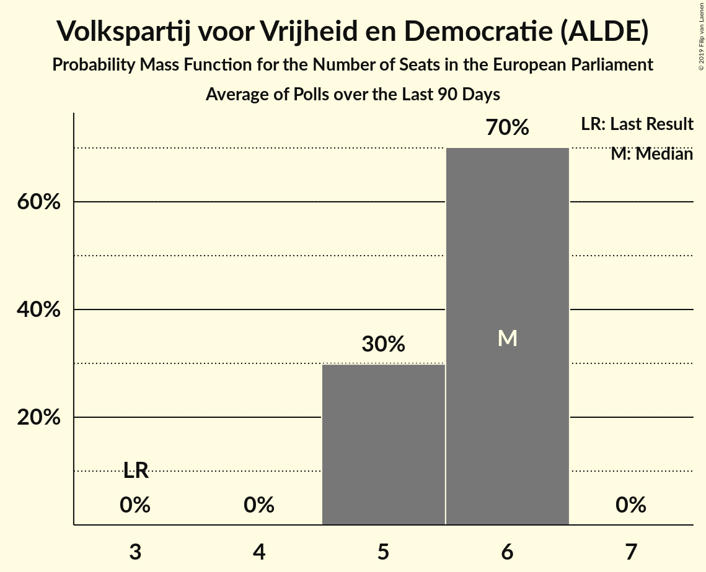

# Volkspartij voor Vrijheid en Democratie (ALDE)

<a href="#voting-intentions">Voting Intentions</a> | <a href="#seats">Seats</a>

## Voting Intentions

Last result: **12.0%** (General Election of 22 May 2014)

### Confidence Intervals

| Period     | Polling firm/Commissioner(s) | Median | 80% Confidence Interval | 90% Confidence Interval | 95% Confidence Interval | 99% Confidence Interval |
|:----------:|:----------------:|:-----------:|:-----------------------:|:-----------------------:|:-----------------------:|:-----------------------:|
| N/A | [Poll Average](average.html) | 20.0% | 18.4–21.6% | 18.0–22.1% | 17.6–22.5% | 16.9–23.3% |
| [27 February–4 March 2018](2018-03-04-KantarPublic.html) | Kantar Public | 20.0% | 18.5–21.7% | 18.0–22.1% | 17.7–22.5% | 17.0–23.4% |
| [23–26 February 2018](2018-02-26-Ipsos.html) | Ipsos   EenVandaag | 19.9% | 18.4–21.6% | 17.9–22.0% | 17.5–22.5% | 16.8–23.3% |
| [2–6 February 2018](2018-02-06-IOResearch.html) | I&O Research | 18.9% | N/A | N/A | N/A | N/A |
| [26–29 January 2018](2018-01-29-Ipsos.html) | Ipsos   EenVandaag | 20.7% | N/A | N/A | N/A | N/A |
| [25–28 January 2018](2018-01-28-KantarPublic.html) | Kantar Public | 18.7% | N/A | N/A | N/A | N/A |
| [15–18 December 2017](2017-12-18-GfK.html) | GfK   EenVandaag | 19.3% | N/A | N/A | N/A | N/A |

### Probability Mass Function

The following table shows the probability mass function per percentage block of voting intentions for the [poll average](average.html) for Volkspartij voor Vrijheid en Democratie (ALDE).

| Voting Intentions | Probability | Accumulated | Special Marks |
|:-----------------:|:-----------:|:-----------:|:-------------:|
| 11.5–12.5% | 0% | 100% | Last Result |
| 12.5–13.5% | 0% | 100% |  |
| 13.5–14.5% | 0% | 100% |  |
| 14.5–15.5% | 0% | 100% |  |
| 15.5–16.5% | 0.2% | 100% |  |
| 16.5–17.5% | 2% | 99.8% |  |
| 17.5–18.5% | 10% | 98% |  |
| 18.5–19.5% | 24% | 88% |  |
| 19.5–20.5% | 31% | 63% | Median |
| 20.5–21.5% | 22% | 33% |  |
| 21.5–22.5% | 9% | 11% |  |
| 22.5–23.5% | 2% | 2% |  |
| 23.5–24.5% | 0.3% | 0.3% |  |
| 24.5–25.5% | 0% | 0% |  |

## Seats

Last result: **3** seats (General Election of 22 May 2014)

### Confidence Intervals

| Period     | Polling firm/Commissioner(s) | Median | 80% Confidence Interval | 90% Confidence Interval | 95% Confidence Interval | 99% Confidence Interval |
|:----------:|:----------------:|:------:|:-----------------------:|:-----------------------:|:-----------------------:|:-----------------------:|
| N/A | [Poll Average](average.html) | 7 | 7 | 6–7 | 5–7 | 5–7 |
| [27 February–4 March 2018](2018-03-04-KantarPublic.html) | Kantar Public | 7 | 7 | 7 | 6–7 | 5–7 |
| [23–26 February 2018](2018-02-26-Ipsos.html) | Ipsos   EenVandaag | 7 | 7 | 5–7 | 5–7 | 5–7 |
| [2–6 February 2018](2018-02-06-IOResearch.html) | I&O Research |  |  |  |  |  |
| [26–29 January 2018](2018-01-29-Ipsos.html) | Ipsos   EenVandaag |  |  |  |  |  |
| [25–28 January 2018](2018-01-28-KantarPublic.html) | Kantar Public |  |  |  |  |  |
| [15–18 December 2017](2017-12-18-GfK.html) | GfK   EenVandaag |  |  |  |  |  |

### Probability Mass Function

The following table shows the probability mass function per seat for the [poll average](average.html) for Volkspartij voor Vrijheid en Democratie (ALDE).

| Number of Seats | Probability | Accumulated | Special Marks |
|:---------------:|:-----------:|:-----------:|:-------------:|
| 3 | 0% | 100% | Last Result |
| 4 | 0% | 100% |  |
| 5 | 4% | 100% |  |
| 6 | 1.5% | 96% |  |
| 7 | 94% | 94% | Median |
| 8 | 0% | 0% |  |

