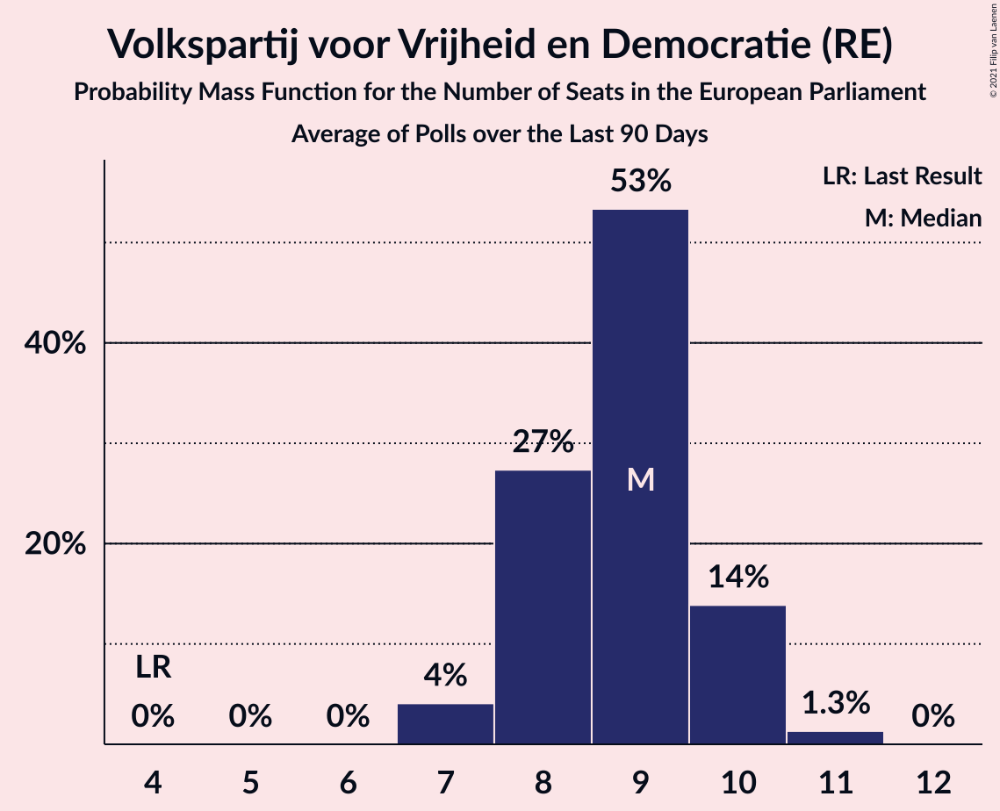

# Volkspartij voor Vrijheid en Democratie (RE)

<a href="#voting-intentions">Voting Intentions</a> | <a href="#seats">Seats</a>

## Voting Intentions

Last result: **14.6%** (General Election of 23 May 2019)

### Confidence Intervals

| Period     | Polling firm/Commissioner(s) | Median | 80% Confidence Interval | 90% Confidence Interval | 95% Confidence Interval | 99% Confidence Interval |
|:----------:|:----------------:|:-----------:|:-----------------------:|:-----------------------:|:-----------------------:|:-----------------------:|
| N/A | [Poll Average](average.html) | 20.1% | 18.3–22.1% | 17.9–22.6% | 17.7–23.1% | 17.2–24.0% |
| [10–15 October 2019](2019-10-15-IOResearch.html) | I&O Research | 19.3% | 18.1–20.5% | 17.8–20.9% | 17.5–21.2% | 17.0–21.8% |
| [7–12 October 2019](2019-10-12-Peilnl.html) | Peil.nl | 18.7% | 17.8–19.6% | 17.5–19.9% | 17.3–20.1% | 16.9–20.6% |
| [30 September–5 October 2019](2019-10-05-Peilnl.html) | Peil.nl | 18.7% | 17.8–19.6% | 17.5–19.9% | 17.3–20.1% | 16.9–20.6% |
| [23–28 September 2019](2019-09-28-Peilnl.html) | Peil.nl | 18.7% | 17.8–19.6% | 17.5–19.9% | 17.3–20.1% | 16.9–20.6% |
| [20–23 September 2019](2019-09-23-Ipsos.html) | Ipsos   EenVandaag | 21.1% | 19.5–22.8% | 19.1–23.3% | 18.7–23.7% | 17.9–24.6% |
| [16–21 September 2019](2019-09-21-Peilnl.html) | Peil.nl | 18.7% | 17.8–19.6% | 17.5–19.9% | 17.3–20.1% | 16.9–20.6% |
| [9–14 September 2019](2019-09-14-Peilnl.html) | Peil.nl | 18.7% | 17.8–19.6% | 17.5–19.9% | 17.3–20.1% | 16.9–20.6% |
| [2–7 September 2019](2019-09-07-Peilnl.html) | Peil.nl | 18.7% | 17.8–19.6% | 17.5–19.9% | 17.3–20.1% | 16.9–20.6% |
| [29 August–3 September 2019](2019-09-03-IOResearch.html) | I&O Research | 20.6% | 19.3–21.9% | 19.0–22.3% | 18.7–22.6% | 18.1–23.3% |
| [30 August–2 September 2019](2019-09-02-Ipsos.html) | Ipsos   EenVandaag | 20.9% | 19.3–22.6% | 18.9–23.1% | 18.5–23.5% | 17.7–24.4% |
| [26–31 August 2019](2019-08-31-Peilnl.html) | Peil.nl | 18.0% | 17.1–18.9% | 16.9–19.2% | 16.7–19.4% | 16.2–19.9% |
| [19–24 August 2019](2019-08-24-Peilnl.html) | Peil.nl | 18.0% | 17.1–18.9% | 16.9–19.2% | 16.7–19.4% | 16.2–19.9% |
| [29 July–4 August 2019](2019-08-04-Peilnl.html) | Peil.nl | 18.0% | 17.1–18.9% | 16.9–19.2% | 16.7–19.4% | 16.2–19.9% |
| [26–29 July 2019](2019-07-29-Ipsos.html) | Ipsos   EenVandaag | 20.1% | 18.6–21.8% | 18.2–22.3% | 17.8–22.7% | 17.1–23.5% |
| [5–9 July 2019](2019-07-09-IOResearch.html) | I&O Research | 19.3% | 18.3–20.4% | 18.0–20.7% | 17.7–21.0% | 17.2–21.5% |
| [1–7 July 2019](2019-07-07-Peilnl.html) | Peil.nl | 17.3% | 16.5–18.3% | 16.2–18.5% | 16.0–18.7% | 15.6–19.2% |
| [24–30 June 2019](2019-06-30-Peilnl.html) | Peil.nl | 17.3% | 16.5–18.3% | 16.2–18.5% | 16.0–18.7% | 15.6–19.2% |
| [21–24 June 2019](2019-06-24-Ipsos.html) | Ipsos   EenVandaag | 20.0% | 18.5–21.7% | 18.1–22.2% | 17.7–22.6% | 17.0–23.4% |
| [17–23 June 2019](2019-06-23-Peilnl.html) | Peil.nl | 18.0% | 17.1–18.9% | 16.9–19.2% | 16.7–19.4% | 16.2–19.9% |
| [10–16 June 2019](2019-06-16-Peilnl.html) | Peil.nl | 18.0% | 17.1–18.9% | 16.9–19.2% | 16.7–19.4% | 16.2–19.9% |
| [3–9 June 2019](2019-06-09-Peilnl.html) | Peil.nl | 18.0% | 17.1–18.9% | 16.9–19.2% | 16.7–19.4% | 16.2–19.9% |
| [27 May–2 June 2019](2019-06-02-Peilnl.html) | Peil.nl | 18.0% | 17.1–18.9% | 16.9–19.2% | 16.7–19.4% | 16.2–19.9% |

### Probability Mass Function

The following table shows the probability mass function per percentage block of voting intentions for the [poll average](average.html) for Volkspartij voor Vrijheid en Democratie (RE).

| Voting Intentions | Probability | Accumulated | Special Marks |
|:-----------------:|:-----------:|:-----------:|:-------------:|
| 14.5–15.5% | 0% | 100% | Last Result |
| 15.5–16.5% | 0% | 100% |  |
| 16.5–17.5% | 2% | 100% |  |
| 17.5–18.5% | 14% | 98% |  |
| 18.5–19.5% | 23% | 85% |  |
| 19.5–20.5% | 22% | 62% | Median |
| 20.5–21.5% | 22% | 40% |  |
| 21.5–22.5% | 13% | 18% |  |
| 22.5–23.5% | 4% | 6% |  |
| 23.5–24.5% | 1.0% | 1.2% |  |
| 24.5–25.5% | 0.2% | 0.2% |  |
| 25.5–26.5% | 0% | 0% |  |

## Seats

Last result: **4** seats (General Election of 23 May 2019)

### Confidence Intervals

| Period     | Polling firm/Commissioner(s) | Median | 80% Confidence Interval | 90% Confidence Interval | 95% Confidence Interval | 99% Confidence Interval |
|:----------:|:----------------:|:------:|:-----------------------:|:-----------------------:|:-----------------------:|:-----------------------:|
| N/A | [Poll Average](average.html) | 6 | 5–7 | 5–7 | 5–7 | 5–8 |
| [10–15 October 2019](2019-10-15-IOResearch.html) | I&O Research | 6 | 5–6 | 5–6 | 5–7 | 5–7 |
| [7–12 October 2019](2019-10-12-Peilnl.html) | Peil.nl | 6 | 6 | 6 | 6 | 5–7 |
| [30 September–5 October 2019](2019-10-05-Peilnl.html) | Peil.nl | 6 | 5–6 | 5–6 | 5–6 | 5–6 |
| [23–28 September 2019](2019-09-28-Peilnl.html) | Peil.nl | 6 | 5–6 | 5–6 | 5–6 | 5–6 |
| [20–23 September 2019](2019-09-23-Ipsos.html) | Ipsos   EenVandaag | 7 | 5–7 | 5–7 | 5–7 | 5–8 |
| [16–21 September 2019](2019-09-21-Peilnl.html) | Peil.nl | 6 | 5–6 | 5–6 | 5–6 | 5–6 |
| [9–14 September 2019](2019-09-14-Peilnl.html) | Peil.nl | 6 | 5–6 | 5–6 | 5–6 | 5–6 |
| [2–7 September 2019](2019-09-07-Peilnl.html) | Peil.nl | 6 | 5–6 | 5–6 | 5–6 | 5–6 |
| [29 August–3 September 2019](2019-09-03-IOResearch.html) | I&O Research | 6 | 6–7 | 6–7 | 5–7 | 5–7 |
| [30 August–2 September 2019](2019-09-02-Ipsos.html) | Ipsos   EenVandaag | 6 | 6–7 | 6–7 | 5–7 | 5–8 |
| [26–31 August 2019](2019-08-31-Peilnl.html) | Peil.nl | 5 | 5–6 | 5–6 | 5–6 | 5–6 |
| [19–24 August 2019](2019-08-24-Peilnl.html) | Peil.nl | 6 | 6 | 5–6 | 5–6 | 5–6 |
| [29 July–4 August 2019](2019-08-04-Peilnl.html) | Peil.nl | 5 | 5–6 | 5–6 | 5–6 | 5–6 |
| [26–29 July 2019](2019-07-29-Ipsos.html) | Ipsos   EenVandaag | 6 | 6–7 | 6–7 | 6–7 | 5–7 |
| [5–9 July 2019](2019-07-09-IOResearch.html) | I&O Research | 6 | 6 | 6–7 | 5–7 | 5–7 |
| [1–7 July 2019](2019-07-07-Peilnl.html) | Peil.nl | 5 | 5–6 | 5–6 | 5–6 | 5–6 |
| [24–30 June 2019](2019-06-30-Peilnl.html) | Peil.nl | 5 | 5–6 | 5–6 | 5–6 | 5–6 |
| [21–24 June 2019](2019-06-24-Ipsos.html) | Ipsos   EenVandaag | 6 | 6–7 | 5–7 | 5–8 | 5–8 |
| [17–23 June 2019](2019-06-23-Peilnl.html) | Peil.nl | 6 | 5–6 | 5–6 | 5–6 | 5–6 |
| [10–16 June 2019](2019-06-16-Peilnl.html) | Peil.nl | 6 | 5–6 | 5–6 | 5–6 | 5–6 |
| [3–9 June 2019](2019-06-09-Peilnl.html) | Peil.nl | 6 | 5–6 | 5–6 | 5–6 | 5–6 |
| [27 May–2 June 2019](2019-06-02-Peilnl.html) | Peil.nl | 6 | 5–6 | 5–6 | 5–6 | 5–6 |

### Probability Mass Function

The following table shows the probability mass function per seat for the [poll average](average.html) for Volkspartij voor Vrijheid en Democratie (RE).

| Number of Seats | Probability | Accumulated | Special Marks |
|:---------------:|:-----------:|:-----------:|:-------------:|
| 4 | 0% | 100% | Last Result |
| 5 | 17% | 100% |  |
| 6 | 54% | 83% | Median |
| 7 | 28% | 29% |  |
| 8 | 0.9% | 0.9% |  |
| 9 | 0% | 0% |  |

